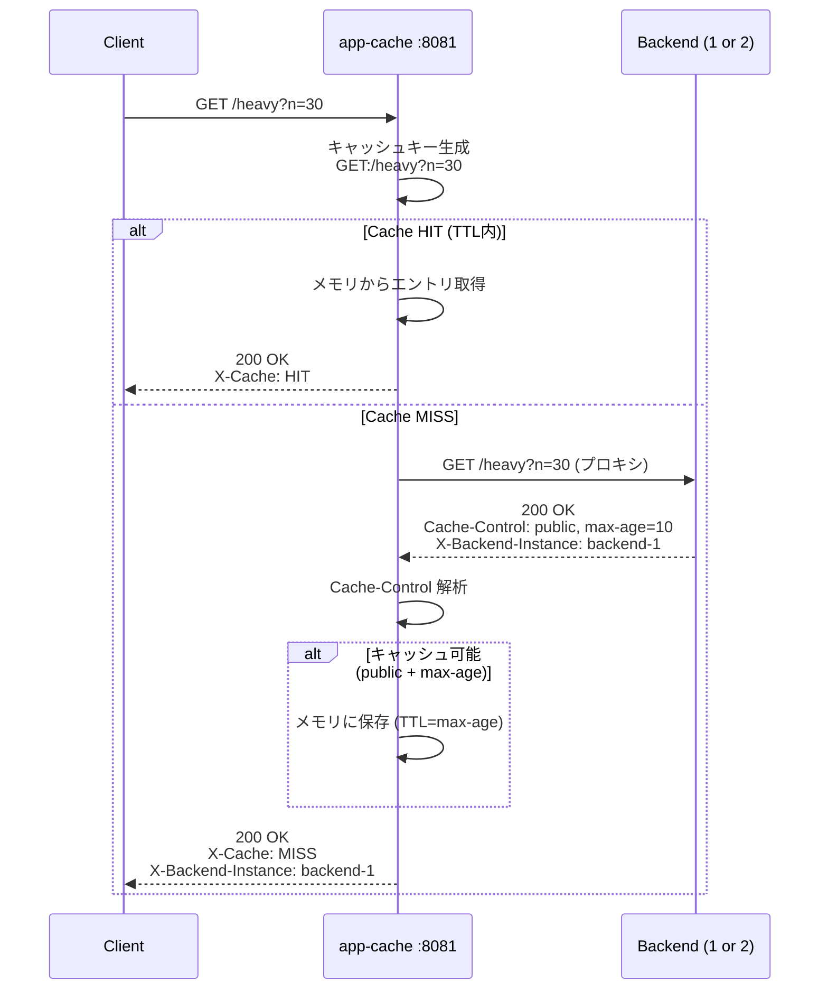
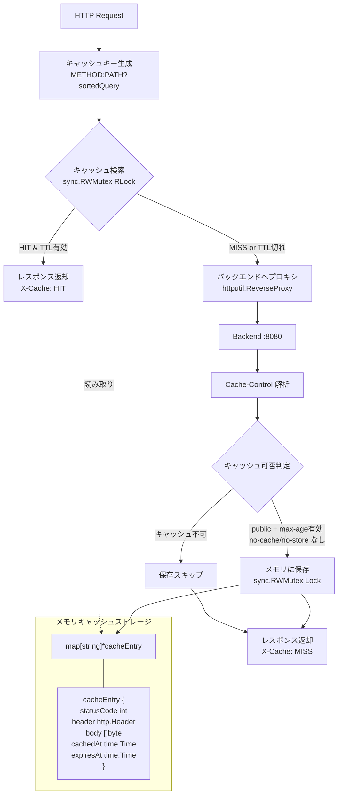

# app-cache アーキテクチャ

アプリケーションプロセス内のインメモリキャッシュ。`sync.RWMutex` で保護された `map` にキャッシュエントリを保存する。

- ポート: 8081
- キャッシュストレージ: プロセス内メモリ (`map[string]*cacheEntry`)
- TTL管理: `Cache-Control: max-age` から取得

## リクエストフロー

## コンポーネント構成

