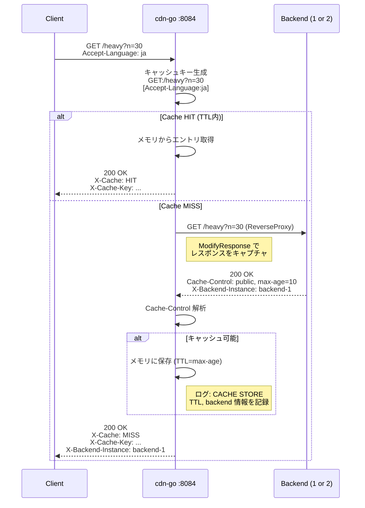
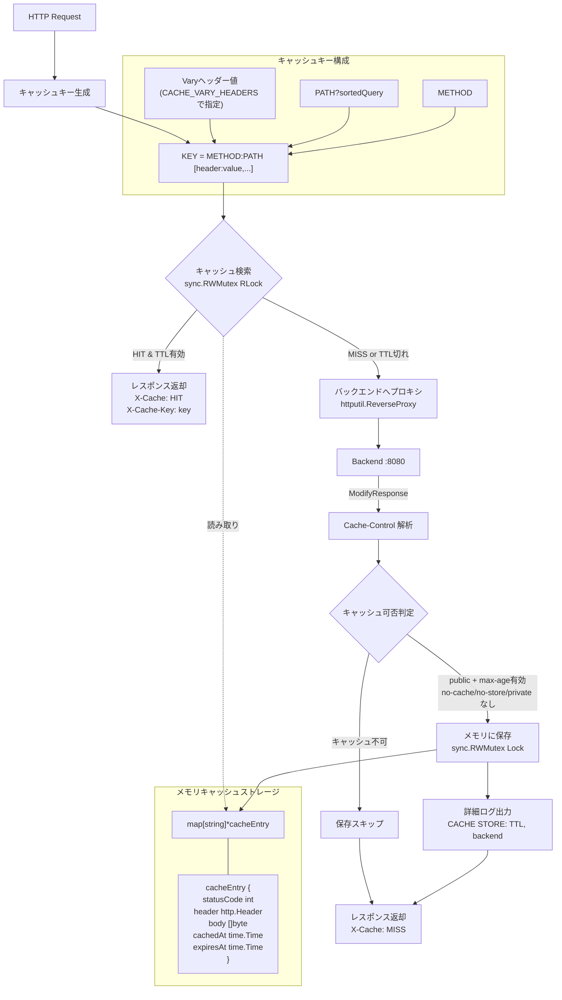

# cdn-go アーキテクチャ

Go で自作したリバースプロキシ + CDN キャッシュ。`Vary` ヘッダーに対応したキャッシュキー生成が特徴。

- ポート: 8084
- キャッシュストレージ: プロセス内メモリ (`map[string]*cacheEntry`)
- TTL管理: `Cache-Control: max-age` から取得
- Vary対応: `CACHE_VARY_HEADERS` 環境変数でホワイトリスト指定

## リクエストフロー

## コンポーネント構成

