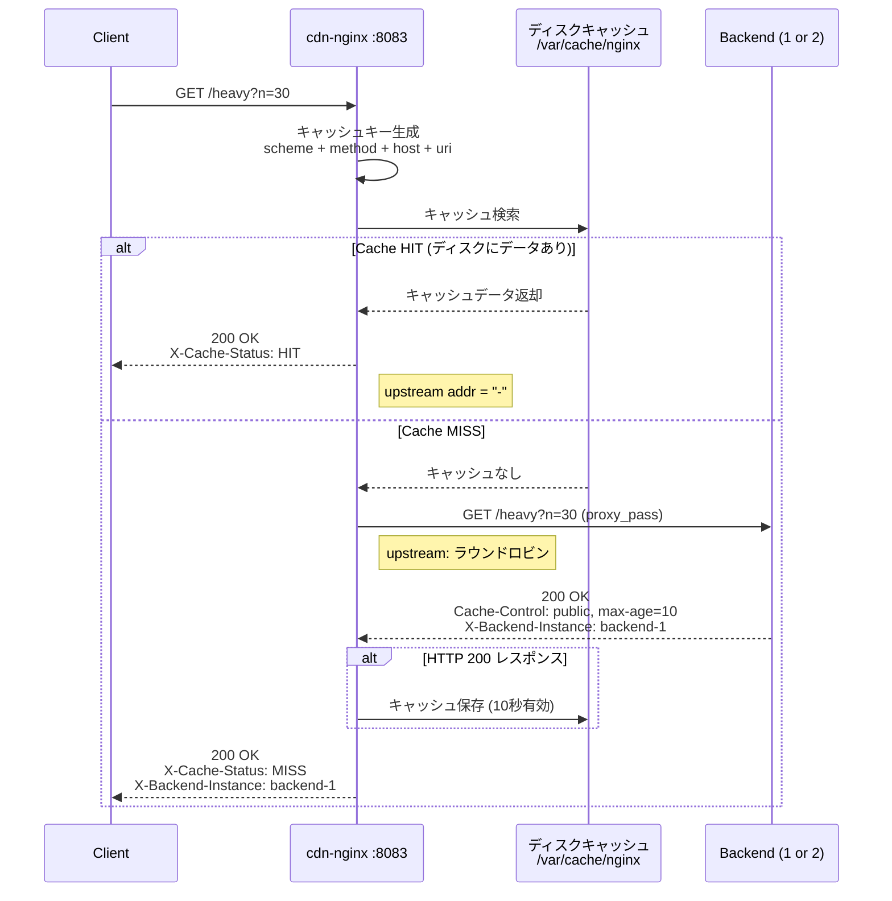
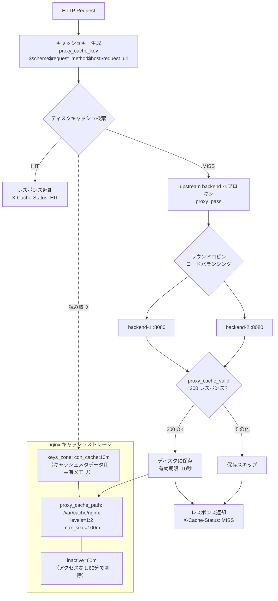

# cdn-nginx アーキテクチャ

nginx の `proxy_cache` モジュールによるディスクベースキャッシュ。設定ファイルのみでキャッシュ動作を制御する、本番環境で広く使われるパターン。

- ポート: 8083
- キャッシュストレージ: ディスク (`/var/cache/nginx`) + 共有メモリ (`keys_zone`)
- TTL管理: `proxy_cache_valid` ディレクティブ

## リクエストフロー

## コンポーネント構成

