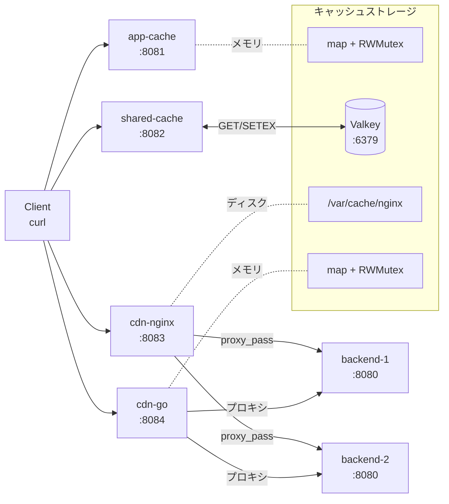
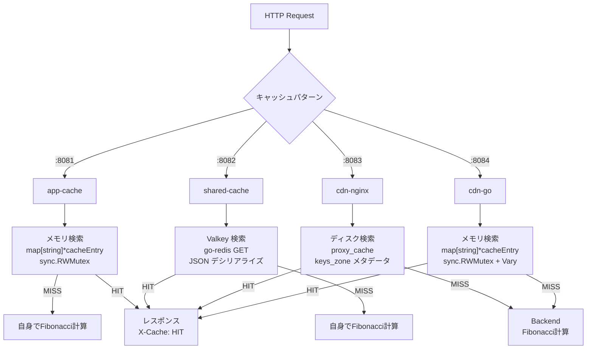

# キャッシュパターン全体比較

## 全体アーキテクチャ

## パターン比較

| 特性 | app-cache | shared-cache | cdn-nginx | cdn-go |
|------|-----------|-------------|-----------|--------|
| ポート | 8081 | 8082 | 8083 | 8084 |
| 方式 | 自身で計算 + キャッシュ | 自身で計算 + キャッシュ | リバースプロキシ + キャッシュ | リバースプロキシ + キャッシュ |
| ストレージ | プロセス内メモリ | Valkey (Redis互換) | ディスク + 共有メモリ | プロセス内メモリ |
| 永続化 | なし (再起動で消失) | あり (Valkey保存) | あり (ディスク保存) | なし (再起動で消失) |
| 複数プロセス共有 | 不可 | 可能 | 不可 (単一nginx内) | 不可 |
| TTL制御 | Cache-Control max-age | Cache-Control max-age | proxy_cache_valid | Cache-Control max-age |
| Vary対応 | なし | なし | なし | あり (ホワイトリスト) |
| キャッシュキー | METHOD:PATH?query | METHOD:PATH?query | scheme+method+host+uri | METHOD:PATH?query+headers |
| 実装言語 | Go | Go + Valkey | nginx設定 | Go |

## リクエストフロー比較

## 詳細ドキュメント

- [app-cache アーキテクチャ](app-cache.md)
- [shared-cache アーキテクチャ](shared-cache.md)
- [cdn-nginx アーキテクチャ](cdn-nginx.md)
- [cdn-go アーキテクチャ](cdn-go.md)
