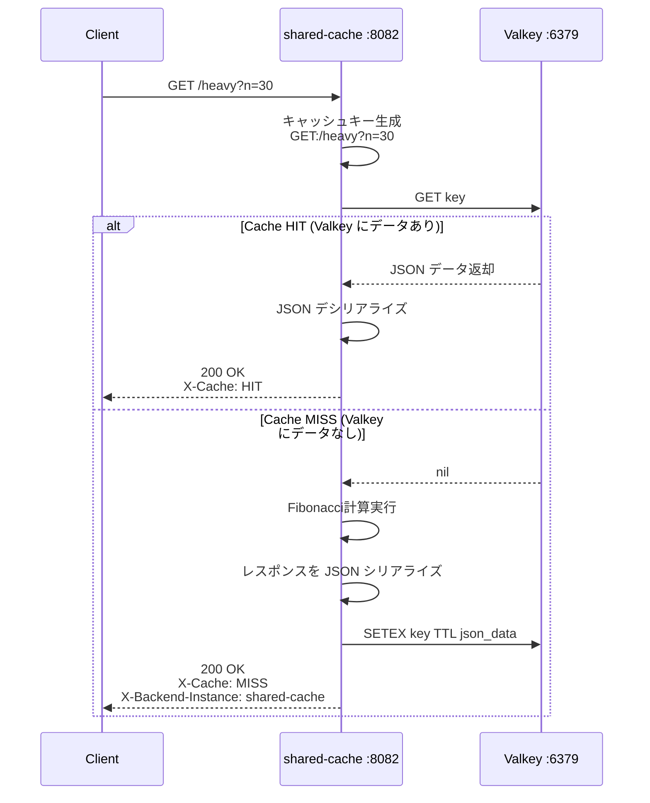
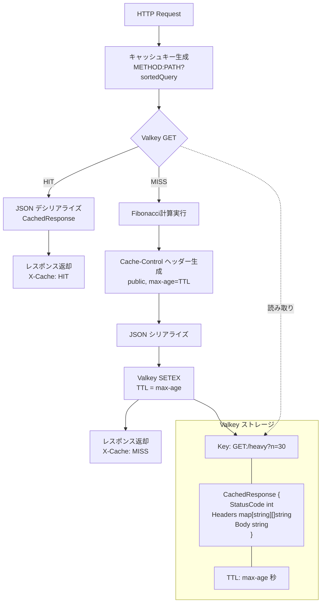

# shared-cache アーキテクチャ

Valkey（Redis互換）を外部キャッシュストレージとして使用する共有キャッシュ。複数プロセス間でキャッシュを共有できる。
自身でエンドポイントを持ち、キャッシュMISS時はfibonacci計算を直接実行し、結果をValkeyに保存する。

- ポート: 8082
- キャッシュストレージ: Valkey (Redis互換) :6379
- TTL管理: Valkey の `SetEx` (TTL付き保存)
- シリアライズ: JSON

## リクエストフロー

## コンポーネント構成

