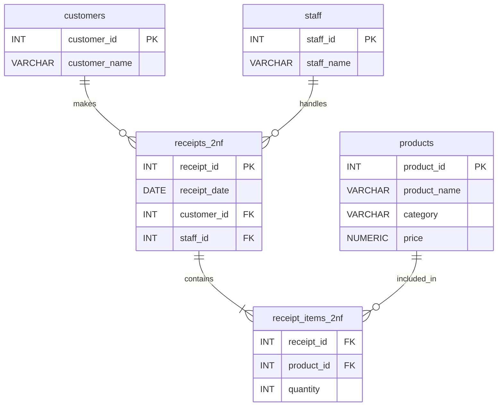
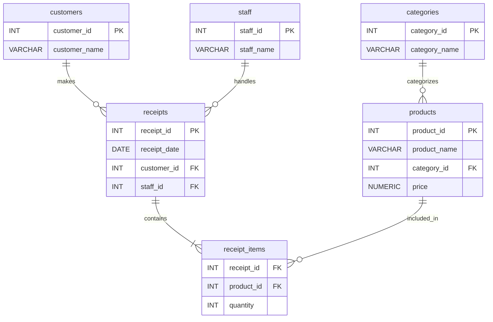

# 設計演習: スーパーのレジシステム

## 問題

以下の要件を満たすデータベースを設計してください。

**要件:**
1. レジで商品を購入すると、レシートが発行される
2. レシートには複数の商品が含まれる
3. 商品にはカテゴリがある（例: 乳製品、野菜、飲料）
4. 会員カードを持つ顧客は識別される（非会員は NULL）
5. レジを担当したスタッフが記録される

**考えてみましょう:**
どのようなテーブル構成にしますか？どんな問題が起きそうですか？

---

## Step 0: 非正規形（最初の悪い設計）

すべてのデータを1つのテーブルに詰め込んだ状態から始めます。

```sql
CREATE TABLE receipts_bad (
    receipt_id       INT,
    receipt_date     DATE,
    customer_id      INT,          -- NULL = 非会員
    customer_name    VARCHAR(100), -- NULL = 非会員
    staff_id         INT,
    staff_name       VARCHAR(100),
    product_id_1     INT,
    product_name_1   VARCHAR(100),
    category_1       VARCHAR(100),
    price_1          NUMERIC,
    qty_1            INT,
    product_id_2     INT,          -- 2品目（存在しない場合はNULL）
    product_name_2   VARCHAR(100),
    category_2       VARCHAR(100),
    price_2          NUMERIC,
    qty_2            INT,
    product_id_3     INT,          -- 3品目（存在しない場合はNULL）
    product_name_3   VARCHAR(100),
    category_3       VARCHAR(100),
    price_3          NUMERIC,
    qty_3            INT
    -- ... 4品目以降は？
);

INSERT INTO receipts_bad VALUES (
    1001, '2024-01-15',
    42, '田中 花子',
    5, '佐藤 太郎',
    101, '牛乳', '乳製品', 198, 2,
    202, '食パン', 'パン', 248, 1,
    NULL, NULL, NULL, NULL, NULL
);
```

### 発生する問題

**1. 繰り返しグループ（第1正規形違反）**
- 商品列が `product_id_1`, `product_id_2`, `product_id_3` と横に並んでいる
- 4品目以上を買うとテーブル定義を変えなければならない
- 「牛乳を買った全レシートを検索する」クエリが極めて複雑になる

**2. 更新異常**
- 商品名が変わったとき → `product_name_1` / `product_name_2` / `product_name_3` すべてを更新
- スタッフ名が変わったとき → そのスタッフが担当した全レシートを更新

**3. 挿入異常**
- 新しい商品を登録するだけでは（購入されるまで）データが存在できない

**4. 削除異常**
- レシートを削除すると、そのレシートにしか存在しない商品情報も消える

### この段階のテーブル構成

| テーブル | 主キー | 問題点 |
|---------|--------|--------|
| `receipts_bad` | なし（未定義） | 商品列が横に並んでいるため品数に上限がある。冗長データだらけで更新・挿入・削除異常が全発生 |

---

次のステップでこれを段階的に修正していきます。

## Step 1: 第1正規形への変換

**解決すること:** 繰り返しグループ（商品列の横並び）を排除する

```sql
-- 商品を行に展開する
CREATE TABLE receipts_1nf (
    receipt_id    INT,
    receipt_date  DATE,
    customer_id   INT,
    customer_name VARCHAR(100),
    staff_id      INT,
    staff_name    VARCHAR(100),
    product_id    INT,
    product_name  VARCHAR(100),
    category      VARCHAR(100),
    price         NUMERIC,
    quantity      INT,
    PRIMARY KEY (receipt_id, product_id)
);

INSERT INTO receipts_1nf VALUES
    (1001, '2024-01-15', 42, '田中 花子', 5, '佐藤 太郎', 101, '牛乳', '乳製品', 198, 2),
    (1001, '2024-01-15', 42, '田中 花子', 5, '佐藤 太郎', 202, '食パン', 'パン', 248, 1);
```

**改善されたこと:**
- 何品買っても行を増やすだけで対応できる
- 「牛乳を買った全レシート」が `WHERE product_name = '牛乳'` で検索できる

**まだ残っている問題点:**
- `customer_name` は `customer_id` だけで決まる（主キー全体ではなく一部で決まる）→ **部分関数従属（第2正規形違反）**
- `product_name`, `category`, `price` は `product_id` だけで決まる → **部分関数従属（第2正規形違反）**
- `staff_name` は `staff_id` だけで決まる → **部分関数従属（第2正規形違反）**

### この段階のテーブル構成

| テーブル | 主キー | 列数 | 意義 |
|---------|--------|------|------|
| `receipts_1nf` | (receipt_id, product_id) | 11列 | 繰り返しグループを排除し、商品を行単位で管理できるようになった |

---

## Step 2: 第2正規形への変換

**解決すること:** 部分関数従属を排除する（主キーの一部で決まる列を別テーブルへ）

```sql
-- 顧客テーブル（customer_id → customer_name）
CREATE TABLE customers (
    customer_id   INT PRIMARY KEY,
    customer_name VARCHAR(100)
);

-- 商品テーブル（product_id → product_name, category, price）
CREATE TABLE products (
    product_id   INT PRIMARY KEY,
    product_name VARCHAR(100),
    category     VARCHAR(100),
    price        NUMERIC
);

-- スタッフテーブル（staff_id → staff_name）
CREATE TABLE staff (
    staff_id   INT PRIMARY KEY,
    staff_name VARCHAR(100)
);

-- レシートヘッダー（receipt_id → receipt_date, customer_id, staff_id）
CREATE TABLE receipts_2nf (
    receipt_id   INT PRIMARY KEY,
    receipt_date DATE,
    customer_id  INT REFERENCES customers(customer_id),  -- NULL許容（非会員）
    staff_id     INT REFERENCES staff(staff_id)
);

-- レシート明細（receipt_id + product_id → quantity）
CREATE TABLE receipt_items_2nf (
    receipt_id INT REFERENCES receipts_2nf(receipt_id),
    product_id INT REFERENCES products(product_id),
    quantity   INT,
    PRIMARY KEY (receipt_id, product_id)
);
```

**改善されたこと:**
- 商品名の変更は `products` テーブルの1行を更新するだけ
- スタッフ名の変更は `staff` テーブルの1行を更新するだけ

**まだ残っている問題点:**
- `products` テーブルで `product_id → category`、かつ将来 `category → category_description` などの属性を追加すると推移関数従属（`product_id → category → category_description`）が生じる
- → **推移関数従属（第3正規形違反）**の可能性

### この段階のテーブル構成

| テーブル | 主キー | 意義 |
|---------|--------|------|
| `customers` | customer_id | 顧客情報を独立管理。1箇所の更新で全レシートに反映される |
| `products` | product_id | 商品情報を独立管理。価格・名称変更が容易になった |
| `staff` | staff_id | スタッフ情報を独立管理。スタッフ名変更の更新異常を解消 |
| `receipts_2nf` | receipt_id | レシートのヘッダー情報のみ保持。明細は別テーブルへ |
| `receipt_items_2nf` | (receipt_id, product_id) | レシートと商品の紐付け。何品でも対応可能 |



---

## Step 3: 第3正規形への変換

**解決すること:** 推移関数従属を排除する（非キー列が他の非キー列を通じて決まる関係を切り離す）

```sql
-- カテゴリテーブルを分離（category_name → category_description など将来の拡張も見据えて）
CREATE TABLE categories (
    category_id   INT PRIMARY KEY,
    category_name VARCHAR(100)
);

-- 商品テーブル（カテゴリIDで参照）
CREATE TABLE products (
    product_id   INT PRIMARY KEY,
    product_name VARCHAR(100),
    category_id  INT REFERENCES categories(category_id),
    price        NUMERIC
);

-- 顧客テーブル（変更なし）
CREATE TABLE customers (
    customer_id   INT PRIMARY KEY,
    customer_name VARCHAR(100)
);

-- スタッフテーブル（変更なし）
CREATE TABLE staff (
    staff_id   INT PRIMARY KEY,
    staff_name VARCHAR(100)
);

-- レシートヘッダー（変更なし）
CREATE TABLE receipts (
    receipt_id   INT PRIMARY KEY,
    receipt_date DATE,
    customer_id  INT REFERENCES customers(customer_id),  -- NULL = 非会員
    staff_id     INT REFERENCES staff(staff_id)
);

-- レシート明細（変更なし）
CREATE TABLE receipt_items (
    receipt_id INT REFERENCES receipts(receipt_id),
    product_id INT REFERENCES products(product_id),
    quantity   INT,
    PRIMARY KEY (receipt_id, product_id)
);
```

### この段階のテーブル構成

| テーブル | 主キー | 意義 |
|---------|--------|------|
| `categories` | category_id | カテゴリを独立管理。`products` から推移従属を排除 |
| `products` | product_id | category_id（外部キー）でカテゴリを参照。推移従属が解消された |
| `customers` | customer_id | 変更なし |
| `staff` | staff_id | 変更なし |
| `receipts` | receipt_id | 変更なし（命名を最終形に） |
| `receipt_items` | (receipt_id, product_id) | 変更なし（命名を最終形に） |



---

## 解答まとめ

### 最終テーブル構成

```
categories
├── category_id (PK)
└── category_name

products
├── product_id (PK)
├── product_name
├── category_id (FK → categories)
└── price

customers
├── customer_id (PK)
└── customer_name

staff
├── staff_id (PK)
└── staff_name

receipts
├── receipt_id (PK)
├── receipt_date
├── customer_id (FK → customers, NULL許容)
└── staff_id (FK → staff)

receipt_items
├── receipt_id (FK → receipts) ┐ 複合PK
├── product_id (FK → products) ┘
└── quantity
```

### ER図


### 各テーブルの役割

| テーブル | 役割 |
|---------|------|
| `categories` | 商品カテゴリのマスター |
| `products` | 商品マスター（名前・価格・カテゴリ） |
| `customers` | 会員顧客マスター |
| `staff` | レジ担当スタッフマスター |
| `receipts` | 購入トランザクションのヘッダー（いつ・誰が・誰に） |
| `receipt_items` | レシートの明細（何を・何個） |

### 正規化の効果

| 問題 | 解決方法 |
|-----|---------|
| 商品名変更 | `products` の1行のみ更新 |
| スタッフ名変更 | `staff` の1行のみ更新 |
| カテゴリ追加 | `categories` に1行追加するだけ |
| 新商品登録 | 購入前から `products` に登録可能 |
| 何品でも対応 | `receipt_items` に行を追加するだけ |
