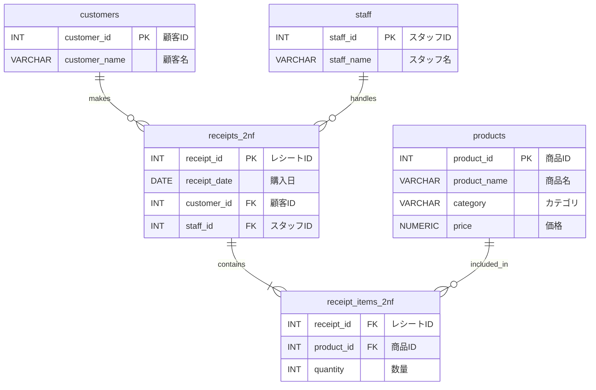
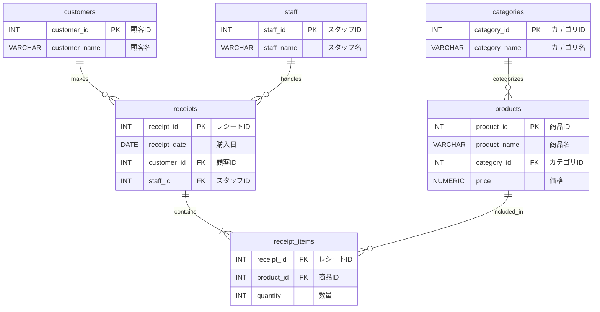

# 設計演習: スーパーのレジシステム

## 問題

以下の要件を満たすデータベースを設計してください。

**要件:**
1. レジで商品を購入すると、レシートが発行される
2. レシートには複数の商品が含まれる
3. 商品にはカテゴリがある（例: 乳製品、野菜、飲料）
4. 会員カードを持つ顧客は識別される（非会員は NULL）
5. レジを担当したスタッフが記録される

**考えてみましょう:**
どのようなテーブル構成にしますか？どんな問題が起きそうですか？

---

## Step 0: 非正規形（最初の悪い設計）

すべてのデータを1つのテーブルに詰め込んだ状態から始めます。

**receipts_bad（レシートテーブル・非正規形）**

| 列名 | 日本語名 | 型 | 備考 |
|------|---------|-----|------|
| receipt_id | レシートID | INT | |
| receipt_date | 購入日 | DATE | |
| customer_id | 顧客ID | INT | NULL = 非会員 |
| customer_name | 顧客名 | VARCHAR(100) | NULL = 非会員 |
| staff_id | スタッフID | INT | |
| staff_name | スタッフ名 | VARCHAR(100) | |
| product_id_1 | 商品ID（1品目） | INT | |
| product_name_1 | 商品名（1品目） | VARCHAR(100) | |
| category_1 | カテゴリ（1品目） | VARCHAR(100) | |
| price_1 | 価格（1品目） | NUMERIC | |
| qty_1 | 数量（1品目） | INT | |
| product_id_2 | 商品ID（2品目） | INT | 存在しない場合はNULL |
| product_name_2 | 商品名（2品目） | VARCHAR(100) | |
| category_2 | カテゴリ（2品目） | VARCHAR(100) | |
| price_2 | 価格（2品目） | NUMERIC | |
| qty_2 | 数量（2品目） | INT | |
| product_id_3 | 商品ID（3品目） | INT | 存在しない場合はNULL |
| ... | ... | ... | 4品目以降は？ |

サンプルデータ:

| receipt_id | receipt_date | customer_id | customer_name | staff_id | staff_name | product_id_1 | product_name_1 | category_1 | price_1 | qty_1 | product_id_2 | product_name_2 | category_2 | price_2 | qty_2 | product_id_3 | product_name_3 | category_3 | price_3 | qty_3 |
|-----------|------------|------------|--------------|---------|-----------|-------------|---------------|-----------|--------|------|-------------|---------------|-----------|--------|------|-------------|---------------|-----------|--------|------|
| 1001 | 2024-01-15 | 42 | 田中 花子 | 5 | 佐藤 太郎 | 101 | 牛乳 | 乳製品 | 198 | 2 | 202 | 食パン | パン | 248 | 1 | NULL | NULL | NULL | NULL | NULL |
| 1002 | 2024-01-15 | NULL | NULL | 5 | 佐藤 太郎 | 303 | バター | 乳製品 | 398 | 1 | NULL | NULL | NULL | NULL | NULL | NULL | NULL | NULL | NULL | NULL |
| 1003 | 2024-01-16 | 17 | 鈴木 一郎 | 8 | 田中 次郎 | 101 | 牛乳 | 乳製品 | 198 | 1 | 404 | 卵 | 卵類 | 298 | 2 | 505 | チーズ | 乳製品 | 348 | 1 |
| 1004 | 2024-01-16 | 42 | 田中 花子 | 8 | 田中 次郎 | 202 | 食パン | パン | 248 | 3 | NULL | NULL | NULL | NULL | NULL | NULL | NULL | NULL | NULL | NULL |
| 1005 | 2024-01-17 | 31 | 山田 美咲 | 5 | 佐藤 太郎 | 101 | 牛乳 | 乳製品 | 198 | 1 | 303 | バター | 乳製品 | 398 | 1 | NULL | NULL | NULL | NULL | NULL |

### 発生する問題

**1. 繰り返しグループ（第1正規形違反）**
- 商品列が `product_id_1`, `product_id_2`, `product_id_3` と横に並んでいる
- 4品目以上を買うとテーブル定義を変えなければならない
- 「牛乳を買った全レシートを検索する」クエリが極めて複雑になる

**2. 更新異常**
- 商品名が変わったとき → `product_name_1` / `product_name_2` / `product_name_3` すべてを更新
- スタッフ名が変わったとき → そのスタッフが担当した全レシートを更新

**3. 挿入異常**
- 新しい商品を登録するだけでは（購入されるまで）データが存在できない

**4. 削除異常**
- レシートを削除すると、そのレシートにしか存在しない商品情報も消える

---

次のステップでこれを段階的に修正していきます。

## Step 1: 第1正規形への変換

**解決すること:** 繰り返しグループ（商品列の横並び）を排除する

**receipts_1nf（レシートテーブル・第1正規形）**

| 列名 | 日本語名 | 型 | 制約 |
|------|---------|-----|------|
| receipt_id | レシートID | INT | PK（複合） |
| receipt_date | 購入日 | DATE | |
| customer_id | 顧客ID | INT | NULL許容 |
| customer_name | 顧客名 | VARCHAR(100) | NULL許容 |
| staff_id | スタッフID | INT | |
| staff_name | スタッフ名 | VARCHAR(100) | |
| product_id | 商品ID | INT | PK（複合） |
| product_name | 商品名 | VARCHAR(100) | |
| category | カテゴリ | VARCHAR(100) | |
| price | 価格 | NUMERIC | |
| quantity | 数量 | INT | |

サンプルデータ:

| receipt_id | receipt_date | customer_id | customer_name | staff_id | staff_name | product_id | product_name | category | price | quantity |
|-----------|------------|------------|--------------|---------|-----------|-----------|-------------|---------|-------|----------|
| 1001 | 2024-01-15 | 42 | 田中 花子 | 5 | 佐藤 太郎 | 101 | 牛乳 | 乳製品 | 198 | 2 |
| 1001 | 2024-01-15 | 42 | 田中 花子 | 5 | 佐藤 太郎 | 202 | 食パン | パン | 248 | 1 |
| 1002 | 2024-01-15 | NULL | NULL | 5 | 佐藤 太郎 | 303 | バター | 乳製品 | 398 | 1 |
| 1003 | 2024-01-16 | 17 | 鈴木 一郎 | 8 | 田中 次郎 | 101 | 牛乳 | 乳製品 | 198 | 1 |
| 1003 | 2024-01-16 | 17 | 鈴木 一郎 | 8 | 田中 次郎 | 404 | 卵 | 卵類 | 298 | 2 |

**改善されたこと:**
- 何品買っても行を増やすだけで対応できる
- 「牛乳を買った全レシート」が `WHERE product_name = '牛乳'` で検索できる

**まだ残っている問題点:**
- `customer_name` は `customer_id` だけで決まる（主キー全体ではなく一部で決まる）→ **部分関数従属（第2正規形違反）**
- `product_name`, `category`, `price` は `product_id` だけで決まる → **部分関数従属（第2正規形違反）**
- `staff_name` は `staff_id` だけで決まる → **部分関数従属（第2正規形違反）**

---

## Step 2: 第2正規形への変換

**解決すること:** 部分関数従属を排除する（主キーの一部で決まる列を別テーブルへ）

**customers（顧客テーブル）**

| 列名 | 日本語名 | 型 | 制約 |
|------|---------|-----|------|
| customer_id | 顧客ID | INT | PK |
| customer_name | 顧客名 | VARCHAR(100) | |

サンプルデータ:

| customer_id | customer_name |
|------------|--------------|
| 17 | 鈴木 一郎 |
| 31 | 山田 美咲 |
| 42 | 田中 花子 |
| 55 | 高橋 健太 |
| 63 | 渡辺 恵子 |

**products（商品テーブル）**

| 列名 | 日本語名 | 型 | 制約 |
|------|---------|-----|------|
| product_id | 商品ID | INT | PK |
| product_name | 商品名 | VARCHAR(100) | |
| category | カテゴリ | VARCHAR(100) | |
| price | 価格 | NUMERIC | |

サンプルデータ:

| product_id | product_name | category | price |
|-----------|-------------|---------|-------|
| 101 | 牛乳 | 乳製品 | 198 |
| 202 | 食パン | パン | 248 |
| 303 | バター | 乳製品 | 398 |
| 404 | 卵 | 卵類 | 298 |
| 505 | チーズ | 乳製品 | 348 |

**staff（スタッフテーブル）**

| 列名 | 日本語名 | 型 | 制約 |
|------|---------|-----|------|
| staff_id | スタッフID | INT | PK |
| staff_name | スタッフ名 | VARCHAR(100) | |

サンプルデータ:

| staff_id | staff_name |
|---------|-----------|
| 5 | 佐藤 太郎 |
| 8 | 田中 次郎 |
| 12 | 山本 花子 |
| 15 | 中村 健一 |
| 20 | 小林 美咲 |

**receipts_2nf（レシートヘッダーテーブル）**

| 列名 | 日本語名 | 型 | 制約 |
|------|---------|-----|------|
| receipt_id | レシートID | INT | PK |
| receipt_date | 購入日 | DATE | |
| customer_id | 顧客ID | INT | FK → customers, NULL許容 |
| staff_id | スタッフID | INT | FK → staff |

サンプルデータ:

| receipt_id | receipt_date | customer_id | staff_id |
|-----------|------------|------------|---------|
| 1001 | 2024-01-15 | 42 | 5 |
| 1002 | 2024-01-15 | NULL | 5 |
| 1003 | 2024-01-16 | 17 | 8 |
| 1004 | 2024-01-16 | 42 | 8 |
| 1005 | 2024-01-17 | 31 | 5 |

**receipt_items_2nf（レシート明細テーブル）**

| 列名 | 日本語名 | 型 | 制約 |
|------|---------|-----|------|
| receipt_id | レシートID | INT | PK（複合）, FK → receipts_2nf |
| product_id | 商品ID | INT | PK（複合）, FK → products |
| quantity | 数量 | INT | |

サンプルデータ:

| receipt_id | product_id | quantity |
|-----------|-----------|----------|
| 1001 | 101 | 2 |
| 1001 | 202 | 1 |
| 1002 | 303 | 1 |
| 1003 | 101 | 1 |
| 1003 | 404 | 2 |

**改善されたこと:**
- 商品名の変更は `products` テーブルの1行を更新するだけ
- スタッフ名の変更は `staff` テーブルの1行を更新するだけ

**まだ残っている問題点:**
- `products` テーブルで `product_id → category`、かつ将来 `category → category_description` などの属性を追加すると推移関数従属（`product_id → category → category_description`）が生じる
- → **推移関数従属（第3正規形違反）**の可能性

---

## Step 3: 第3正規形への変換

**解決すること:** 推移関数従属を排除する（非キー列が他の非キー列を通じて決まる関係を切り離す）

**categories（カテゴリテーブル）** ← 新規追加

| 列名 | 日本語名 | 型 | 制約 |
|------|---------|-----|------|
| category_id | カテゴリID | INT | PK |
| category_name | カテゴリ名 | VARCHAR(100) | |

サンプルデータ:

| category_id | category_name |
|------------|--------------|
| 1 | 乳製品 |
| 2 | パン |
| 3 | 卵類 |
| 4 | 野菜 |
| 5 | 飲料 |

**products（商品テーブル）** ← `category` を `category_id`（FK）に変更

| 列名 | 日本語名 | 型 | 制約 |
|------|---------|-----|------|
| product_id | 商品ID | INT | PK |
| product_name | 商品名 | VARCHAR(100) | |
| category_id | カテゴリID | INT | FK → categories |
| price | 価格 | NUMERIC | |

サンプルデータ:

| product_id | product_name | category_id | price |
|-----------|-------------|------------|-------|
| 101 | 牛乳 | 1 | 198 |
| 202 | 食パン | 2 | 248 |
| 303 | バター | 1 | 398 |
| 404 | 卵 | 3 | 298 |
| 505 | チーズ | 1 | 348 |

**customers（顧客テーブル）** ← 変更なし

| 列名 | 日本語名 | 型 | 制約 |
|------|---------|-----|------|
| customer_id | 顧客ID | INT | PK |
| customer_name | 顧客名 | VARCHAR(100) | |

**staff（スタッフテーブル）** ← 変更なし

| 列名 | 日本語名 | 型 | 制約 |
|------|---------|-----|------|
| staff_id | スタッフID | INT | PK |
| staff_name | スタッフ名 | VARCHAR(100) | |

**receipts（レシートヘッダーテーブル）** ← 命名を最終形に

| 列名 | 日本語名 | 型 | 制約 |
|------|---------|-----|------|
| receipt_id | レシートID | INT | PK |
| receipt_date | 購入日 | DATE | |
| customer_id | 顧客ID | INT | FK → customers, NULL許容 |
| staff_id | スタッフID | INT | FK → staff |

**receipt_items（レシート明細テーブル）** ← 命名を最終形に

| 列名 | 日本語名 | 型 | 制約 |
|------|---------|-----|------|
| receipt_id | レシートID | INT | PK（複合）, FK → receipts |
| product_id | 商品ID | INT | PK（複合）, FK → products |
| quantity | 数量 | INT | |

---

## 解答まとめ

### 各テーブルの役割

| テーブル | 日本語名 | 役割 |
|---------|---------|------|
| `categories` | カテゴリ | 商品カテゴリのマスター |
| `products` | 商品 | 商品マスター（名前・価格・カテゴリ） |
| `customers` | 顧客 | 会員顧客マスター |
| `staff` | スタッフ | レジ担当スタッフマスター |
| `receipts` | レシート | 購入トランザクションのヘッダー（いつ・誰が・誰に） |
| `receipt_items` | レシート明細 | レシートの明細（何を・何個） |

### 正規化の効果

| 問題 | 解決方法 |
|-----|---------|
| 商品名変更 | `products` の1行のみ更新 |
| スタッフ名変更 | `staff` の1行のみ更新 |
| カテゴリ追加 | `categories` に1行追加するだけ |
| 新商品登録 | 購入前から `products` に登録可能 |
| 何品でも対応 | `receipt_items` に行を追加するだけ |

### ER図

