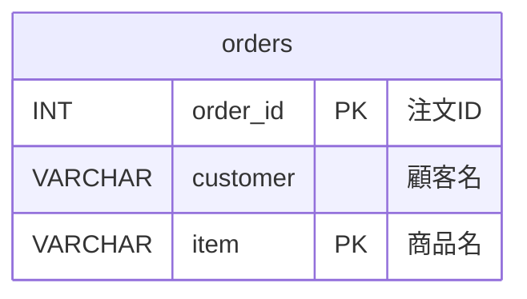
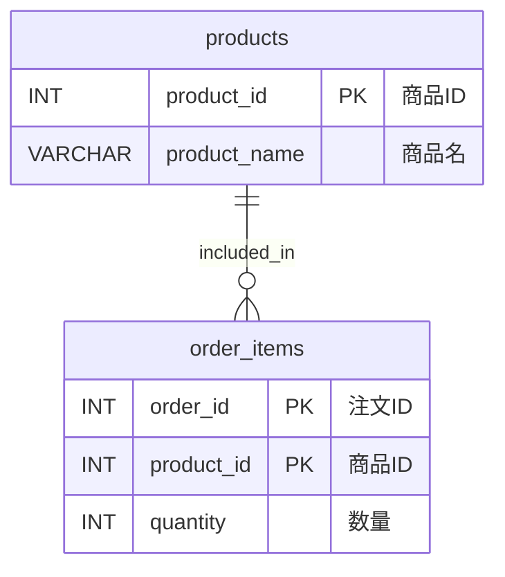
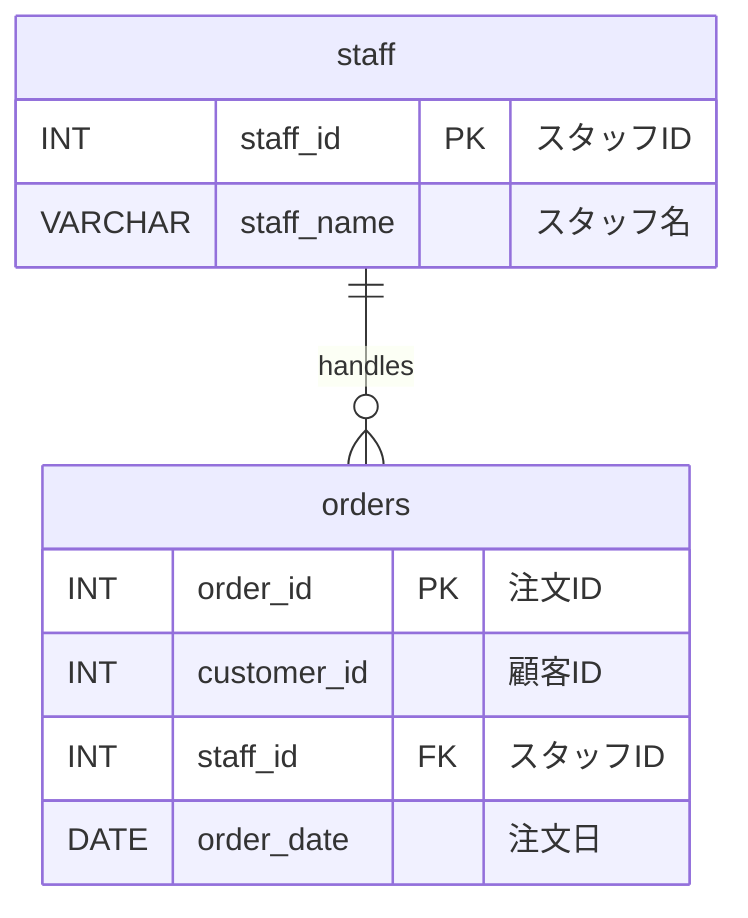
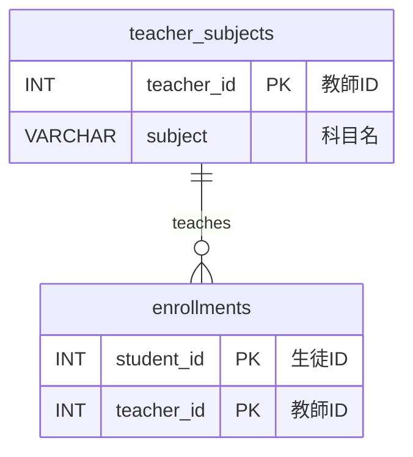
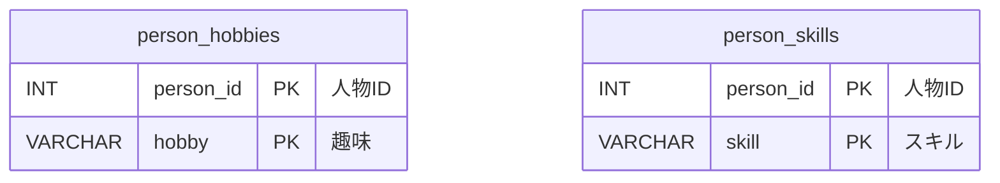

# データベース正規化

## 1. 正規化とは

正規化とは、データベースのテーブル設計を体系的に整理し、**データの冗長性を排除**し、**更新異常を防ぐ**プロセスです。

### 目的

- **冗長性の排除**: 同じデータを複数箇所に持たない
- **更新異常の防止**: データを1箇所だけ更新すれば済む状態にする
- **整合性の確保**: データの矛盾が起きない構造にする

### 更新異常の種類

| 異常の種類 | 説明 | 例 |
|-----------|------|-----|
| 更新異常 | 同じデータが複数行にあり、一部だけ更新されると矛盾が生じる | 商品の価格が複数行にあり、片方だけ更新された |
| 挿入異常 | 必要な情報が揃わないとレコードを挿入できない | 注文なしでは顧客情報を登録できない |
| 削除異常 | あるデータを削除すると、他の必要な情報も失われる | 最後の注文を削除すると顧客情報も消える |

### メリット・デメリット

| | メリット | デメリット |
|---|---------|-----------|
| 正規化 | 冗長性排除、更新異常防止、整合性確保 | JOINが増えてクエリが複雑になる |
| 非正規化 | クエリがシンプル、読み取り性能が高い | 冗長性あり、更新異常のリスク |

---

## 2. 正規形の一覧

| 正規形 | 英語名 | 主な条件 |
|--------|--------|---------|
| 第1正規形 | First Normal Form | 繰り返しグループの排除、原子値 |
| 第2正規形 | Second Normal Form | 部分関数従属の排除 |
| 第3正規形 | Third Normal Form | 推移関数従属の排除 |
| ボイス・コッド正規形（BCNF） | Boyce-Codd Normal Form | すべての決定項が候補キー |
| 第4正規形 | Fourth Normal Form | 多値従属性の排除 |
| 第5正規形 | Fifth Normal Form | 結合従属性の排除 |
| 第6正規形 / DKNF / 第7正規形 | 上位正規形 | 時制データ、ドメイン・キー制約 |

実務では **第3正規形 または ボイス・コッド正規形（BCNF）** まで適用することがほとんどです。

---

## 3. 第1正規形

### 定義

テーブルのすべての列が**原子値**（これ以上分割できない値）を持ち、**繰り返しグループが存在しない**状態。

### 違反例

**orders_bad（注文テーブル・違反）**

| 列名 | 日本語名 | 型 | 制約 |
|------|---------|-----|------|
| order_id | 注文ID | INT | PK |
| customer | 顧客名 | VARCHAR(100) | |
| items | 商品リスト | VARCHAR(500) | 例: `'牛乳,卵,パン'`（複数値） |

サンプルデータ:

| order_id | customer | items |
|----------|----------|-------|
| 1 | 田中 花子 | 牛乳,卵,パン |
| 2 | 鈴木 一郎 | 卵,バター |
| 3 | 佐藤 太郎 | 米,味噌,豆腐,納豆 |
| 4 | 山田 美咲 | パン |
| 5 | 高橋 健太 | 牛乳,チーズ |

**問題点:**
- `items` に複数の商品が詰め込まれている
- 「牛乳を買った人を検索する」クエリが書きにくい（LIKE検索に頼ることになる）
- 商品を追加・削除するたびに文字列を加工する必要がある

### 第1正規形に変換後

**orders（注文テーブル）**

| 列名 | 日本語名 | 型 | 制約 |
|------|---------|-----|------|
| order_id | 注文ID | INT | PK（複合） |
| customer | 顧客名 | VARCHAR(100) | |
| item | 商品名 | VARCHAR(100) | PK（複合） |

サンプルデータ:

| order_id | customer | item |
|----------|----------|------|
| 1 | 田中 花子 | 牛乳 |
| 1 | 田中 花子 | 卵 |
| 1 | 田中 花子 | パン |
| 2 | 鈴木 一郎 | 卵 |
| 2 | 鈴木 一郎 | バター |

**まだ残っている問題点:**
- `customer` が `order_id` だけでなく `item` にも依存しているように見える（実際は `order_id` だけで決まる）
- → **部分関数従属**が存在する（第2正規形違反）

### 第1正規形の意義

| 観点 | 内容 |
|-----|------|
| 解決する問題 | 繰り返しグループ（1セルに複数値）の排除 |
| 変換の操作 | 複数値を持つ列を行に展開する |
| 得られる効果 | 個別データの検索・追加・削除が容易になる |
| まだ残る課題 | 部分関数従属（主キーの一部で非キー列が決まる） |

---

## 4. 第2正規形

### 定義

第1正規形を満たし、かつ**部分関数従属が存在しない**状態。
すべての非キー列が**主キー全体**に依存している。

> **部分関数従属**: 複合主キーの一部だけで非キー列が決まること。

### 違反例

**order_items_bad（注文明細テーブル・違反）**

| 列名 | 日本語名 | 型 | 制約 | 備考 |
|------|---------|-----|------|------|
| order_id | 注文ID | INT | PK（複合） | |
| product_id | 商品ID | INT | PK（複合） | |
| product_name | 商品名 | VARCHAR(100) | | `product_id` だけで決まる → 部分従属 |
| quantity | 数量 | INT | | |

サンプルデータ:

| order_id | product_id | product_name | quantity |
|----------|-----------|--------------|----------|
| 1 | 101 | 牛乳 | 2 |
| 1 | 202 | 食パン | 1 |
| 2 | 101 | 牛乳 | 1 |
| 2 | 303 | バター | 1 |
| 3 | 202 | 食パン | 3 |

**問題点:**
- 商品名を変更するとき、その商品を含む全行を更新する必要がある（更新異常）
- 商品情報だけを登録することができない（挿入異常）

### 第2正規形に変換後

**products（商品テーブル）**

| 列名 | 日本語名 | 型 | 制約 |
|------|---------|-----|------|
| product_id | 商品ID | INT | PK |
| product_name | 商品名 | VARCHAR(100) | |

サンプルデータ:

| product_id | product_name |
|-----------|--------------|
| 101 | 牛乳 |
| 202 | 食パン |
| 303 | バター |
| 404 | 卵 |
| 505 | チーズ |

**order_items（注文明細テーブル）**

| 列名 | 日本語名 | 型 | 制約 |
|------|---------|-----|------|
| order_id | 注文ID | INT | PK（複合） |
| product_id | 商品ID | INT | PK（複合）, FK → products |
| quantity | 数量 | INT | |

サンプルデータ:

| order_id | product_id | quantity |
|----------|-----------|----------|
| 1 | 101 | 2 |
| 1 | 202 | 1 |
| 2 | 101 | 1 |
| 2 | 303 | 1 |
| 3 | 202 | 3 |

**まだ残っている問題点:**
- 非キー列が他の非キー列に依存している場合（推移関数従属）はまだ残っている
- → **推移関数従属**が存在する可能性（第3正規形違反）

### 第2正規形の意義

| 観点 | 内容 |
|-----|------|
| 解決する問題 | 部分関数従属（複合主キーの一部で非キー列が決まる） |
| 変換の操作 | 主キーの一部にだけ依存する列を別テーブルに分離する |
| 得られる効果 | マスターデータを1箇所で管理できる（更新・挿入異常が解消） |
| まだ残る課題 | 推移関数従属（非キー列が他の非キー列を通じて主キーに依存） |

---

## 5. 第3正規形

### 定義

第2正規形を満たし、かつ**推移関数従属が存在しない**状態。
すべての非キー列が**主キーにのみ**直接依存している。

> **推移関数従属**: 非キー列Aが非キー列Bを通じて主キーに依存すること（主キー → B → A）。

### 違反例

**orders_bad（注文テーブル・違反）**

| 列名 | 日本語名 | 型 | 制約 | 備考 |
|------|---------|-----|------|------|
| order_id | 注文ID | INT | PK | |
| customer_id | 顧客ID | INT | | |
| staff_id | スタッフID | INT | | |
| staff_name | スタッフ名 | VARCHAR(100) | | `staff_id` で決まる → 推移従属 |
| order_date | 注文日 | DATE | | |

サンプルデータ:

| order_id | customer_id | staff_id | staff_name | order_date |
|----------|------------|----------|------------|------------|
| 1 | 42 | 5 | 佐藤 太郎 | 2024-01-15 |
| 2 | 17 | 5 | 佐藤 太郎 | 2024-01-15 |
| 3 | 42 | 8 | 田中 次郎 | 2024-01-16 |
| 4 | 31 | 8 | 田中 次郎 | 2024-01-16 |
| 5 | 55 | 5 | 佐藤 太郎 | 2024-01-17 |

**問題点:**
- スタッフ名が変わったとき、そのスタッフが担当した全注文を更新する必要がある
- スタッフ情報だけを登録できない

### 第3正規形に変換後

**staff（スタッフテーブル）**

| 列名 | 日本語名 | 型 | 制約 |
|------|---------|-----|------|
| staff_id | スタッフID | INT | PK |
| staff_name | スタッフ名 | VARCHAR(100) | |

サンプルデータ:

| staff_id | staff_name |
|----------|------------|
| 5 | 佐藤 太郎 |
| 8 | 田中 次郎 |
| 12 | 山本 花子 |
| 15 | 中村 健一 |
| 20 | 小林 美咲 |

**orders（注文テーブル）**

| 列名 | 日本語名 | 型 | 制約 |
|------|---------|-----|------|
| order_id | 注文ID | INT | PK |
| customer_id | 顧客ID | INT | |
| staff_id | スタッフID | INT | FK → staff |
| order_date | 注文日 | DATE | |

サンプルデータ:

| order_id | customer_id | staff_id | order_date |
|----------|------------|----------|------------|
| 1 | 42 | 5 | 2024-01-15 |
| 2 | 17 | 5 | 2024-01-15 |
| 3 | 42 | 8 | 2024-01-16 |
| 4 | 31 | 8 | 2024-01-16 |
| 5 | 55 | 5 | 2024-01-17 |

これで更新異常・挿入異常・削除異常がすべて解消されます。

### 第3正規形の意義

| 観点 | 内容 |
|-----|------|
| 解決する問題 | 推移関数従属（非キー列が他の非キー列を通じて主キーに依存） |
| 変換の操作 | 非キー列に依存する列をさらに別テーブルへ分離する |
| 得られる効果 | すべての更新異常・挿入異常・削除異常が解消される |
| まだ残る課題 | 決定項が候補キーでない場合（ボイス・コッド正規形違反） |

---

## 6. ボイス・コッド正規形（BCNF）

### 定義

第3正規形の強化版。すべての**決定項（関数従属の左辺）が候補キー**である状態。

第3正規形を満たしていてもBCNFを満たさないケースが稀にある。

### 第3正規形を満たすがBCNF違反の例

前提: 生徒は複数の科目を履修し、各科目は1人の教師が担当する。

- 候補キー: `(student_id, subject)` または `(student_id, teacher_id)`
- 関数従属: `teacher_id → subject`（教師が決まると科目が決まる）
- しかし `teacher_id` は候補キーではない → BCNF違反

**enrollments_bad（履修テーブル・違反）**

| 列名 | 日本語名 | 型 | 制約 | 備考 |
|------|---------|-----|------|------|
| student_id | 生徒ID | INT | PK（複合） | |
| subject | 科目名 | VARCHAR(100) | PK（複合） | |
| teacher_id | 教師ID | INT | | `teacher_id → subject` だが候補キーでない |

サンプルデータ:

| student_id | subject | teacher_id |
|-----------|---------|------------|
| 1 | 数学 | 10 |
| 1 | 英語 | 20 |
| 2 | 数学 | 10 |
| 2 | 物理 | 30 |
| 3 | 英語 | 20 |

### BCNFに変換後

**teacher_subjects（教師・科目テーブル）**

| 列名 | 日本語名 | 型 | 制約 |
|------|---------|-----|------|
| teacher_id | 教師ID | INT | PK |
| subject | 科目名 | VARCHAR(100) | |

サンプルデータ:

| teacher_id | subject |
|------------|---------|
| 10 | 数学 |
| 20 | 英語 |
| 30 | 物理 |
| 40 | 化学 |
| 50 | 国語 |

**enrollments（履修テーブル）**

| 列名 | 日本語名 | 型 | 制約 |
|------|---------|-----|------|
| student_id | 生徒ID | INT | PK（複合） |
| teacher_id | 教師ID | INT | PK（複合）, FK → teacher_subjects |

サンプルデータ:

| student_id | teacher_id |
|-----------|------------|
| 1 | 10 |
| 1 | 20 |
| 2 | 10 |
| 2 | 30 |
| 3 | 20 |

### ボイス・コッド正規形の意義

| 観点 | 内容 |
|-----|------|
| 解決する問題 | 決定項が候補キーでない関数従属の残存 |
| 変換の操作 | 候補キーでない決定項を主キーとする新テーブルに分離する |
| 得られる効果 | 第3正規形で残る微妙な更新異常を完全に排除できる |
| まだ残る課題 | 多値従属性（独立した多値の関係が同一テーブルに混在） |

---

## 7. 第4〜第7正規形

これらは理論的な上位正規形です。実務で意識することは稀ですが、概念として知っておくと役立ちます。

### 第4正規形

**多値従属性**を排除した状態。

> 多値従属性: 主キーAに対して、BとCが互いに独立して複数の値を持つ場合（A →→ B かつ A →→ C）。

#### 違反例

**person_hobbies_skills_bad（趣味・スキルテーブル・違反）**

| 列名 | 日本語名 | 型 | 制約 | 備考 |
|------|---------|-----|------|------|
| person_id | 人物ID | INT | PK（複合） | |
| hobby | 趣味 | VARCHAR(100) | PK（複合） | skill とは独立 |
| skill | スキル | VARCHAR(100) | PK（複合） | hobby とは独立 |

サンプルデータ:

| person_id | hobby | skill |
|-----------|-------|-------|
| 1 | 読書 | Python |
| 1 | 読書 | SQL |
| 1 | 釣り | Python |
| 1 | 釣り | SQL |
| 2 | 料理 | Java |

#### 第4正規形に変換後

**person_hobbies（趣味テーブル）**

| 列名 | 日本語名 | 型 | 制約 |
|------|---------|-----|------|
| person_id | 人物ID | INT | PK（複合） |
| hobby | 趣味 | VARCHAR(100) | PK（複合） |

サンプルデータ:

| person_id | hobby |
|-----------|-------|
| 1 | 読書 |
| 1 | 釣り |
| 2 | 料理 |
| 2 | 旅行 |
| 3 | 読書 |

**person_skills（スキルテーブル）**

| 列名 | 日本語名 | 型 | 制約 |
|------|---------|-----|------|
| person_id | 人物ID | INT | PK（複合） |
| skill | スキル | VARCHAR(100) | PK（複合） |

サンプルデータ:

| person_id | skill |
|-----------|-------|
| 1 | Python |
| 1 | SQL |
| 2 | Java |
| 2 | SQL |
| 3 | Go |

### 第5正規形

**結合従属性**を排除した状態。テーブルをどのように分割しても、JOINで元に戻せる状態。
第4正規形より制約が厳しく、実務での適用は非常にまれ。

### 第6正規形

**時制データ**（有効期間を持つデータ）を扱うための正規形。
例: 商品の価格が期間ごとに変わる場合に、時間軸を独立した軸として扱う。

**product_prices（商品価格テーブル）**

| 列名 | 日本語名 | 型 | 制約 |
|------|---------|-----|------|
| product_id | 商品ID | INT | PK（複合） |
| valid_from | 有効開始日 | DATE | PK（複合） |
| valid_to | 有効終了日 | DATE | |
| price | 価格 | NUMERIC | |

サンプルデータ:

| product_id | valid_from | valid_to | price |
|-----------|------------|----------|-------|
| 101 | 2024-01-01 | 2024-03-31 | 198 |
| 101 | 2024-04-01 | 2024-12-31 | 218 |
| 202 | 2024-01-01 | 2024-06-30 | 248 |
| 202 | 2024-07-01 | 2024-12-31 | 258 |
| 303 | 2024-01-01 | 2024-12-31 | 398 |

### DKNF / 第7正規形

- **DKNF（ドメイン・キー正規形）**: すべての制約がドメイン制約またはキー制約から導出できる状態。理論的な到達点。
- **第7正規形**: 第6正規形を時制データの観点でさらに拡張したもの。学術的な概念。

---

## 8. 非正規化

### 目的

意図的に正規化を崩し、**クエリのパフォーマンスを向上させる**テクニック。

### メリット・デメリット

| | 内容 |
|---|------|
| **メリット** | JOINが減り、クエリがシンプルになる |
| | 読み取りパフォーマンスが向上する |
| **デメリット** | データの冗長性が生まれる |
| | 更新時に複数箇所を同期する必要がある |
| | 整合性の維持がアプリケーション側の責任になる |

### 適用場面

- **分析系クエリ（OLAP）**: 集計・レポート用のテーブルで読み取りを最優先にする場合
- **キャッシュテーブル**: 計算済みの集計値を別テーブルに保持する
- **高トラフィックな読み取り**: 大量アクセスに対してJOINのコストを下げたい場合

### 非正規化の例

**orders_denormalized（注文テーブル・非正規化）**

| 列名 | 日本語名 | 型 | 制約 | 備考 |
|------|---------|-----|------|------|
| order_id | 注文ID | INT | PK | |
| customer_id | 顧客ID | INT | | |
| customer_name | 顧客名 | VARCHAR(100) | | customers テーブルからコピー（冗長） |
| order_total | 注文合計 | NUMERIC | | 明細の合計を事前計算（冗長） |
| order_date | 注文日 | DATE | | |

サンプルデータ:

| order_id | customer_id | customer_name | order_total | order_date |
|----------|------------|---------------|-------------|------------|
| 1 | 42 | 田中 花子 | 644 | 2024-01-15 |
| 2 | 17 | 鈴木 一郎 | 596 | 2024-01-15 |
| 3 | 42 | 田中 花子 | 744 | 2024-01-16 |
| 4 | 31 | 山田 美咲 | 198 | 2024-01-16 |
| 5 | 55 | 高橋 健太 | 416 | 2024-01-17 |

> **実務の指針**: まず正規化して設計し、パフォーマンス問題が実際に発生したときに限り、計測しながら非正規化を検討する。
