# 第2章: クエリ最適化 — EXPLAIN・インデックス・非正規化

## この章で学ぶこと

- EXPLAIN ANALYZE による実行計画の読み方
- インデックスの種類と選び方（B-tree・複合・部分・カバリング）
- クエリの書き換えによる最適化（EXISTS・CTE・LATERAL JOIN・ページネーション）
- パフォーマンスのための非正規化パターン（冗長FK・JSON集約・集約キャッシュ）

---

## 学習の進め方

1. [SNSスキーマ設計](00_schema.md) — この章（題材となるSNSのDB構造）
2. [EXPLAINの読み方](01_explain.md) — 実行計画を読んでボトルネックを発見する
3. [インデックス](02_indexing.md) — インデックスの仕組みと選び方
4. [クエリチューニング](03_query_tuning.md) — クエリの書き方で速くする
5. [非正規化パターン](04_denormalization.md) — 意図的な冗長化でさらに速くする
6. [クエリ最適化演習](exercise.md) — タイムラインクエリを段階的に改善する
7. [演習の解答](answer.md)

---

## 前提知識

- 第1章の内容（正規化の理解）
- 基本的なJOINクエリ（INNER JOIN・LEFT JOIN）
- CREATE TABLE・INSERT

---

## SNSアプリケーションの概要

この章では、**SNSアプリケーション**のデータベースを題材にクエリ最適化を学びます。

想定するSNSの機能は以下の通りです。

| 機能 | 説明 |
|------|------|
| ユーザー管理 | アカウント作成、プロフィール設定 |
| フォロー | 他のユーザーをフォローし、タイムラインを構成する |
| 投稿 | テキスト投稿（ツイート相当） |
| コメント | 投稿へのリプライ |
| いいね | 投稿へのいいね（お気に入り） |
| スタンプ | 絵文字的なリアクション |
| ハッシュタグ | 投稿へのタグ付け、タグのフォロー |
| ブロック・ミュート | 特定ユーザーの非表示設定 |

スキーマは**第3正規形（3NF）**で設計されています。この正規化されたスキーマに対してクエリ最適化を施すことで、正規化とパフォーマンスのトレードオフを実践的に体験できます。

---

## テーブル一覧

| テーブル名 | 用途 | 主キー |
|-----------|------|--------|
| users | ユーザー情報 | id |
| follows | フォロー関係 | (user_id, follow_user_id) |
| posts | 投稿 | id |
| post_replies | 投稿へのコメント（リプライ） | id |
| post_favorites | 投稿へのいいね | (post_id, user_id) |
| stamps | スタンプマスタ | id |
| post_stamps | 投稿へのスタンプ | (post_id, stamp_id, user_id) |
| hashtags | ハッシュタグマスタ | id |
| hashtag_posts | 投稿とハッシュタグの紐付け | (hashtag_id, post_id) |
| hashtag_follows | ハッシュタグのフォロー | (hashtag_id, user_id) |
| user_blocks | ユーザーのブロック | (user_id, block_user_id) |
| user_mutes | ユーザーのミュート | (user_id, mute_user_id) |

---

## 各テーブルの定義

### users テーブル

ユーザーアカウントの基本情報を管理します。

| カラム名 | 型 | 説明 |
|---------|-----|------|
| id | SERIAL | ユーザーID（主キー） |
| display_name | VARCHAR(100) | 表示名 |
| bio | TEXT | プロフィール文（NULL可） |
| created_at | TIMESTAMPTZ | 登録日時 |

サンプルデータ:

| id | display_name | bio | created_at |
|----|-------------|-----|------------|
| 1 | 田中 花子 | 日常のことをつぶやきます。 | 2025-06-15 09:23:00+09 |
| 2 | 鈴木 一郎 | 技術ブログも書いています。 | 2025-07-02 14:05:00+09 |
| 3 | 佐藤 美咲 | 旅行と写真が好きです。 | 2025-08-20 18:44:00+09 |
| 4 | 山本 健太 | NULL | 2025-09-10 11:30:00+09 |
| 5 | 中村 さくら | 猫と暮らしています。 | 2025-10-01 08:00:00+09 |

---

### follows テーブル

ユーザー間のフォロー関係を管理します。(user_id, follow_user_id) の複合主キーにより、同じ組み合わせの重複を防ぎます。

| カラム名 | 型 | 説明 |
|---------|-----|------|
| user_id | INT | フォローするユーザーのID（PK・FK → users） |
| follow_user_id | INT | フォローされるユーザーのID（PK・FK → users） |
| created_at | TIMESTAMPTZ | フォロー日時 |

サンプルデータ:

| user_id | follow_user_id | created_at |
|---------|---------------|------------|
| 1 | 2 | 2025-07-10 10:00:00+09 |
| 1 | 3 | 2025-08-05 15:30:00+09 |
| 2 | 1 | 2025-07-11 09:15:00+09 |
| 3 | 1 | 2025-09-01 12:00:00+09 |
| 4 | 2 | 2025-09-20 17:45:00+09 |

---

### posts テーブル

ユーザーが投稿したテキスト投稿を管理します。

| カラム名 | 型 | 説明 |
|---------|-----|------|
| id | SERIAL | 投稿ID（主キー） |
| user_id | INT | 投稿者のユーザーID（FK → users） |
| content | TEXT | 投稿本文 |
| created_at | TIMESTAMPTZ | 投稿日時 |

サンプルデータ:

| id | user_id | content | created_at |
|----|---------|---------|------------|
| 1 | 1 | 今日は天気が良いですね！ | 2025-10-01 09:00:00+09 |
| 2 | 2 | 新しいフレームワークを試してみました。 | 2025-10-01 11:30:00+09 |
| 3 | 3 | 京都旅行の写真を整理中です。 | 2025-10-02 14:00:00+09 |
| 4 | 1 | 夕飯は鍋にしました。 | 2025-10-02 19:30:00+09 |
| 5 | 4 | 週末は山登りに行く予定です。 | 2025-10-03 08:15:00+09 |

---

### post_replies テーブル

投稿へのコメント（リプライ）を管理します。

| カラム名 | 型 | 説明 |
|---------|-----|------|
| id | SERIAL | コメントID（主キー） |
| post_id | INT | コメント先の投稿ID（FK → posts） |
| user_id | INT | コメント投稿者のユーザーID（FK → users） |
| content | TEXT | コメント本文 |
| created_at | TIMESTAMPTZ | コメント日時 |

サンプルデータ:

| id | post_id | user_id | content | created_at |
|----|---------|---------|---------|------------|
| 1 | 1 | 2 | 本当に気持ちいい天気ですね！ | 2025-10-01 09:30:00+09 |
| 2 | 1 | 3 | 外に出たくなりますね。 | 2025-10-01 10:00:00+09 |
| 3 | 2 | 1 | どのフレームワークですか？ | 2025-10-01 12:00:00+09 |
| 4 | 3 | 4 | 京都いいですね！どこに行きましたか？ | 2025-10-02 15:00:00+09 |
| 5 | 4 | 5 | 鍋の季節が来ましたね。 | 2025-10-02 20:00:00+09 |

---

### post_favorites テーブル

ユーザーが投稿に付けたいいねを管理します。(post_id, user_id) の複合主キーにより、1ユーザーが同じ投稿に二重にいいねすることを防ぎます。

| カラム名 | 型 | 説明 |
|---------|-----|------|
| post_id | INT | いいね対象の投稿ID（PK・FK → posts） |
| user_id | INT | いいねしたユーザーのID（PK・FK → users） |
| created_at | TIMESTAMPTZ | いいね日時 |

サンプルデータ:

| post_id | user_id | created_at |
|---------|---------|------------|
| 1 | 2 | 2025-10-01 09:45:00+09 |
| 1 | 3 | 2025-10-01 10:10:00+09 |
| 2 | 1 | 2025-10-01 11:50:00+09 |
| 3 | 2 | 2025-10-02 14:30:00+09 |
| 4 | 5 | 2025-10-02 20:05:00+09 |

---

### stamps テーブル

使用可能なスタンプの種類を管理するマスタテーブルです。

| カラム名 | 型 | 説明 |
|---------|-----|------|
| id | SERIAL | スタンプID（主キー） |
| name | VARCHAR(50) | スタンプ名 |
| created_at | TIMESTAMPTZ | 登録日時 |

サンプルデータ:

| id | name | created_at |
|----|------|------------|
| 1 | いいね | 2025-01-01 00:00:00+09 |
| 2 | 最高 | 2025-01-01 00:00:00+09 |
| 3 | 笑える | 2025-01-01 00:00:00+09 |
| 4 | 驚き | 2025-01-01 00:00:00+09 |
| 5 | 悲しい | 2025-01-01 00:00:00+09 |

---

### post_stamps テーブル

ユーザーが投稿に付けたスタンプを管理します。(post_id, stamp_id, user_id) の複合主キーにより、同一ユーザーが同じ投稿に同じスタンプを二重に付けることを防ぎます。

| カラム名 | 型 | 説明 |
|---------|-----|------|
| post_id | INT | スタンプ対象の投稿ID（PK・FK → posts） |
| stamp_id | INT | 使用したスタンプのID（PK・FK → stamps） |
| user_id | INT | スタンプを付けたユーザーのID（PK・FK → users） |
| created_at | TIMESTAMPTZ | スタンプ付与日時 |

サンプルデータ:

| post_id | stamp_id | user_id | created_at |
|---------|----------|---------|------------|
| 1 | 1 | 2 | 2025-10-01 09:50:00+09 |
| 1 | 2 | 3 | 2025-10-01 10:15:00+09 |
| 2 | 3 | 4 | 2025-10-01 12:10:00+09 |
| 3 | 1 | 1 | 2025-10-02 14:20:00+09 |
| 4 | 4 | 2 | 2025-10-02 19:45:00+09 |

---

### hashtags テーブル

ハッシュタグの種類を管理するマスタテーブルです。タグ名には UNIQUE 制約があり、重複登録を防ぎます。

| カラム名 | 型 | 説明 |
|---------|-----|------|
| id | SERIAL | ハッシュタグID（主キー） |
| name | VARCHAR(100) | タグ名（UNIQUE） |
| created_at | TIMESTAMPTZ | 登録日時 |

サンプルデータ:

| id | name | created_at |
|----|------|------------|
| 1 | 日常 | 2025-01-01 00:00:00+09 |
| 2 | テクノロジー | 2025-01-01 00:00:00+09 |
| 3 | 旅行 | 2025-01-01 00:00:00+09 |
| 4 | グルメ | 2025-01-01 00:00:00+09 |
| 5 | アウトドア | 2025-01-01 00:00:00+09 |

---

### hashtag_posts テーブル

投稿とハッシュタグの紐付けを管理します。(hashtag_id, post_id) の複合主キーにより、同じ投稿に同じタグが二重に付くことを防ぎます。

| カラム名 | 型 | 説明 |
|---------|-----|------|
| hashtag_id | INT | タグのID（PK・FK → hashtags） |
| post_id | INT | タグ付けされた投稿のID（PK・FK → posts） |
| created_at | TIMESTAMPTZ | タグ付け日時 |

サンプルデータ:

| hashtag_id | post_id | created_at |
|-----------|---------|------------|
| 1 | 1 | 2025-10-01 09:00:00+09 |
| 2 | 2 | 2025-10-01 11:30:00+09 |
| 3 | 3 | 2025-10-02 14:00:00+09 |
| 1 | 4 | 2025-10-02 19:30:00+09 |
| 4 | 4 | 2025-10-02 19:30:00+09 |

---

### hashtag_follows テーブル

ユーザーがフォローしているハッシュタグを管理します。(hashtag_id, user_id) の複合主キーにより、同じユーザーが同じタグを二重にフォローすることを防ぎます。

| カラム名 | 型 | 説明 |
|---------|-----|------|
| hashtag_id | INT | フォロー対象のタグID（PK・FK → hashtags） |
| user_id | INT | フォローするユーザーのID（PK・FK → users） |
| created_at | TIMESTAMPTZ | フォロー日時 |

サンプルデータ:

| hashtag_id | user_id | created_at |
|-----------|---------|------------|
| 1 | 1 | 2025-08-01 10:00:00+09 |
| 2 | 2 | 2025-08-15 14:30:00+09 |
| 3 | 3 | 2025-09-01 09:00:00+09 |
| 4 | 1 | 2025-09-10 16:00:00+09 |
| 5 | 4 | 2025-09-20 11:45:00+09 |

---

### user_blocks テーブル

ユーザーが他のユーザーをブロックした関係を管理します。(user_id, block_user_id) の複合主キーにより重複を防ぎ、CHECK 制約により自分自身をブロックすることを禁じます。

| カラム名 | 型 | 説明 |
|---------|-----|------|
| user_id | INT | ブロックするユーザーのID（PK・FK → users） |
| block_user_id | INT | ブロックされるユーザーのID（PK・FK → users） |
| created_at | TIMESTAMPTZ | ブロック日時 |

サンプルデータ:

| user_id | block_user_id | created_at |
|---------|--------------|------------|
| 1 | 5 | 2025-09-05 18:00:00+09 |
| 2 | 4 | 2025-09-10 12:30:00+09 |
| 3 | 5 | 2025-09-15 09:00:00+09 |
| 4 | 1 | 2025-09-20 20:00:00+09 |
| 5 | 3 | 2025-09-25 07:45:00+09 |

---

### user_mutes テーブル

ユーザーが他のユーザーをミュートした関係を管理します。ブロックと異なり、ミュートは相手には通知されません。(user_id, mute_user_id) の複合主キーにより重複を防ぎ、CHECK 制約により自分自身をミュートすることを禁じます。

| カラム名 | 型 | 説明 |
|---------|-----|------|
| user_id | INT | ミュートするユーザーのID（PK・FK → users） |
| mute_user_id | INT | ミュートされるユーザーのID（PK・FK → users） |
| created_at | TIMESTAMPTZ | ミュート日時 |

サンプルデータ:

| user_id | mute_user_id | created_at |
|---------|-------------|------------|
| 1 | 3 | 2025-09-08 13:00:00+09 |
| 2 | 5 | 2025-09-12 17:30:00+09 |
| 3 | 4 | 2025-09-18 10:15:00+09 |
| 4 | 5 | 2025-09-22 08:30:00+09 |
| 5 | 2 | 2025-09-28 19:00:00+09 |

---

## ER図

```mermaid
erDiagram
    users ||--o{ posts : "投稿する"
    users ||--o{ follows : "フォローする（user_id）"
    users ||--o{ follows : "フォローされる（follow_user_id）"
    users ||--o{ post_favorites : "いいねする"
    users ||--o{ post_replies : "コメントする"
    users ||--o{ post_stamps : "スタンプする"
    users ||--o{ hashtag_follows : "タグフォローする"
    users ||--o{ user_blocks : "ブロックする（user_id）"
    users ||--o{ user_blocks : "ブロックされる（block_user_id）"
    users ||--o{ user_mutes : "ミュートする（user_id）"
    users ||--o{ user_mutes : "ミュートされる（mute_user_id）"
    posts ||--o{ post_replies : "持つ"
    posts ||--o{ post_favorites : "持つ"
    posts ||--o{ post_stamps : "持つ"
    posts ||--o{ hashtag_posts : "タグ付けされる"
    stamps ||--o{ post_stamps : "使われる"
    hashtags ||--o{ hashtag_posts : "付けられる"
    hashtags ||--o{ hashtag_follows : "フォローされる"

    users {
        SERIAL id PK "ユーザーID"
        VARCHAR display_name "表示名"
        TEXT bio "プロフィール文"
        TIMESTAMPTZ created_at "登録日時"
    }
    follows {
        INT user_id PK "フォローするユーザーID"
        INT follow_user_id PK "フォローされるユーザーID"
        TIMESTAMPTZ created_at "フォロー日時"
    }
    posts {
        SERIAL id PK "投稿ID"
        INT user_id FK "投稿者ユーザーID"
        TEXT content "投稿本文"
        TIMESTAMPTZ created_at "投稿日時"
    }
    post_replies {
        SERIAL id PK "コメントID"
        INT post_id FK "投稿ID"
        INT user_id FK "コメント者ユーザーID"
        TEXT content "コメント本文"
        TIMESTAMPTZ created_at "コメント日時"
    }
    post_favorites {
        INT post_id PK "投稿ID"
        INT user_id PK "ユーザーID"
        TIMESTAMPTZ created_at "いいね日時"
    }
    stamps {
        SERIAL id PK "スタンプID"
        VARCHAR name "スタンプ名"
        TIMESTAMPTZ created_at "登録日時"
    }
    post_stamps {
        INT post_id PK "投稿ID"
        INT stamp_id PK "スタンプID"
        INT user_id PK "ユーザーID"
        TIMESTAMPTZ created_at "スタンプ付与日時"
    }
    hashtags {
        SERIAL id PK "ハッシュタグID"
        VARCHAR name "タグ名"
        TIMESTAMPTZ created_at "登録日時"
    }
    hashtag_posts {
        INT hashtag_id PK "タグID"
        INT post_id PK "投稿ID"
        TIMESTAMPTZ created_at "タグ付け日時"
    }
    hashtag_follows {
        INT hashtag_id PK "タグID"
        INT user_id PK "ユーザーID"
        TIMESTAMPTZ created_at "フォロー日時"
    }
    user_blocks {
        INT user_id PK "ブロックするユーザーID"
        INT block_user_id PK "ブロックされるユーザーID"
        TIMESTAMPTZ created_at "ブロック日時"
    }
    user_mutes {
        INT user_id PK "ミュートするユーザーID"
        INT mute_user_id PK "ミュートされるユーザーID"
        TIMESTAMPTZ created_at "ミュート日時"
    }
```

---

## テストデータの概要

EXPLAIN ANALYZE による実行計画の違いが明確に現れるよう、各テーブルに大量のデータを投入します。

| テーブル | 件数 | 目的 |
|---------|------|------|
| users | 1,000 | ユーザーマスタ |
| posts | 100,000 | 投稿データ（最大のテーブル） |
| follows | 約50,000 | フォロー関係（1ユーザーあたり平均50フォロー） |
| post_favorites | 約200,000 | いいねデータ |
| post_replies | 30,000 | コメントデータ |
| hashtags | 100 | タグマスタ |
| hashtag_posts | 約300,000 | 投稿-タグ紐付け（1投稿あたり平均3タグ） |
| hashtag_follows | 約10,000 | タグフォロー関係 |
| user_blocks | 約5,000 | ブロック関係 |
| user_mutes | 約5,000 | ミュート関係 |

このデータ量があることで、インデックスあり・なしの実行時間の差や、クエリの書き方による性能差を体感できます。
