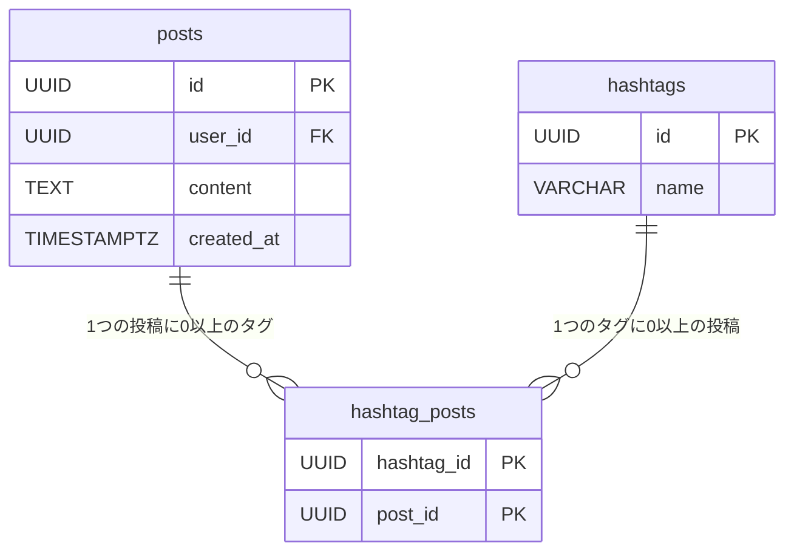
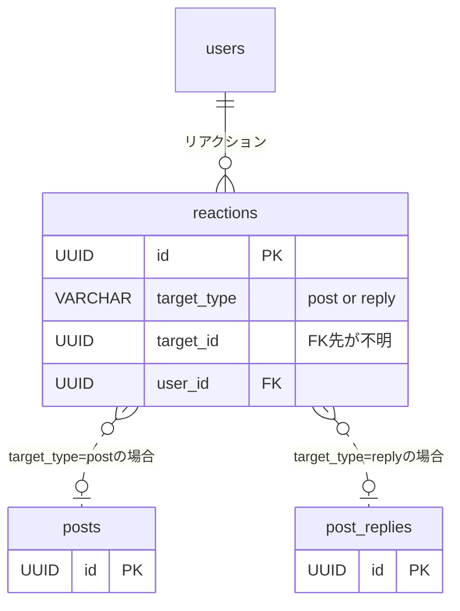
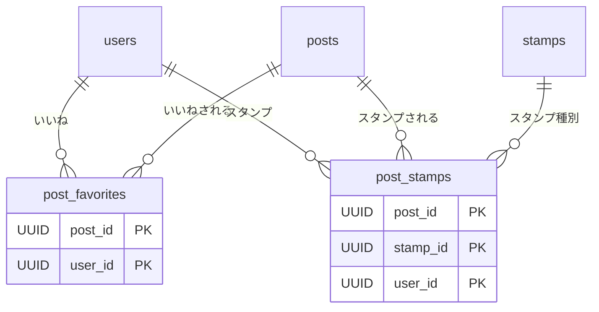
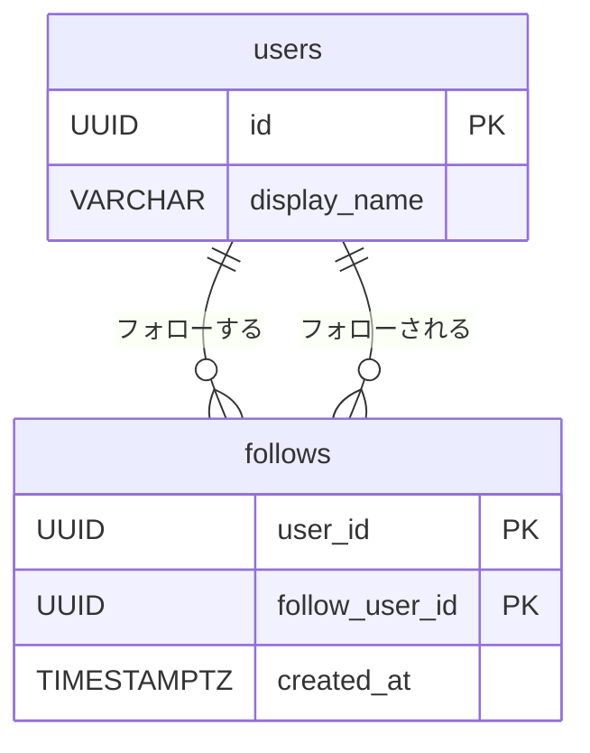
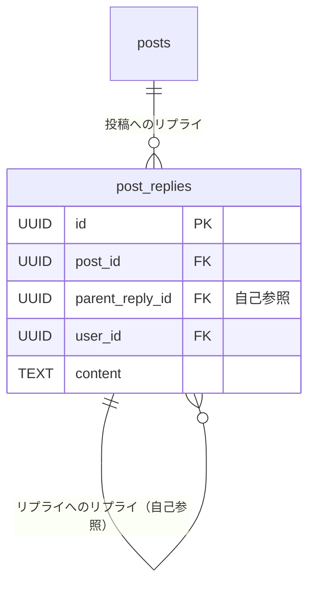

# テーブル設計のアンチパターン

> この章で学んだ SNS スキーマを題材に、よくあるテーブル設計のアンチパターンを紹介します。
> 「なぜダメなのか」を EXPLAIN や具体的なクエリで体感してください。

---

## 1. ジェイウォーク（信号無視）

多対多の関係をカンマ区切り文字列で1カラムに押し込めるアンチパターンです。

### ❌ アンチパターン

投稿のタグをカンマ区切りで1つのカラムに格納する。

**テーブル定義（posts — タグをカンマ区切りで持つ場合）:**

| カラム名 | 型 | 説明 |
|---------|-----|------|
| id | UUID (UUIDv7) | 投稿ID（主キー） |
| user_id | UUID | 投稿者のユーザーID（FK → users） |
| content | TEXT | 投稿本文 |
| tags | TEXT | タグ（カンマ区切り、例: `'旅行,グルメ,写真'`） |
| created_at | TIMESTAMPTZ | 投稿日時 |

サンプルデータ:

| id | user_id | content | tags | created_at |
|----|---------|---------|------|------------|
| 01906b1a-... | 01905a3b-... | 京都旅行の写真です | 旅行,写真,京都 | 2025-10-01 09:00:00+09 |
| 01906b1b-... | 01905a3c-... | 新しいカフェを発見 | グルメ,カフェ | 2025-10-01 11:30:00+09 |
| 01906b1c-... | 01905a3d-... | 今日のランニング記録 | NULL | 2025-10-02 14:00:00+09 |

```sql
CREATE TABLE posts (
    id         UUID PRIMARY KEY DEFAULT gen_random_uuid(),
    user_id    UUID NOT NULL REFERENCES users(id),
    content    TEXT NOT NULL,
    tags       TEXT, -- '旅行,グルメ,写真'
    created_at TIMESTAMPTZ NOT NULL DEFAULT NOW()
);
```

タグで検索するには LIKE を使うしかない。

```sql
-- 「旅行」タグの投稿を取得
SELECT * FROM posts WHERE tags LIKE '%旅行%';
-- → 「旅行記」「海外旅行」にもヒットしてしまう
```

### ✅ 正しい設計

hashtags マスタテーブルと hashtag_posts 中間テーブルで正規化する。

**テーブル定義（hashtags — タグマスタ）:**

| カラム名 | 型 | 説明 |
|---------|-----|------|
| id | UUID (UUIDv7) | タグID（主キー） |
| name | VARCHAR(100) | タグ名（ユニーク） |
| created_at | TIMESTAMPTZ | 作成日時 |

サンプルデータ:

| id | name | created_at |
|----|------|------------|
| 01907c1a-... | 旅行 | 2025-06-01 00:00:00+09 |
| 01907c1b-... | グルメ | 2025-06-01 00:00:00+09 |
| 01907c1c-... | 写真 | 2025-06-01 00:00:00+09 |

**テーブル定義（hashtag_posts — 投稿とタグの紐付け）:**

| カラム名 | 型 | 説明 |
|---------|-----|------|
| hashtag_id | UUID | タグID（PK・FK → hashtags） |
| post_id | UUID | 投稿ID（PK・FK → posts） |
| created_at | TIMESTAMPTZ | 紐付け日時 |

サンプルデータ:

| hashtag_id | post_id | created_at |
|------------|---------|------------|
| 01907c1a-... (旅行) | 01906b1a-... | 2025-10-01 09:00:00+09 |
| 01907c1c-... (写真) | 01906b1a-... | 2025-10-01 09:00:00+09 |
| 01907c1b-... (グルメ) | 01906b1b-... | 2025-10-01 11:30:00+09 |



```sql
-- 「旅行」タグの投稿を正確に取得
SELECT p.*
FROM   posts p
JOIN   hashtag_posts hp ON hp.post_id = p.id
JOIN   hashtags h       ON h.id = hp.hashtag_id
WHERE  h.name = '旅行';
```

### なぜダメなのか

- **LIKE '%旅行%'** は前方一致でないためインデックスが効かず、必ず Seq Scan になる
- タグ別の投稿数集計（`GROUP BY`）が文字列操作なしには不可能
- 外部キー制約を設定できないため、存在しないタグを格納できてしまう
- カンマ区切り文字列のパースはアプリケーション側の責務になり、バグの温床になる

> 💡 「1つのカラムに複数の値を入れたい」と感じたら、中間テーブルが必要なサインです。

---

## 2. マルチカラムアトリビュート（複数列属性）

同じ意味のカラムを連番で並べるアンチパターンです。ジェイウォークの変種とも言えます。

### ❌ アンチパターン

タグを固定数のカラムで持つ。

**テーブル定義（posts — タグを固定カラムで持つ場合）:**

| カラム名 | 型 | 説明 |
|---------|-----|------|
| id | UUID (UUIDv7) | 投稿ID（主キー） |
| user_id | UUID | 投稿者のユーザーID（FK → users） |
| content | TEXT | 投稿本文 |
| tag1 | VARCHAR(100) | タグ1（NULL可） |
| tag2 | VARCHAR(100) | タグ2（NULL可） |
| tag3 | VARCHAR(100) | タグ3（NULL可） |
| created_at | TIMESTAMPTZ | 投稿日時 |

サンプルデータ:

| id | user_id | content | tag1 | tag2 | tag3 | created_at |
|----|---------|---------|------|------|------|------------|
| 01906b1a-... | 01905a3b-... | 京都旅行の写真です | 旅行 | 写真 | 京都 | 2025-10-01 09:00:00+09 |
| 01906b1b-... | 01905a3c-... | 新しいカフェを発見 | グルメ | カフェ | NULL | 2025-10-01 11:30:00+09 |
| 01906b1c-... | 01905a3d-... | 今日のランニング記録 | NULL | NULL | NULL | 2025-10-02 14:00:00+09 |

```sql
CREATE TABLE posts (
    id         UUID PRIMARY KEY DEFAULT gen_random_uuid(),
    user_id    UUID NOT NULL REFERENCES users(id),
    content    TEXT NOT NULL,
    tag1       VARCHAR(100),
    tag2       VARCHAR(100),
    tag3       VARCHAR(100),
    created_at TIMESTAMPTZ NOT NULL DEFAULT NOW()
);
```

```sql
-- 「旅行」タグの投稿を検索するには全カラムを調べる必要がある
SELECT * FROM posts
WHERE tag1 = '旅行' OR tag2 = '旅行' OR tag3 = '旅行';
```

### ✅ 正しい設計

hashtag_posts 中間テーブルで多対多を表現する（ジェイウォークと同じ解決策）。

```sql
-- 中間テーブルなら何個でもタグを付けられる
INSERT INTO hashtag_posts (hashtag_id, post_id) VALUES
    (:'tag_travel', :'post_id'),
    (:'tag_gourmet', :'post_id'),
    (:'tag_photo',   :'post_id'),
    (:'tag_outdoor', :'post_id');  -- 4個目以降も問題なし
```

### なぜダメなのか

- タグ数の上限が固定される（3列なら最大3個）。4個目が必要になったら `ALTER TABLE` が必要
- 使われていないカラムは NULL だらけになり、ストレージを無駄に消費する
- `WHERE tag1 = X OR tag2 = X OR tag3 = X` はインデックスの効率が悪く、カラム追加のたびにクエリも修正が必要
- ユニーク制約で「同じ投稿に同じタグを2回付けない」を保証するのが困難

> 💡 カラム名に連番が付いたら危険信号。行として展開できないか検討しましょう。

---

## 3. EAV（エンティティ・アトリビュート・バリュー）

属性名と値をすべて行に押し込む汎用テーブルのアンチパターンです。

### ❌ アンチパターン

ユーザーの属性を汎用的な key-value 形式で格納する。

**テーブル定義（user_attributes — EAV 方式）:**

| カラム名 | 型 | 説明 |
|---------|-----|------|
| user_id | UUID | ユーザーID（PK・FK → users） |
| attribute_name | VARCHAR(100) | 属性名（PK、例: `'display_name'`） |
| attribute_value | TEXT | 属性値（型に関わらず全て TEXT） |

サンプルデータ:

| user_id | attribute_name | attribute_value |
|---------|---------------|----------------|
| 01905a3b-... | display_name | 田中 花子 |
| 01905a3b-... | bio | 日常のことをつぶやきます。 |
| 01905a3b-... | website | https://example.com |
| 01905a3c-... | display_name | 鈴木 一郎 |
| 01905a3c-... | bio | 技術ブログも書いています。 |

```sql
CREATE TABLE user_attributes (
    user_id         UUID NOT NULL REFERENCES users(id),
    attribute_name  VARCHAR(100) NOT NULL,
    attribute_value TEXT,
    PRIMARY KEY (user_id, attribute_name)
);
```

```sql
-- display_name を取得するだけで WHERE 句に属性名の指定が必要
SELECT ua.attribute_value AS display_name
FROM   user_attributes ua
WHERE  ua.user_id = :'user_id'
AND    ua.attribute_name = 'display_name';
```

### ✅ 正しい設計

users テーブルに直接カラムを定義する。

**テーブル定義（users — カラムを直接定義）:**

| カラム名 | 型 | 説明 |
|---------|-----|------|
| id | UUID (UUIDv7) | ユーザーID（主キー） |
| display_name | VARCHAR(100) | 表示名 |
| bio | TEXT | プロフィール文（NULL可） |
| created_at | TIMESTAMPTZ | 登録日時 |

サンプルデータ:

| id | display_name | bio | created_at |
|----|-------------|-----|------------|
| 01905a3b-... | 田中 花子 | 日常のことをつぶやきます。 | 2025-06-15 09:23:00+09 |
| 01905a3c-... | 鈴木 一郎 | 技術ブログも書いています。 | 2025-07-02 14:05:00+09 |
| 01905a3d-... | 佐藤 美咲 | NULL | 2025-08-20 18:44:00+09 |

```sql
-- シンプルにカラムを参照するだけ
SELECT display_name, bio FROM users WHERE id = :'user_id';
```

### なぜダメなのか

- **型制約が効かない**: `attribute_value` が TEXT 型なので、数値や日付に対する型チェックができない
- **NOT NULL 制約が使えない**: 必須項目かどうかをスキーマレベルで保証できない
- **1ユーザーの全属性取得に自己結合かピボットが必要**: 属性が増えるほど JOIN の嵐になる
- EXPLAIN で見ると、属性ごとにインデックスを細かく使い分けることが困難で、全件スキャンになりやすい

> 💡 EAV は「柔軟な設計」に見えますが、リレーショナルDBの強みを全て捨てることになります。本当に動的な属性が必要なら PostgreSQL の JSONB カラムを検討しましょう。

---

## 4. ポリモーフィック関連

1つの外部キーカラムが複数のテーブルを指すアンチパターンです。

### ❌ アンチパターン

投稿とリプライの両方に対するリアクションを1テーブルにまとめる。

**テーブル定義（reactions — ポリモーフィック方式）:**

| カラム名 | 型 | 説明 |
|---------|-----|------|
| id | UUID (UUIDv7) | リアクションID（主キー） |
| target_type | VARCHAR(20) | 対象の種類（`'post'` または `'reply'`） |
| target_id | UUID | 対象のID（posts.id **または** post_replies.id） |
| user_id | UUID | リアクションしたユーザーID（FK → users） |
| reaction_type | VARCHAR(20) | リアクション種別（`'like'`, `'stamp'` 等） |
| created_at | TIMESTAMPTZ | リアクション日時 |

サンプルデータ:

| id | target_type | target_id | user_id | reaction_type | created_at |
|----|------------|-----------|---------|--------------|------------|
| 01908a1a-... | post | 01906b1a-... | 01905a3c-... | like | 2025-10-01 10:00:00+09 |
| 01908a1b-... | post | 01906b1a-... | 01905a3d-... | stamp | 2025-10-01 10:05:00+09 |
| 01908a1c-... | reply | 01907d1a-... | 01905a3b-... | like | 2025-10-01 11:00:00+09 |



```sql
-- JOINする場合は CASE 文が必要
SELECT r.*, COALESCE(p.content, pr.content) AS target_content
FROM   reactions r
LEFT JOIN posts        p  ON r.target_type = 'post'  AND r.target_id = p.id
LEFT JOIN post_replies pr ON r.target_type = 'reply' AND r.target_id = pr.id;
```

### ✅ 正しい設計

対象テーブルごとにリアクションテーブルを分離する。

**テーブル定義（post_favorites — 投稿へのいいね）:**

| カラム名 | 型 | 説明 |
|---------|-----|------|
| post_id | UUID | 投稿ID（PK・FK → posts） |
| user_id | UUID | ユーザーID（PK・FK → users） |
| created_at | TIMESTAMPTZ | いいね日時 |

**テーブル定義（post_stamps — 投稿へのスタンプ）:**

| カラム名 | 型 | 説明 |
|---------|-----|------|
| post_id | UUID | 投稿ID（PK・FK → posts） |
| stamp_id | UUID | スタンプID（PK・FK → stamps） |
| user_id | UUID | ユーザーID（PK・FK → users） |
| created_at | TIMESTAMPTZ | スタンプ日時 |

サンプルデータ（post_favorites）:

| post_id | user_id | created_at |
|---------|---------|------------|
| 01906b1a-... | 01905a3c-... | 2025-10-01 10:00:00+09 |
| 01906b1a-... | 01905a3d-... | 2025-10-01 10:05:00+09 |
| 01906b1b-... | 01905a3b-... | 2025-10-01 12:30:00+09 |



### なぜダメなのか

- **外部キー制約が使えない**: `target_id` が `posts.id` か `post_replies.id` か DB 側で判別できないため、REFERENCES を設定できない
- 存在しない target_id を格納できてしまい、データの整合性が壊れる
- JOIN に必ず `target_type` の条件分岐が入り、クエリが複雑になる
- インデックスの効率が落ちる（`target_type` と `target_id` の複合インデックスが必要）

> 💡 「type カラムで参照先を切り替える」設計を見たら、テーブル分割を検討しましょう。テーブルが増えることを恐れる必要はありません。

---

## 5. キーレスエントリ（外部キー嫌い）

「パフォーマンスのために」外部キー制約を付けない設計のアンチパターンです。

### ❌ アンチパターン

follows テーブルに REFERENCES を付けない。

**テーブル定義（follows — FK制約なし）:**

| カラム名 | 型 | 説明 |
|---------|-----|------|
| user_id | UUID | フォローするユーザーのID（**REFERENCES なし**） |
| follow_user_id | UUID | フォローされるユーザーのID（**REFERENCES なし**） |
| created_at | TIMESTAMPTZ | フォロー日時 |

サンプルデータ:

| user_id | follow_user_id | created_at |
|---------|---------------|------------|
| 01905a3b-... | 01905a3c-... | 2025-07-10 10:00:00+09 |
| 01905a3b-... | **00000000-0000-...** | 2025-08-05 15:30:00+09 |
| **00000000-0000-...** | 01905a3b-... | 2025-09-01 12:00:00+09 |

> ⚠️ **太字** の UUID は存在しないユーザー。FK制約がないためエラーにならず INSERT できてしまう。

```sql
CREATE TABLE follows (
    user_id        UUID NOT NULL, -- REFERENCES なし
    follow_user_id UUID NOT NULL, -- REFERENCES なし
    created_at     TIMESTAMPTZ NOT NULL DEFAULT NOW(),
    PRIMARY KEY (user_id, follow_user_id)
);
```

### ✅ 正しい設計

全ての外部キーに REFERENCES と CHECK 制約を設定する。

**テーブル定義（follows — FK制約あり）:**

| カラム名 | 型 | 説明 |
|---------|-----|------|
| user_id | UUID | フォローするユーザーID（PK・FK → users） |
| follow_user_id | UUID | フォローされるユーザーID（PK・FK → users） |
| created_at | TIMESTAMPTZ | フォロー日時 |

> CHECK制約: `user_id <> follow_user_id`（自分自身のフォローを防止）



```sql
-- 存在しないユーザーへのフォローはエラーになる
INSERT INTO follows (user_id, follow_user_id, created_at)
VALUES ('00000000-0000-0000-0000-000000000000',
        '00000000-0000-0000-0000-000000000001',
        NOW());
-- → ERROR: insert or update on table "follows" violates foreign key constraint
```

### なぜダメなのか

- **孤立レコード**: 参照先が削除されても参照元が残り、データが矛盾する
- **デバッグ地獄**: 「存在しないユーザーのフォロー」のような不整合が原因のバグは再現しにくく、発見も遅れる
- アプリケーション層で整合性を担保しようとすると、バリデーションの漏れが不整合を生む

> 💡 「FK制約はパフォーマンスを下げる」は間違いではありませんが、影響は INSERT/UPDATE/DELETE 時のチェックだけです。データの整合性と引き換えにするのは最後の最後の手段です。

---

## 6. IDリクワイアド（とりあえずID）

全てのテーブルに `id SERIAL PRIMARY KEY` を機械的に付けるアンチパターンです。

### ❌ アンチパターン

中間テーブルに不要なサロゲートキーを追加する。

**テーブル定義（follows — 不要なサロゲートキー付き）:**

| カラム名 | 型 | 説明 |
|---------|-----|------|
| id | SERIAL | 連番ID（**不要な**主キー） |
| user_id | UUID | フォローするユーザーのID（FK → users） |
| follow_user_id | UUID | フォローされるユーザーのID（FK → users） |
| created_at | TIMESTAMPTZ | フォロー日時 |

> UNIQUE(user_id, follow_user_id) を忘れると重複フォローが可能に…

サンプルデータ:

| id | user_id | follow_user_id | created_at |
|----|---------|---------------|------------|
| 1 | 01905a3b-... | 01905a3c-... | 2025-07-10 10:00:00+09 |
| 2 | 01905a3b-... | 01905a3d-... | 2025-08-05 15:30:00+09 |
| **3** | **01905a3b-...** | **01905a3c-...** | **2025-09-01 12:00:00+09** |

> ⚠️ id=1 と id=3 は同じ (user_id, follow_user_id) のペア。UNIQUE 制約を付け忘れると重複レコードが生まれる。

```sql
CREATE TABLE follows (
    id             SERIAL PRIMARY KEY,  -- 不要なサロゲートキー
    user_id        UUID NOT NULL REFERENCES users(id),
    follow_user_id UUID NOT NULL REFERENCES users(id),
    created_at     TIMESTAMPTZ NOT NULL DEFAULT NOW(),
    UNIQUE (user_id, follow_user_id)    -- 重複防止に別途 UNIQUE が必要
);
```

### ✅ 正しい設計

中間テーブルは複合主キーで設計する。

**テーブル定義（follows — 複合主キー）:**

| カラム名 | 型 | 説明 |
|---------|-----|------|
| user_id | UUID | フォローするユーザーID（PK・FK → users） |
| follow_user_id | UUID | フォローされるユーザーID（PK・FK → users） |
| created_at | TIMESTAMPTZ | フォロー日時 |

> PRIMARY KEY (user_id, follow_user_id) だけで一意性が保証される。

```sql
CREATE TABLE follows (
    user_id        UUID NOT NULL REFERENCES users(id),
    follow_user_id UUID NOT NULL REFERENCES users(id),
    created_at     TIMESTAMPTZ NOT NULL DEFAULT NOW(),
    PRIMARY KEY (user_id, follow_user_id),
    CHECK (user_id <> follow_user_id)
);
```

### なぜダメなのか

- **余分なインデックス**: `id` のプライマリキーインデックスと `(user_id, follow_user_id)` の UNIQUE インデックスで、実質2つのインデックスを持つことになる
- **ストレージの無駄**: 不要な `id` カラムとそのインデックスが全行分のディスクを消費する
- **重複防止を UNIQUE 制約に頼る**: PRIMARY KEY で自然に保証される一意性を、別途制約で再定義する冗長な設計になる
- SNS スキーマでは follows, post_favorites, hashtag_posts, hashtag_follows, user_blocks, user_mutes の6テーブルが複合主キーを採用している

> 💡 「そのテーブルの行を一意に識別する自然な組み合わせは何か」を考え、中間テーブルには複合主キーを使いましょう。

---

## 7. インデックスショットガン（闇雲インデックス）

「遅い」と言われたら全カラムにインデックスを張ってしまうアンチパターンです。

### ❌ アンチパターン

posts テーブルの全カラムにインデックスを作成する。

```sql
CREATE INDEX idx_posts_id         ON posts(id);          -- PK で既にある
CREATE INDEX idx_posts_user_id    ON posts(user_id);
CREATE INDEX idx_posts_content    ON posts(content);     -- TEXT全文にB-tree
CREATE INDEX idx_posts_created_at ON posts(created_at);
```

### ✅ 正しい設計

EXPLAIN ANALYZE でボトルネックを特定してから、必要なインデックスだけを追加する。

```sql
-- まず実行計画を確認
EXPLAIN ANALYZE
SELECT p.id, p.content, p.created_at
FROM   posts p
WHERE  p.user_id = :'user_id'
ORDER BY p.created_at DESC
LIMIT 20;

-- Seq Scan が確認できたら、必要なインデックスだけ追加
CREATE INDEX idx_posts_user_id ON posts(user_id);
```

### なぜダメなのか

- **INSERT/UPDATE/DELETE が遅くなる**: データの変更時に全インデックスの更新が走る。posts テーブルに4個のインデックスがあれば、1行の INSERT で4回のインデックス更新が発生する
- **ストレージが増大する**: インデックスはテーブル本体とは別にディスクを消費する
- **オプティマイザが混乱する**: 似たようなインデックスが複数あると、プランナーがどれを使うか判断に迷い、かえって非最適な実行計画を選ぶことがある
- TEXT カラムへの B-tree インデックスは前方一致以外では使われず、無駄になる

> 💡 インデックスは「EXPLAIN ANALYZE で Seq Scan がボトルネックになっている箇所」にだけ追加するのが鉄則です。[02_indexing.md](02_indexing.md) の内容を復習しましょう。

---

## 8. カーディナリティの低いインデックス

値の種類が少ないカラムに単独インデックスを張るアンチパターンです。

### ❌ アンチパターン

boolean カラムや少数の値しか取らないカラムに単独インデックスを作成する。

```sql
-- users テーブルに is_active カラムがあると仮定
ALTER TABLE users ADD COLUMN is_active BOOLEAN NOT NULL DEFAULT TRUE;

CREATE INDEX idx_users_is_active ON users(is_active);
```

```sql
EXPLAIN ANALYZE SELECT * FROM users WHERE is_active = TRUE;
-- → 全体の90%が TRUE なので、オプティマイザはインデックスを無視して Seq Scan を選択
```

### ✅ 正しい設計

部分インデックスや複合インデックスの一部として活用する。

```sql
-- 部分インデックス: 「論理削除されていない投稿」だけをインデックス化
CREATE INDEX idx_posts_active_created
ON posts(created_at DESC)
WHERE deleted_at IS NULL;

-- 複合インデックスの一部として使う
CREATE INDEX idx_users_active_created
ON users(is_active, created_at DESC);
-- → is_active = TRUE AND created_at > '2025-01-01' のような絞り込みで有効
```

### なぜダメなのか

- **選択性が低い**: TRUE/FALSE の2値しかないカラムでは、インデックスを使っても全行の50%〜90%にアクセスすることになり、Seq Scan と大差ない
- **オプティマイザが無視する**: PostgreSQL のプランナーはコストを見積もり、インデックスを使うより Seq Scan の方が安いと判断する
- インデックスのストレージだけが無駄に消費される

> 💡 [02_indexing.md](02_indexing.md) で学んだ部分インデックス（`WHERE deleted_at IS NULL`）を使えば、低カーディナリティのカラムでもインデックスを有効活用できます。

---

## 9. ナイーブツリー（素朴な木）

木構造を隣接リストだけで表現し、深い階層の取得に苦しむアンチパターンです。

### ❌ アンチパターン

リプライにスレッド構造（リプライへのリプライ）を持たせる場合に、`parent_reply_id` だけで木構造を表現する。

**テーブル定義（post_replies — 隣接リスト方式）:**

| カラム名 | 型 | 説明 |
|---------|-----|------|
| id | UUID (UUIDv7) | コメントID（主キー） |
| post_id | UUID | 投稿ID（FK → posts） |
| parent_reply_id | UUID | 親リプライID（FK → post_replies、NULL=ルート） |
| user_id | UUID | コメントしたユーザーID（FK → users） |
| content | TEXT | コメント本文 |
| created_at | TIMESTAMPTZ | コメント日時 |

サンプルデータ（スレッドの例）:

| id | post_id | parent_reply_id | user_id | content | created_at |
|----|---------|----------------|---------|---------|------------|
| 01907d1a-... | 01906b1a-... | NULL | 01905a3c-... | いい写真ですね！ | 2025-10-01 10:00:00+09 |
| 01907d1b-... | 01906b1a-... | 01907d1a-... | 01905a3b-... | ありがとう！ | 2025-10-01 10:05:00+09 |
| 01907d1c-... | 01906b1a-... | 01907d1b-... | 01905a3d-... | 私も行きたい！ | 2025-10-01 10:10:00+09 |
| 01907d1d-... | 01906b1a-... | 01907d1c-... | 01905a3c-... | 一緒に行こう！ | 2025-10-01 10:15:00+09 |



```sql
-- スレッド全体を取得するには再帰 CTE が必要
WITH RECURSIVE thread AS (
    SELECT id, content, parent_reply_id, 1 AS depth
    FROM   post_replies
    WHERE  post_id = :'post_id' AND parent_reply_id IS NULL

    UNION ALL

    SELECT r.id, r.content, r.parent_reply_id, t.depth + 1
    FROM   post_replies r
    JOIN   thread t ON r.parent_reply_id = t.id
)
SELECT * FROM thread;
-- → スレッドが深くなると再帰の回数が増え、パフォーマンスが劣化
```

### ✅ 正しい設計

現在の post_replies は投稿に対する1階層のリプライに限定しており、この問題を回避している。

**テーブル定義（post_replies — フラット方式）:**

| カラム名 | 型 | 説明 |
|---------|-----|------|
| id | UUID (UUIDv7) | コメントID（主キー） |
| post_id | UUID | 投稿ID（FK → posts） |
| user_id | UUID | コメントしたユーザーID（FK → users） |
| content | TEXT | コメント本文 |
| created_at | TIMESTAMPTZ | コメント日時 |

```sql
-- 投稿のリプライ一覧は単純な SELECT で取得できる
SELECT id, user_id, content, created_at
FROM   post_replies
WHERE  post_id = :'post_id'
ORDER BY created_at;
```

### なぜダメなのか

- **再帰 CTE の実行コスト**: 階層が深くなるほど再帰回数が増え、メモリ使用量と実行時間が増加する
- **サブツリーの削除が複雑**: ある返信を削除する場合、その下にぶら下がる全リプライも再帰的に削除する必要がある
- **特定の深さまでの取得が困難**: 「3階層目まで」のような制限付き取得は再帰 CTE に `WHERE depth <= 3` を追加する必要があり、無駄な再帰が発生する

深い木構造が必要な場合の代替案:

| 方式 | 特徴 |
|------|------|
| 閉包テーブル (Closure Table) | 全ての先祖-子孫関係を別テーブルに保持。読み取りは速いが、ノード追加時に先祖分の行を挿入する必要がある |
| パス列挙 (Materialized Path) | `path = '/1/5/12/'` のようにルートからの経路を文字列で持つ。前方一致で子孫を検索可能 |
| 入れ子集合 (Nested Set) | 左右の番号で範囲管理。読み取りは高速だが、挿入・削除で番号の振り直しが重い |

> 💡 現在の SNS スキーマのように、ビジネス要件で木構造の深さを制限できるなら、隣接リストを使わないことが最もシンプルな解決策です。

---

## 10. ソフトデリート（論理削除）

削除フラグ（`deleted_at`）を使った論理削除のアンチパターンです。

### ❌ アンチパターン

posts テーブルに `deleted_at` カラムを追加して論理削除する。

**テーブル定義（posts — 論理削除カラム付き）:**

| カラム名 | 型 | 説明 |
|---------|-----|------|
| id | UUID (UUIDv7) | 投稿ID（主キー） |
| user_id | UUID | 投稿者のユーザーID（FK → users） |
| content | TEXT | 投稿本文 |
| created_at | TIMESTAMPTZ | 投稿日時 |
| deleted_at | TIMESTAMPTZ | 削除日時（NULL = 有効、値あり = 削除済み） |

サンプルデータ:

| id | user_id | content | created_at | deleted_at |
|----|---------|---------|------------|------------|
| 01906b1a-... | 01905a3b-... | 今日は天気が良いですね！ | 2025-10-01 09:00:00+09 | NULL |
| 01906b1b-... | 01905a3c-... | 間違えて投稿しました | 2025-10-01 11:30:00+09 | **2025-10-01 11:35:00+09** |
| 01906b1c-... | 01905a3d-... | 京都旅行の写真を整理中 | 2025-10-02 14:00:00+09 | NULL |
| 01906b1d-... | 01905a3b-... | テスト投稿（消し忘れ） | 2025-10-02 19:30:00+09 | **2025-10-03 08:00:00+09** |

```sql
-- 全てのクエリに WHERE deleted_at IS NULL を追加しなければならない
SELECT p.id, p.content, u.display_name
FROM   posts p
JOIN   users u ON u.id = p.user_id
WHERE  p.user_id = :'user_id'
AND    p.deleted_at IS NULL  -- これを忘れると削除済み投稿が表示される
ORDER BY p.created_at DESC
LIMIT 20;
```

### ✅ 正しい設計

論理削除が本当に必要な場合は、部分インデックスとセットで運用する。あるいはアーカイブテーブルへ移動する。

```sql
-- 対策1: 部分インデックスで「有効な投稿」だけを高速に検索可能にする
CREATE INDEX idx_posts_user_active
ON posts(user_id, created_at DESC)
WHERE deleted_at IS NULL;

-- 対策2: アーカイブテーブルに移動する（物理削除 + 履歴保存）
CREATE TABLE posts_archive (LIKE posts INCLUDING ALL);

-- 削除時にアーカイブへ移動
WITH deleted AS (
    DELETE FROM posts WHERE id = :'post_id' RETURNING *
)
INSERT INTO posts_archive SELECT * FROM deleted;
```

### なぜダメなのか

- **全クエリにフィルタが必須**: `WHERE deleted_at IS NULL` を1箇所でも忘れると、削除したはずのデータが表示される
- **インデックスの肥大化**: 削除済みの行もインデックスに含まれるため、インデックスサイズが膨らみ、検索効率が落ちる
- **UNIQUE制約が効かなくなる**: 例えば `UNIQUE(name)` があるテーブルで論理削除すると、削除済みの name と同じ値を INSERT できなくなる（削除済みの行が UNIQUE 制約に引っかかる）
- 外部キーで参照されているレコードを論理削除すると、参照元からは「存在する」ように見えるため不整合が生じる

> 💡 論理削除は「復元機能が必須」「監査ログとして残す必要がある」場合にのみ検討しましょう。アーカイブテーブルへの移動は、元テーブルのパフォーマンスを維持しつつ履歴を残せる良い代替案です。

---

## 11. God Table（神テーブル）

全ての情報を1つの巨大テーブルに詰め込むアンチパターンです。

### ❌ アンチパターン

ユーザー、投稿、リプライ、いいね数、フォロー数を1テーブルにまとめる。

**テーブル定義（everything — 全部入りテーブル）:**

| カラム名 | 型 | 説明 |
|---------|-----|------|
| id | UUID (UUIDv7) | 行ID（主キー） |
| user_name | VARCHAR(100) | ユーザー名（ユーザー行のみ） |
| user_bio | TEXT | プロフィール（ユーザー行のみ） |
| post_content | TEXT | 投稿本文（投稿行のみ） |
| reply_content | TEXT | リプライ本文（リプライ行のみ） |
| reply_to_post | UUID | リプライ先投稿ID（リプライ行のみ） |
| like_count | INTEGER | いいね数 |
| follower_count | INTEGER | フォロワー数 |
| following_count | INTEGER | フォロー数 |
| created_at | TIMESTAMPTZ | 作成日時 |

サンプルデータ:

| id | user_name | user_bio | post_content | reply_content | reply_to_post | like_count | follower_count | following_count | created_at |
|----|-----------|----------|-------------|--------------|---------------|-----------|---------------|----------------|------------|
| 01905a3b-... | 田中 花子 | 日常のこと... | NULL | NULL | NULL | NULL | 120 | 45 | 2025-06-15 ... |
| 01906b1a-... | NULL | NULL | 今日は天気が良い | NULL | NULL | 15 | NULL | NULL | 2025-10-01 ... |
| 01907d1a-... | NULL | NULL | NULL | いい写真ですね！ | 01906b1a-... | NULL | NULL | NULL | 2025-10-01 ... |

> ⚠️ 1行あたり10カラム中、常に5〜7カラムが NULL。行の意味がカラムの値の有無で決まるため、構造から意味を読み取ることが不可能。

### ✅ 正しい設計

責務ごとにテーブルを分割する（現在の12テーブル構成）。

```sql
-- 各テーブルが1つの責務を持つ
-- users:          ユーザー情報
-- posts:          投稿
-- post_replies:   リプライ
-- post_favorites: いいね
-- follows:        フォロー関係
-- （他7テーブル）
```

詳細は [00_schema.md](00_schema.md) を参照。

### なぜダメなのか

- **更新異常**: ユーザー名を変更するとき、そのユーザーの全投稿行の `user_name` を更新する必要がある
- **NULL だらけ**: 投稿行にはリプライ系カラムが NULL、リプライ行にはフォロー数カラムが NULL になる
- **ロック競合**: 1つのテーブルに全操作が集中するため、書き込みが多い環境では行ロック・テーブルロックの競合が発生する
- テーブルの意味（ドメイン）が曖昧になり、開発者が正しい使い方を理解できなくなる

> 💡 これは第1章（正規化）の復習です。「1テーブル = 1つの事実」の原則を守りましょう。

---

## 12. インプリシットカラム（暗黙のカラム）

`SELECT *` を多用し、必要なカラムを明示しないアンチパターンです。

### ❌ アンチパターン

全カラムを取得する。

```sql
SELECT * FROM posts p
JOIN users u ON u.id = p.user_id
WHERE p.user_id = :'user_id'
ORDER BY p.created_at DESC
LIMIT 20;
```

### ✅ 正しい設計

必要なカラムだけを明示的に指定する。

```sql
SELECT p.id, p.content, p.created_at, u.display_name
FROM   posts p
JOIN   users u ON u.id = p.user_id
WHERE  p.user_id = :'user_id'
ORDER BY p.created_at DESC
LIMIT 20;
```

カバリングインデックスとの組み合わせで Index Only Scan が可能になる。

```sql
-- カバリングインデックス（INCLUDE で必要なカラムを含める）
CREATE INDEX idx_posts_user_covering
ON posts(user_id, created_at DESC) INCLUDE (id, content);

-- EXPLAIN で Index Only Scan を確認
EXPLAIN ANALYZE
SELECT p.id, p.content, p.created_at
FROM   posts p
WHERE  p.user_id = :'user_id'
ORDER BY p.created_at DESC
LIMIT 20;
-- → Index Only Scan using idx_posts_user_covering（ヒープアクセスなし）
```

### なぜダメなのか

- **ネットワーク転送量の増大**: 不要なカラム（例: `bio` の長いテキスト）も転送されるため、通信量が無駄に増える
- **カバリングインデックスが使えない**: `SELECT *` ではインデックスに含まれないカラムも要求するため、必ずヒープ（テーブル本体）へのアクセスが発生し、Index Only Scan が選択されない
- **スキーマ変更で壊れる**: カラムの追加・削除・型変更があると、`SELECT *` に依存するクエリやアプリケーションコードが予期せず壊れる
- 結合で同名カラム（例: `id`, `created_at`）が衝突し、アプリケーション側で区別できなくなる

> 💡 [02_indexing.md](02_indexing.md) で学んだ INCLUDE カバリングインデックスの効果を最大限に引き出すためにも、カラムは明示的に指定しましょう。

---

## 13. フィア・オブ・ザ・アンノウン（NULL恐怖症）

NULL を恐れて空文字列やマジックナンバーで代用するアンチパターンです。

### ❌ アンチパターン

NULL の代わりに空文字列を使う。

```sql
CREATE TABLE users (
    id           UUID PRIMARY KEY DEFAULT gen_random_uuid(),
    display_name VARCHAR(100) NOT NULL,
    bio          TEXT NOT NULL DEFAULT '', -- NULL の代わりに空文字列
    created_at   TIMESTAMPTZ NOT NULL DEFAULT NOW()
);
```

```sql
-- 「プロフィール未設定」のユーザーを検索
SELECT * FROM users WHERE bio = '';

-- 「プロフィールを設定したが空にした」ユーザーも同じ結果に混ざる
-- → 「未設定」と「意図的に空にした」の区別ができない
```

### ✅ 正しい設計

NULL を正しく使い分ける。

```sql
-- 現在のスキーマ
CREATE TABLE users (
    id           UUID PRIMARY KEY DEFAULT gen_random_uuid(),
    display_name VARCHAR(100) NOT NULL,
    bio          TEXT,  -- NULL = 未設定、'' = 意図的に空にした
    created_at   TIMESTAMPTZ NOT NULL DEFAULT NOW()
);
```

```sql
-- プロフィール未設定のユーザー
SELECT * FROM users WHERE bio IS NULL;

-- プロフィールを設定済み（空含む）のユーザー
SELECT * FROM users WHERE bio IS NOT NULL;

-- プロフィールが入力されているユーザー
SELECT * FROM users WHERE bio IS NOT NULL AND bio != '';
```

### なぜダメなのか

- **意味の区別が消える**: 「未設定（NULL）」と「空（''）」は異なるビジネス上の意味を持つが、空文字列で統一するとこの区別が不可能になる
- **集計関数の挙動がおかしくなる**: `COUNT(bio)` は NULL を除外するが、空文字列は除外しない。「プロフィール設定率」の計算が不正確になる

```sql
-- NULL の場合: COUNT(bio) = 設定済みユーザー数（正確）
SELECT COUNT(bio) AS profiles_set, COUNT(*) AS total FROM users;

-- 空文字列の場合: COUNT(bio) = 全ユーザー数（未設定も含まれて不正確）
SELECT COUNT(bio) AS profiles_set, COUNT(*) AS total FROM users;
```

- **COALESCE の使いどころが消える**: NULL なら `COALESCE(bio, '未設定')` で表示を切り替えられるが、空文字列では `CASE WHEN bio = '' THEN '未設定' ELSE bio END` と冗長になる

> 💡 NULL は「値が存在しない」を表す SQL の正しい表現です。NULL の3値論理（TRUE / FALSE / UNKNOWN）を理解し、恐れずに使いましょう。
