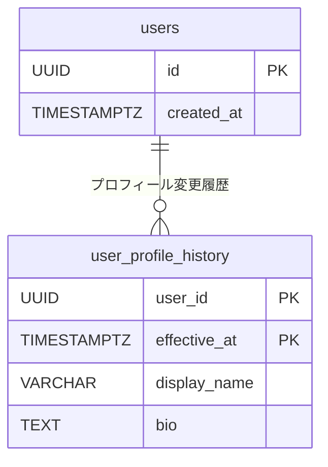
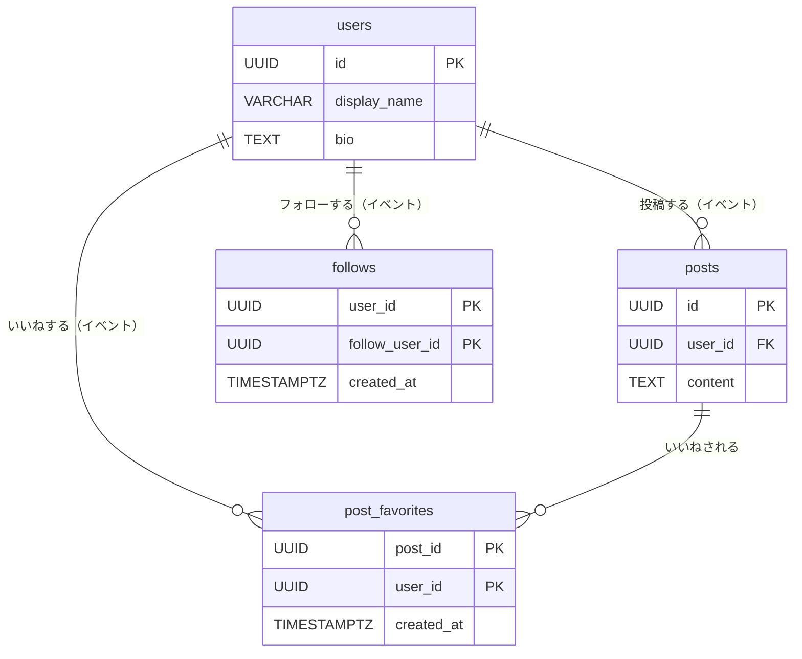
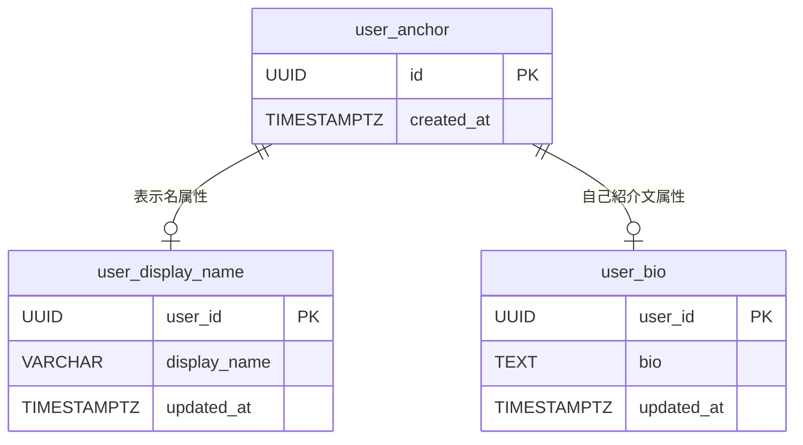
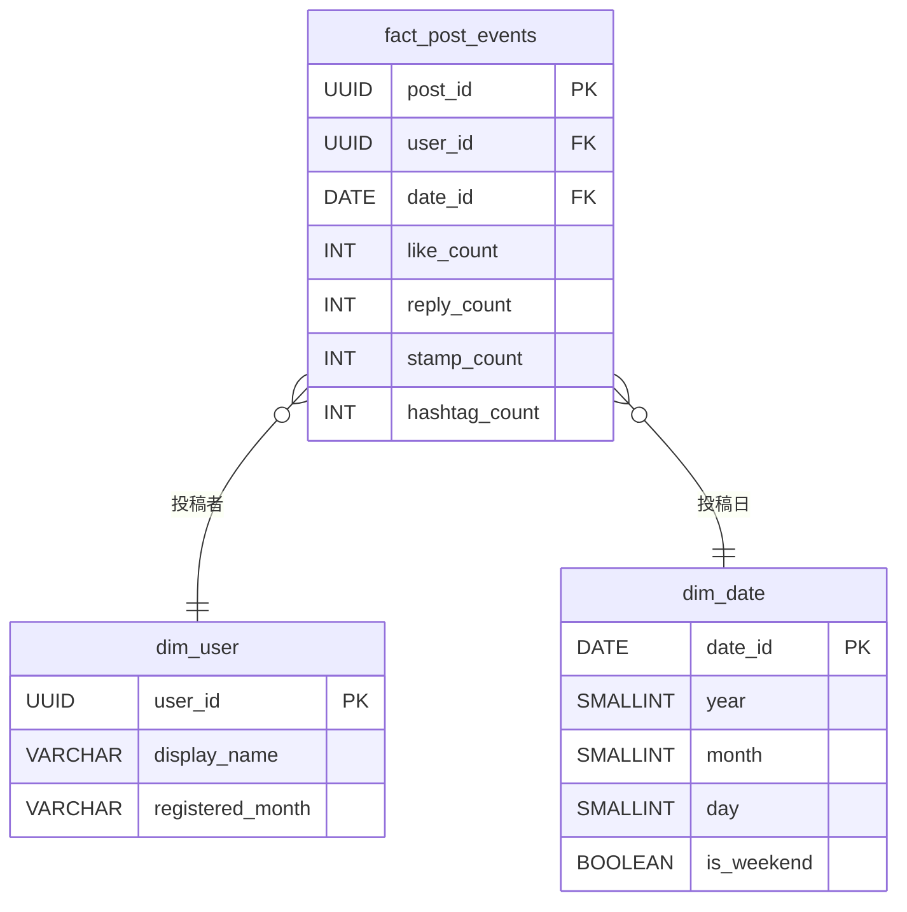

# テーブル設計モデルの比較

> 第1章では**正規化モデル**（1NF〜BCNF）を学びました。
> この章では、実務でよく登場する4つの設計思想を、SNSスキーマを題材に実例付きで紹介します。

---

## 1. イミュータブルモデル

### 概念

**「一度書いたレコードは変更しない」** という原則に基づく設計です。
UPDATE を禁止し、全ての変更を新しい行の INSERT として記録します。

正規化モデルが「データの重複排除」を重視するのに対して、イミュータブルモデルは **「いつ、どんな状態だったか」の完全な再現性** を重視します。

### 適用例

`users` テーブルでプロフィール（表示名・自己紹介文）が変更された場合を考えます。

**通常設計（UPDATE あり）**

**テーブル定義（users — 通常設計）:**

| カラム名 | 型 | 説明 |
|---------|-----|------|
| id | UUID (UUIDv7) | ユーザーID（PK） |
| display_name | VARCHAR(100) | 表示名（上書き更新・NOT NULL） |
| bio | TEXT | 自己紹介文（上書き更新） |
| created_at | TIMESTAMPTZ | 登録日時（NOT NULL） |

サンプルデータ（変更前）:

| id | display_name | bio | created_at |
|----|-------------|-----|------------|
| 01905a3b-... | 田中 花子 | 日常をつぶやきます。 | 2025-06-15 09:23:00+09 |

→ `UPDATE users SET display_name = '田中 花子🌸' WHERE id = ...` を実行すると過去の名前が消える。

---

**イミュータブル設計（INSERT のみ）**

**テーブル定義（users — イミュータブル設計）:**

| カラム名 | 型 | 説明 |
|---------|-----|------|
| id | UUID (UUIDv7) | ユーザーID（PK・不変） |
| created_at | TIMESTAMPTZ | アカウント作成日時（NOT NULL・不変） |

**テーブル定義（user_profile_history — プロフィール変更履歴）:**

| カラム名 | 型 | 説明 |
|---------|-----|------|
| user_id | UUID | ユーザーID（PK・FK → users） |
| effective_at | TIMESTAMPTZ | この行が有効になった日時（PK・NOT NULL） |
| display_name | VARCHAR(100) | 表示名（NOT NULL） |
| bio | TEXT | 自己紹介文 |

サンプルデータ:

| user_id | effective_at | display_name | bio |
|---------|-------------|-------------|-----|
| 01905a3b-... | 2025-06-15 09:23:00+09 | 田中 花子 | 日常をつぶやきます。 |
| 01905a3b-... | 2025-10-01 12:00:00+09 | 田中 花子🌸 | 日常をつぶやきます。秋が好き。 |
| 01905a3c-... | 2025-07-02 14:05:00+09 | 鈴木 一郎 | 技術ブログも書いています。 |



### クエリ例

**現在のプロフィールを取得（最新行のみ）**

```sql
-- DISTINCT ON で user_id ごとに effective_at が最大の行を1件取得
SELECT DISTINCT ON (uph.user_id)
    uph.user_id,
    uph.display_name,
    uph.bio,
    uph.effective_at
FROM user_profile_history uph
WHERE uph.user_id = :'user_id'
ORDER BY uph.user_id, uph.effective_at DESC;
```

**特定時点のプロフィールを取得（過去の再現）**

```sql
-- 2025-09-01 時点のプロフィールを取得
SELECT DISTINCT ON (uph.user_id)
    uph.user_id,
    uph.display_name,
    uph.bio
FROM user_profile_history uph
WHERE uph.user_id = :'user_id'
  AND uph.effective_at <= '2025-09-01 00:00:00+09'
ORDER BY uph.user_id, uph.effective_at DESC;
-- → 「田中 花子」が返る（10月の変更前なので）
```

### トレードオフ

| 観点 | 内容 |
|------|------|
| 過去の再現性 | 任意の時点の状態を完全に再現できる。監査ログ・障害調査に強い |
| 書き込みコスト | UPDATE がなく INSERT のみ。ストレージは増え続ける |
| 読み取り複雑度 | 「現在の値」を取得するのに `DISTINCT ON` や `MAX` が必要になる |
| 向いているケース | 契約・残高・設定変更など「いつ変わったか」が重要なデータ |

---

## 2. Theory of Models (TM)

### 概念

**「ビジネスに存在するものをリソースとイベントに分けて設計する」** 手法です。

- **リソース**: 独立して存在する実体（ユーザー、投稿、スタンプなど）
- **イベント**: リソース間で発生した出来事（フォロー、いいね、スタンプなど）

正規化が「データの重複を減らす」ことを目的とするのに対して、TM は **「ビジネスの構造をテーブル設計に直接反映する」** ことを目的とします。

### 適用例

現行の SNS スキーマは TM の考え方に沿っています。各テーブルをリソース/イベントに分類すると次のようになります。

**テーブル分類:**

| 分類 | テーブル名 | 説明 |
|------|-----------|------|
| リソース | users | 存在するユーザー |
| リソース | posts | 存在する投稿 |
| リソース | stamps | 存在するスタンプ種別 |
| リソース | hashtags | 存在するハッシュタグ |
| イベント | follows | フォローした（出来事） |
| イベント | post_favorites | いいねした（出来事） |
| イベント | post_stamps | スタンプした（出来事） |
| イベント | post_replies | リプライした（出来事） |
| イベント | hashtag_posts | タグ付けした（出来事） |
| イベント | hashtag_follows | ハッシュタグをフォローした（出来事） |
| イベント | user_blocks | ブロックした（出来事） |
| イベント | user_mutes | ミュートした（出来事） |

**テーブル定義（users — リソース）:**

| カラム名 | 型 | 説明 |
|---------|-----|------|
| id | UUID (UUIDv7) | ユーザーID（PK） |
| display_name | VARCHAR(100) | 表示名（NOT NULL） |
| bio | TEXT | 自己紹介文 |
| created_at | TIMESTAMPTZ | 登録日時（NOT NULL） |

サンプルデータ:

| id | display_name | bio | created_at |
|----|-------------|-----|------------|
| 01905a3b-... | 田中 花子 | 日常をつぶやきます。 | 2025-06-15 09:23:00+09 |
| 01905a3c-... | 鈴木 一郎 | 技術ブログも書いています。 | 2025-07-02 14:05:00+09 |
| 01905a3d-... | 佐藤 美咲 | NULL | 2025-08-20 18:44:00+09 |

**テーブル定義（post_favorites — イベント）:**

| カラム名 | 型 | 説明 |
|---------|-----|------|
| post_id | UUID | いいねされた投稿ID（PK・FK → posts） |
| user_id | UUID | いいねしたユーザーID（PK・FK → users） |
| created_at | TIMESTAMPTZ | いいねした日時（NOT NULL、イベント発生時刻） |

サンプルデータ:

| post_id | user_id | created_at |
|---------|---------|------------|
| 01906b1a-... | 01905a3c-... | 2025-10-01 10:00:00+09 |
| 01906b1a-... | 01905a3d-... | 2025-10-01 10:05:00+09 |
| 01906b1b-... | 01905a3b-... | 2025-10-01 12:30:00+09 |



### クエリ例

TM の設計では、**通知一覧の生成** がイベントテーブルだけで完結します。
「自分の投稿に誰かがいいね・スタンプ・リプライした」通知を1クエリで取得できます。

```sql
-- 自分の投稿に対するアクション通知を取得（イベントテーブルのみ使用）
SELECT
    'like'              AS action_type,
    pf.user_id          AS actor_user_id,
    pf.post_id          AS target_post_id,
    pf.created_at
FROM post_favorites pf
JOIN posts p ON p.id = pf.post_id
WHERE p.user_id = :'my_id'

UNION ALL

SELECT
    'stamp'             AS action_type,
    ps.user_id          AS actor_user_id,
    ps.post_id          AS target_post_id,
    ps.created_at
FROM post_stamps ps
JOIN posts p ON p.id = ps.post_id
WHERE p.user_id = :'my_id'

UNION ALL

SELECT
    'reply'             AS action_type,
    pr.user_id          AS actor_user_id,
    pr.post_id          AS target_post_id,
    pr.created_at
FROM post_replies pr
JOIN posts p ON p.id = pr.post_id
WHERE p.user_id = :'my_id'

ORDER BY created_at DESC
LIMIT 20;
```

イベントテーブルには「いつ・誰が・何をした」が揃っているため、通知のような「出来事の一覧」はイベントテーブルを UNION するだけで作れます。

### トレードオフ

| 観点 | 内容 |
|------|------|
| 設計の明確さ | 「これはリソースかイベントか」を問うことで、テーブルの責務が明確になる |
| ビジネスルールの反映 | リソース間の関係（FK）と出来事の記録（イベント）がDB構造に直結する |
| テーブル数 | リソースとイベントを厳密に分けるとテーブル数が増える傾向がある |
| 向いているケース | ビジネスロジックが複雑なシステム。ERPや予約・請求管理など |

---

## 3. アンカーモデル

### 概念

**「1つの属性ごとに1つのテーブルを作る」** 超正規化の設計手法です。

正規化モデルでは `users` テーブルに `display_name`, `bio`, `created_at` などをまとめます。アンカーモデルでは各属性を独立したテーブルに分離します。

- **アンカーテーブル**: 主キーのみを持つ最小限のテーブル
- **アトリビュートテーブル**: 属性ごとの独立したテーブル

カラムを追加するとき、既存のテーブルへの `ALTER TABLE` が不要になります。

### 適用例

`users` テーブルの属性を分離します。

**テーブル定義（user_anchor — アンカー本体）:**

| カラム名 | 型 | 説明 |
|---------|-----|------|
| id | UUID (UUIDv7) | ユーザーID（PK） |
| created_at | TIMESTAMPTZ | アカウント作成日時（NOT NULL） |

サンプルデータ:

| id | created_at |
|----|------------|
| 01905a3b-... | 2025-06-15 09:23:00+09 |
| 01905a3c-... | 2025-07-02 14:05:00+09 |
| 01905a3d-... | 2025-08-20 18:44:00+09 |

**テーブル定義（user_display_name — 表示名属性）:**

| カラム名 | 型 | 説明 |
|---------|-----|------|
| user_id | UUID | ユーザーID（PK・FK → user_anchor） |
| display_name | VARCHAR(100) | 表示名（NOT NULL） |
| updated_at | TIMESTAMPTZ | 最終更新日時（NOT NULL） |

サンプルデータ:

| user_id | display_name | updated_at |
|---------|-------------|------------|
| 01905a3b-... | 田中 花子 | 2025-06-15 09:23:00+09 |
| 01905a3c-... | 鈴木 一郎 | 2025-07-02 14:05:00+09 |
| 01905a3d-... | 佐藤 美咲 | 2025-08-20 18:44:00+09 |

**テーブル定義（user_bio — 自己紹介文属性）:**

| カラム名 | 型 | 説明 |
|---------|-----|------|
| user_id | UUID | ユーザーID（PK・FK → user_anchor） |
| bio | TEXT | 自己紹介文（NOT NULL） |
| updated_at | TIMESTAMPTZ | 最終更新日時（NOT NULL） |

サンプルデータ:

| user_id | bio | updated_at |
|---------|-----|------------|
| 01905a3b-... | 日常をつぶやきます。 | 2025-06-15 09:23:00+09 |
| 01905a3c-... | 技術ブログも書いています。 | 2025-07-02 14:05:00+09 |

> `user_bio` に行がないユーザーは bio 未設定（01905a3d-... は登録なし）。



### クエリ例

**ユーザー情報をフル取得**

```sql
SELECT
    ua.id,
    udn.display_name,
    ub.bio,
    ua.created_at
FROM user_anchor ua
LEFT JOIN user_display_name udn ON udn.user_id = ua.id
LEFT JOIN user_bio          ub  ON ub.user_id  = ua.id
WHERE ua.id = :'user_id';
```

**新属性（website URL）の追加 — ALTER TABLE 不要**

正規化モデルなら `ALTER TABLE users ADD COLUMN website VARCHAR(255)` が必要です。
アンカーモデルでは新テーブルを作るだけで既存テーブルに影響しません。

```sql
-- 新しい属性テーブルを追加するだけ（既存テーブルへの変更なし）
CREATE TABLE user_website (
    user_id    UUID PRIMARY KEY REFERENCES user_anchor(id),
    website    VARCHAR(255) NOT NULL,
    updated_at TIMESTAMPTZ NOT NULL DEFAULT NOW()
);

-- 取得クエリにテーブルを追加するだけ
SELECT
    ua.id,
    udn.display_name,
    ub.bio,
    uw.website,
    ua.created_at
FROM user_anchor ua
LEFT JOIN user_display_name udn ON udn.user_id = ua.id
LEFT JOIN user_bio          ub  ON ub.user_id  = ua.id
LEFT JOIN user_website      uw  ON uw.user_id  = ua.id
WHERE ua.id = :'user_id';
```

### トレードオフ

| 観点 | 内容 |
|------|------|
| カラム追加の影響 | 新テーブル作成のみ。既存テーブル・既存クエリへの影響がゼロ |
| JOIN の複雑度 | 属性が増えるほど LEFT JOIN が増え、クエリが長くなる |
| 可読性 | テーブル数が多く、スキーマを把握しにくい |
| 向いているケース | 属性の追加・変更が頻繁なSaaS（テナントごとにカスタム属性を持つ場合など） |

---

## 4. スター型スキーマ

### 概念

**「集計・分析クエリの高速化のために、事実（数値）と属性（マスター）を分離する」** OLAP 向けの設計手法です。

- **ファクトテーブル**: 計測・記録したい数値（投稿数・いいね数など）を持つ中心テーブル
- **ディメンションテーブル**: ファクトの文脈を説明するマスターテーブル（ユーザー・日付など）

ERダイアグラムが星形に見えることから「スター型」と呼ばれます。
通常の正規化スキーマ（OLTP）はトランザクションの整合性に最適化されていますが、スター型は**集計・分析クエリ**に最適化されています。

### 適用例

SNS の投稿分析ダッシュボード（「月別ユーザーごとの投稿数・いいね数」など）を題材にします。

**テーブル定義（fact_post_events — ファクトテーブル）:**

| カラム名 | 型 | 説明 |
|---------|-----|------|
| post_id | UUID (UUIDv7) | 投稿ID（PK） |
| user_id | UUID | 投稿者ID（FK → dim_user） |
| date_id | DATE | 投稿日（FK → dim_date） |
| like_count | INT | いいね数（NOT NULL DEFAULT 0、スナップショット） |
| reply_count | INT | リプライ数（NOT NULL DEFAULT 0、スナップショット） |
| stamp_count | INT | スタンプ数（NOT NULL DEFAULT 0、スナップショット） |
| hashtag_count | INT | タグ数（NOT NULL DEFAULT 0） |

サンプルデータ:

| post_id | user_id | date_id | like_count | reply_count | stamp_count | hashtag_count |
|---------|---------|---------|-----------|------------|------------|--------------|
| 01906b1a-... | 01905a3b-... | 2025-10-01 | 15 | 3 | 2 | 2 |
| 01906b1b-... | 01905a3c-... | 2025-10-01 | 7 | 1 | 0 | 1 |
| 01906b1c-... | 01905a3b-... | 2025-10-02 | 22 | 5 | 4 | 0 |
| 01906b1d-... | 01905a3d-... | 2025-10-02 | 3 | 0 | 1 | 3 |

**テーブル定義（dim_user — ユーザーディメンション）:**

| カラム名 | 型 | 説明 |
|---------|-----|------|
| user_id | UUID | ユーザーID（PK） |
| display_name | VARCHAR(100) | 表示名（NOT NULL、分析用スナップショット） |
| registered_month | VARCHAR(7) | 登録月（NOT NULL、例: `'2025-06'`） |

サンプルデータ:

| user_id | display_name | registered_month |
|---------|-------------|-----------------|
| 01905a3b-... | 田中 花子 | 2025-06 |
| 01905a3c-... | 鈴木 一郎 | 2025-07 |
| 01905a3d-... | 佐藤 美咲 | 2025-08 |

**テーブル定義（dim_date — 日付ディメンション）:**

| カラム名 | 型 | 説明 |
|---------|-----|------|
| date_id | DATE | 日付（PK） |
| year | SMALLINT | 年（NOT NULL） |
| month | SMALLINT | 月（NOT NULL、1〜12） |
| day | SMALLINT | 日（NOT NULL） |
| day_of_week | VARCHAR(10) | 曜日（NOT NULL、例: `'Monday'`） |
| is_weekend | BOOLEAN | 週末フラグ（NOT NULL） |

サンプルデータ:

| date_id | year | month | day | day_of_week | is_weekend |
|---------|------|-------|-----|-------------|------------|
| 2025-10-01 | 2025 | 10 | 1 | Wednesday | false |
| 2025-10-02 | 2025 | 10 | 2 | Thursday | false |
| 2025-10-04 | 2025 | 10 | 4 | Saturday | true |



### クエリ例

**月別・ユーザー別の投稿数・いいね数合計**

```sql
SELECT
    dd.year,
    dd.month,
    du.display_name,
    COUNT(fpe.post_id)   AS post_count,
    SUM(fpe.like_count)  AS total_likes
FROM fact_post_events fpe
JOIN dim_user du ON du.user_id = fpe.user_id
JOIN dim_date dd ON dd.date_id = fpe.date_id
WHERE dd.year = 2025 AND dd.month = 10
GROUP BY dd.year, dd.month, du.display_name
ORDER BY total_likes DESC;
```

**週末と平日の投稿数比較**

```sql
SELECT
    dd.is_weekend,
    COUNT(fpe.post_id)              AS post_count,
    AVG(fpe.like_count)::NUMERIC(10,2) AS avg_likes
FROM fact_post_events fpe
JOIN dim_date dd ON dd.date_id = fpe.date_id
GROUP BY dd.is_weekend;
```

通常の正規化スキーマ（posts, post_favorites を毎回 COUNT/JOIN）では全件スキャンになるところを、事前集計されたファクトテーブルへの JOIN だけで高速に取得できます。

### トレードオフ

| 観点 | 内容 |
|------|------|
| 集計速度 | GROUP BY + JOIN が少なく、分析クエリが高速 |
| データ鮮度 | ファクトテーブルへの集計はバッチ処理が多く、リアルタイム性が低い |
| 書き込みコスト | いいねのたびに `like_count` を更新する必要があり、OLTP には不向き |
| 向いているケース | BIダッシュボード・定期レポート・機械学習の特徴量テーブルなど分析用途 |

---

## 5. モデル選択の判断基準

4つのモデルはそれぞれ異なる問題を解決します。要件に応じて選択するための判断表です。

| 要件 | 正規化 | イミュータブル | TM | アンカー | スター型 |
|------|--------|--------------|-----|---------|---------|
| データの整合性・更新異常の防止 | ◎ | ◎ | ○ | ○ | × |
| 変更履歴の完全な保存が必要 | × | ◎ | △ | △ | × |
| ビジネスルールをDB構造に落としたい | ○ | △ | ◎ | △ | × |
| カラム・属性の追加が頻繁に発生する | △ | △ | △ | ◎ | × |
| 大量データの集計・分析が主目的 | × | × | × | × | ◎ |
| シンプルさ・学習コストの低さ | ◎ | ○ | ○ | △ | ○ |

### 組み合わせパターン

4つのモデルは排他ではなく、組み合わせて使うことが多いです。

| 組み合わせ | ユースケース |
|-----------|-------------|
| 正規化 ＋ イミュータブル | 契約・残高など「変更履歴が必要な正規化スキーマ」 |
| TM ＋ イミュータブル | ミッションクリティカルなシステム（イベントを不変ログとして保持） |
| 正規化（OLTP） ＋ スター型（OLAP） | トランザクション用DBとは別に分析用DBを構築する構成 |

> **実務の指針**: まず第3正規形（3NF）で設計する。「変更履歴が必要」ならイミュータブルを、「属性追加が多い」ならアンカーを、「分析が主目的」ならスター型を追加で検討する。
