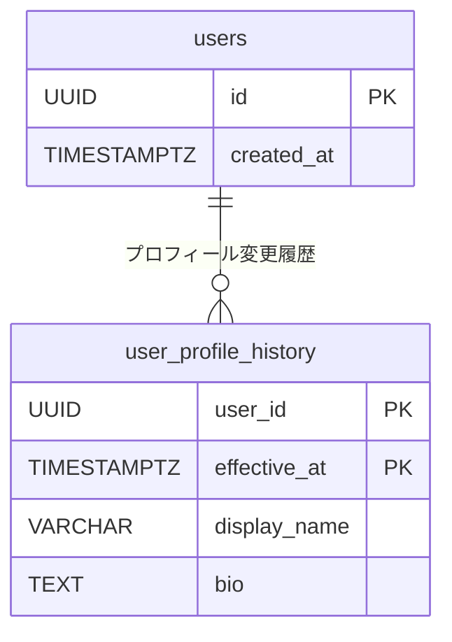
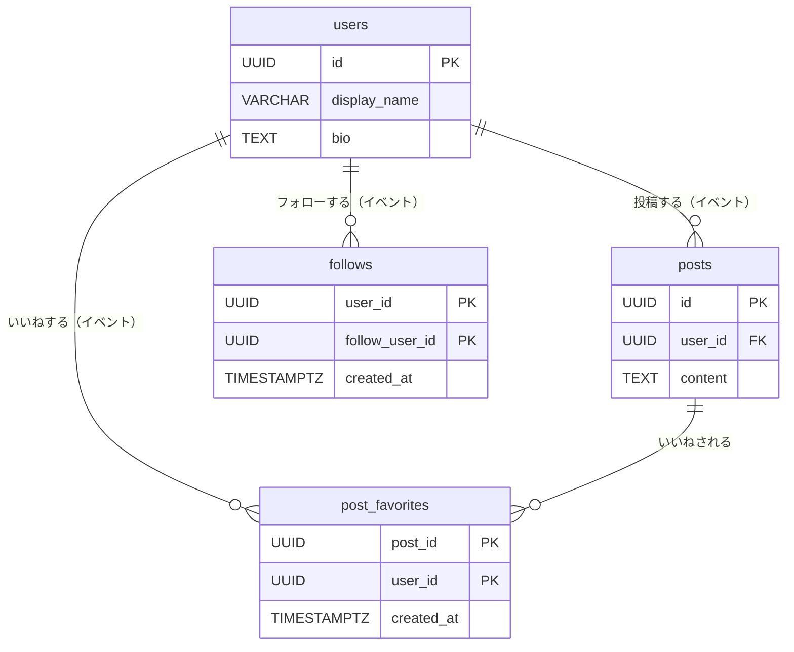

# テーブル設計モデルの比較

> 第1章では**正規化モデル**（1NF〜BCNF）を学びました。
> この章では、実務でよく登場する4つの設計思想を、SNSスキーマを題材に実例付きで紹介します。

---

## 1. イミュータブルモデル

### 概念

**「一度書いたレコードは変更しない」** という原則に基づく設計です。
UPDATE を禁止し、全ての変更を新しい行の INSERT として記録します。

正規化モデルが「データの重複排除」を重視するのに対して、イミュータブルモデルは **「いつ、どんな状態だったか」の完全な再現性** を重視します。

### 適用例

`users` テーブルでプロフィール（表示名・自己紹介文）が変更された場合を考えます。

**通常設計（UPDATE あり）**

**テーブル定義（users — 通常設計）:**

| カラム名 | 型 | 説明 |
|---------|-----|------|
| id | UUID (UUIDv7) | ユーザーID（PK） |
| display_name | VARCHAR(100) | 表示名（上書き更新・NOT NULL） |
| bio | TEXT | 自己紹介文（上書き更新） |
| created_at | TIMESTAMPTZ | 登録日時（NOT NULL） |

サンプルデータ（変更前）:

| id | display_name | bio | created_at |
|----|-------------|-----|------------|
| 01905a3b-... | 田中 花子 | 日常をつぶやきます。 | 2025-06-15 09:23:00+09 |

→ `UPDATE users SET display_name = '田中 花子🌸' WHERE id = ...` を実行すると過去の名前が消える。

---

**イミュータブル設計（INSERT のみ）**

**テーブル定義（users — イミュータブル設計）:**

| カラム名 | 型 | 説明 |
|---------|-----|------|
| id | UUID (UUIDv7) | ユーザーID（PK・不変） |
| created_at | TIMESTAMPTZ | アカウント作成日時（NOT NULL・不変） |

**テーブル定義（user_profile_history — プロフィール変更履歴）:**

| カラム名 | 型 | 説明 |
|---------|-----|------|
| user_id | UUID | ユーザーID（PK・FK → users） |
| effective_at | TIMESTAMPTZ | この行が有効になった日時（PK・NOT NULL） |
| display_name | VARCHAR(100) | 表示名（NOT NULL） |
| bio | TEXT | 自己紹介文 |

サンプルデータ:

| user_id | effective_at | display_name | bio |
|---------|-------------|-------------|-----|
| 01905a3b-... | 2025-06-15 09:23:00+09 | 田中 花子 | 日常をつぶやきます。 |
| 01905a3b-... | 2025-10-01 12:00:00+09 | 田中 花子🌸 | 日常をつぶやきます。秋が好き。 |
| 01905a3c-... | 2025-07-02 14:05:00+09 | 鈴木 一郎 | 技術ブログも書いています。 |



### クエリ例

**現在のプロフィールを取得（最新行のみ）**

```sql
-- DISTINCT ON で user_id ごとに effective_at が最大の行を1件取得
SELECT DISTINCT ON (uph.user_id)
    uph.user_id,
    uph.display_name,
    uph.bio,
    uph.effective_at
FROM user_profile_history uph
WHERE uph.user_id = :'user_id'
ORDER BY uph.user_id, uph.effective_at DESC;
```

**特定時点のプロフィールを取得（過去の再現）**

```sql
-- 2025-09-01 時点のプロフィールを取得
SELECT DISTINCT ON (uph.user_id)
    uph.user_id,
    uph.display_name,
    uph.bio
FROM user_profile_history uph
WHERE uph.user_id = :'user_id'
  AND uph.effective_at <= '2025-09-01 00:00:00+09'
ORDER BY uph.user_id, uph.effective_at DESC;
-- → 「田中 花子」が返る（10月の変更前なので）
```

### トレードオフ

| 観点 | 内容 |
|------|------|
| 過去の再現性 | 任意の時点の状態を完全に再現できる。監査ログ・障害調査に強い |
| 書き込みコスト | UPDATE がなく INSERT のみ。ストレージは増え続ける |
| 読み取り複雑度 | 「現在の値」を取得するのに `DISTINCT ON` や `MAX` が必要になる |
| 向いているケース | 契約・残高・設定変更など「いつ変わったか」が重要なデータ |

---

## 2. Theory of Models (TM)

### 概念

**「ビジネスに存在するものをリソースとイベントに分けて設計する」** 手法です。

- **リソース**: 独立して存在する実体（ユーザー、投稿、スタンプなど）
- **イベント**: リソース間で発生した出来事（フォロー、いいね、スタンプなど）

正規化が「データの重複を減らす」ことを目的とするのに対して、TM は **「ビジネスの構造をテーブル設計に直接反映する」** ことを目的とします。

### 適用例

現行の SNS スキーマは TM の考え方に沿っています。各テーブルをリソース/イベントに分類すると次のようになります。

**テーブル分類:**

| 分類 | テーブル名 | 説明 |
|------|-----------|------|
| リソース | users | 存在するユーザー |
| リソース | posts | 存在する投稿 |
| リソース | stamps | 存在するスタンプ種別 |
| リソース | hashtags | 存在するハッシュタグ |
| イベント | follows | フォローした（出来事） |
| イベント | post_favorites | いいねした（出来事） |
| イベント | post_stamps | スタンプした（出来事） |
| イベント | post_replies | リプライした（出来事） |
| イベント | hashtag_posts | タグ付けした（出来事） |
| イベント | hashtag_follows | ハッシュタグをフォローした（出来事） |
| イベント | user_blocks | ブロックした（出来事） |
| イベント | user_mutes | ミュートした（出来事） |

**テーブル定義（users — リソース）:**

| カラム名 | 型 | 説明 |
|---------|-----|------|
| id | UUID (UUIDv7) | ユーザーID（PK） |
| display_name | VARCHAR(100) | 表示名（NOT NULL） |
| bio | TEXT | 自己紹介文 |
| created_at | TIMESTAMPTZ | 登録日時（NOT NULL） |

サンプルデータ:

| id | display_name | bio | created_at |
|----|-------------|-----|------------|
| 01905a3b-... | 田中 花子 | 日常をつぶやきます。 | 2025-06-15 09:23:00+09 |
| 01905a3c-... | 鈴木 一郎 | 技術ブログも書いています。 | 2025-07-02 14:05:00+09 |
| 01905a3d-... | 佐藤 美咲 | NULL | 2025-08-20 18:44:00+09 |

**テーブル定義（post_favorites — イベント）:**

| カラム名 | 型 | 説明 |
|---------|-----|------|
| post_id | UUID | いいねされた投稿ID（PK・FK → posts） |
| user_id | UUID | いいねしたユーザーID（PK・FK → users） |
| created_at | TIMESTAMPTZ | いいねした日時（NOT NULL、イベント発生時刻） |

サンプルデータ:

| post_id | user_id | created_at |
|---------|---------|------------|
| 01906b1a-... | 01905a3c-... | 2025-10-01 10:00:00+09 |
| 01906b1a-... | 01905a3d-... | 2025-10-01 10:05:00+09 |
| 01906b1b-... | 01905a3b-... | 2025-10-01 12:30:00+09 |



### クエリ例

TM の設計では、**通知一覧の生成** がイベントテーブルだけで完結します。
「自分の投稿に誰かがいいね・スタンプ・リプライした」通知を1クエリで取得できます。

```sql
-- 自分の投稿に対するアクション通知を取得（イベントテーブルのみ使用）
SELECT
    'like'              AS action_type,
    pf.user_id          AS actor_user_id,
    pf.post_id          AS target_post_id,
    pf.created_at
FROM post_favorites pf
JOIN posts p ON p.id = pf.post_id
WHERE p.user_id = :'my_id'

UNION ALL

SELECT
    'stamp'             AS action_type,
    ps.user_id          AS actor_user_id,
    ps.post_id          AS target_post_id,
    ps.created_at
FROM post_stamps ps
JOIN posts p ON p.id = ps.post_id
WHERE p.user_id = :'my_id'

UNION ALL

SELECT
    'reply'             AS action_type,
    pr.user_id          AS actor_user_id,
    pr.post_id          AS target_post_id,
    pr.created_at
FROM post_replies pr
JOIN posts p ON p.id = pr.post_id
WHERE p.user_id = :'my_id'

ORDER BY created_at DESC
LIMIT 20;
```

イベントテーブルには「いつ・誰が・何をした」が揃っているため、通知のような「出来事の一覧」はイベントテーブルを UNION するだけで作れます。

### トレードオフ

| 観点 | 内容 |
|------|------|
| 設計の明確さ | 「これはリソースかイベントか」を問うことで、テーブルの責務が明確になる |
| ビジネスルールの反映 | リソース間の関係（FK）と出来事の記録（イベント）がDB構造に直結する |
| テーブル数 | リソースとイベントを厳密に分けるとテーブル数が増える傾向がある |
| 向いているケース | ビジネスロジックが複雑なシステム。ERPや予約・請求管理など |

---

## 3. アンカーモデル

（後続タスクで追記）

---

## 4. スター型スキーマ

（後続タスクで追記）

---

## 5. モデル選択の判断基準

（後続タスクで追記）
