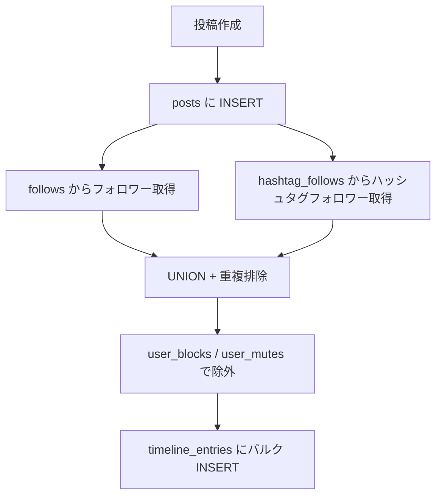
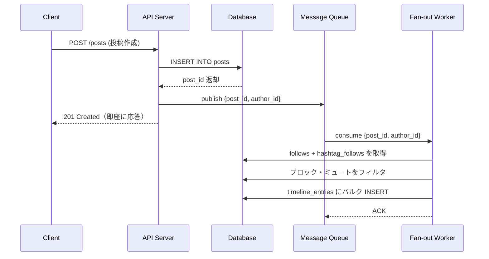
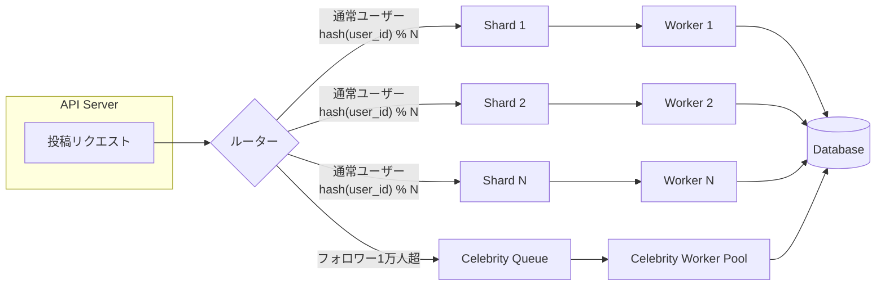

# 事前集計パターン — Fan-out on Write

## 1. 問題提起 — タイムライン取得の JOINコスト

SNS のホームタイムラインは「自分がフォローしているユーザーの投稿を新しい順に表示する」機能である。
素朴に実装すると、以下のようなクエリになる。

```sql
-- タイムライン取得: follows → posts → users をJOIN
SELECT
    p.id,
    p.content,
    p.created_at,
    u.display_name AS author_name
FROM follows f
JOIN posts p ON p.user_id = f.follow_user_id
JOIN users u ON u.id = p.user_id
WHERE f.user_id = :me
ORDER BY p.created_at DESC
LIMIT 20;
```

このクエリは小規模なデータでは問題なく動作するが、以下の条件で急速に劣化する。

| 要因 | 影響 |
|------|------|
| フォロー数の増加 | `follows` との JOIN 対象行が増加 |
| 投稿数の増加 | `posts` のスキャン範囲が拡大 |
| 同時リクエスト | タイムライン表示は最頻アクセスのため負荷集中 |

### EXPLAIN 出力イメージ

```
Sort  (cost=45832.12..45833.45 rows=20)
  Sort Key: p.created_at DESC
  ->  Hash Join  (cost=1234.56..45678.90 rows=52340)
        Hash Cond: (p.user_id = f.follow_user_id)
        ->  Seq Scan on posts p  (cost=0.00..35000.00 rows=1000000)
        ->  Hash  (cost=1200.00..1200.00 rows=500)
              ->  Index Scan on follows f  (cost=0.42..1200.00 rows=500)
                    Index Cond: (user_id = :me)
```

`posts` テーブル全体をスキャンしたあとに `follows` と結合し、最後にソートして上位 20 件を返している。
フォロー数 500 人 × 投稿 100 万件の場合、**毎回数十万行を走査してからソート**することになる。

---

## 2. Fan-out on Write パターンの概念

### 発想の転換

| 従来（Fan-out on Read） | 提案（Fan-out on Write） |
|--------------------------|--------------------------|
| **読み取り時**に JOIN で計算 | **書き込み時**に事前展開 |
| 読み取りが重い | 書き込みが重い |
| ストレージ節約 | ストレージ増加（冗長データ） |

「誰かが投稿したとき、その投稿をフォロワー全員のタイムラインに事前配信する」という考え方である。
第 2 章で学んだ**集約キャッシュテーブル**（非正規化パターン）の発展形として捉えることができる。

### timeline_entries テーブル

```sql
CREATE TABLE timeline_entries (
    id            UUID        PRIMARY KEY DEFAULT gen_random_uuid(),
    user_id       UUID        NOT NULL REFERENCES users(id),       -- タイムラインの所有者（閲覧者）
    post_id       UUID        NOT NULL REFERENCES posts(id),       -- 対象の投稿
    post_user_id  UUID        NOT NULL REFERENCES users(id),       -- 投稿者（冗長FK）
    source_type   VARCHAR(20) NOT NULL,                            -- 'follow' | 'hashtag'
    created_at    TIMESTAMPTZ NOT NULL                             -- 投稿の作成日時（ソート用）
);

-- カバリングインデックス: タイムライン取得を高速化
CREATE INDEX idx_timeline_entries_user_timeline
    ON timeline_entries (user_id, created_at DESC)
    INCLUDE (post_id, post_user_id, source_type);
```

| カラム | 型 | 説明 |
|--------|----|------|
| `id` | UUID | 主キー |
| `user_id` | UUID | タイムラインの所有者（このユーザーの画面に表示される） |
| `post_id` | UUID | 表示対象の投稿 |
| `post_user_id` | UUID | 投稿者（JOINを避けるための冗長FK） |
| `source_type` | VARCHAR(20) | なぜこの投稿がタイムラインに入ったか（`'follow'` or `'hashtag'`） |
| `created_at` | TIMESTAMPTZ | 投稿の作成日時（ソート用、posts.created_at のコピー） |

### Before / After クエリ比較

**Before（JOINが必要）**

```sql
SELECT p.id, p.content, p.created_at, u.display_name
FROM follows f
JOIN posts p ON p.user_id = f.follow_user_id
JOIN users u ON u.id = p.user_id
WHERE f.user_id = :me
ORDER BY p.created_at DESC
LIMIT 20;
```

**After（単純なインデックススキャン）**

```sql
SELECT
    te.post_id,
    te.post_user_id,
    te.source_type,
    te.created_at
FROM timeline_entries te
WHERE te.user_id = :me
ORDER BY te.created_at DESC
LIMIT 20;
```

After のクエリは `idx_timeline_entries_user_timeline` によるインデックスオンリースキャンで完結する。
JOINは不要で、実行計画は以下のようにシンプルになる。

```
Limit  (rows=20)
  ->  Index Only Scan using idx_timeline_entries_user_timeline
        on timeline_entries te  (cost=0.56..2.34 rows=20)
        Index Cond: (user_id = :me)
```

---

## 3. 投稿作成時のフロー

投稿が作成されたとき、以下のステップで `timeline_entries` を展開する。

### ステップ 1: 投稿の INSERT

```sql
INSERT INTO posts (id, user_id, content, created_at)
VALUES (:post_id, :author_id, :content, NOW())
RETURNING id, user_id, created_at;
```

### ステップ 2〜4: タイムラインへの展開

```sql
-- フォロワー + ハッシュタグフォロワーを結合し、
-- ブロック・ミュートを除外して timeline_entries にバルクINSERT
INSERT INTO timeline_entries (user_id, post_id, post_user_id, source_type, created_at)
SELECT DISTINCT
    target.user_id,
    :post_id,
    :author_id,
    target.source_type,
    :post_created_at
FROM (
    -- ステップ2: 投稿者をフォローしているユーザー
    SELECT f.user_id, 'follow' AS source_type
    FROM follows f
    WHERE f.follow_user_id = :author_id

    UNION

    -- ステップ3: 投稿のハッシュタグをフォローしているユーザー
    SELECT hf.user_id, 'hashtag' AS source_type
    FROM hashtag_posts hp
    JOIN hashtag_follows hf ON hf.hashtag_id = hp.hashtag_id
    WHERE hp.post_id = :post_id
) AS target
-- ステップ4: ブロック・ミュートの除外
WHERE target.user_id <> :author_id
  AND NOT EXISTS (
      SELECT 1 FROM user_blocks ub
      WHERE ub.user_id = target.user_id
        AND ub.block_user_id = :author_id
  )
  AND NOT EXISTS (
      SELECT 1 FROM user_mutes um
      WHERE um.user_id = target.user_id
        AND um.mute_user_id = :author_id
  );
```

### 処理フローの概要



---

## 4. 非同期処理アーキテクチャ — Queue + Worker

### 同期処理の問題

上記のバルク INSERT をすべて投稿 API のリクエスト内で同期的に実行すると、フォロワーが多いユーザーの投稿時にレイテンシが著しく悪化する。

| フォロワー数 | 同期処理の概算時間 |
|-------------|-------------------|
| 100 人 | ~50ms |
| 10,000 人 | ~2,000ms |
| 1,000,000 人 | ~60,000ms（タイムアウト） |

### 非同期アーキテクチャ

投稿の INSERT だけを同期的に行い、タイムライン展開はメッセージキューを介して非同期で処理する。



投稿 API は `posts` への INSERT とキューへの publish だけを行うため、フォロワー数に関係なく一定のレスポンスタイムを維持できる。

### キュー技術の選択肢

| 技術 | 特徴 | 適用場面 |
|------|------|---------|
| Amazon SQS | マネージド、スケーラブル | AWS 環境 |
| RabbitMQ | 柔軟なルーティング、AMQP準拠 | オンプレミス / 汎用 |
| Apache Kafka | 高スループット、ログベース | 大規模・イベント駆動 |

---

## 5. Queue のシャーディング戦略

単一のキューでは、ワーカーのスループットがボトルネックになる。
キューを複数に分割（シャーディング）することで、並列処理能力を向上させる。

### 方式 1: user_id ベースのシャーディング

```
shard_index = hash(target_user_id) % shard_count
```

同一ユーザーのタイムライン更新が常に同じシャードに集まるため、**順序保証**が容易になる。

### 方式 2: post_id ベースのシャーディング

```
shard_index = hash(post_id) % shard_count
```

投稿単位で均等に分散されるため、**負荷の偏り**が少ない。

### 方式 3: ハイブリッド方式（推奨）

通常ユーザーは user_id ベースでシャーディングし、有名人（フォロワー 1 万人超など）は**専用キュー**に分離する。

### 比較表

| 観点 | user_id ベース | post_id ベース | ハイブリッド（推奨） |
|------|---------------|---------------|---------------------|
| 負荷分散 | 有名人で偏る | 均等 | 均等（専用キューで吸収） |
| 順序保証 | 容易 | 困難 | 容易（通常ユーザー） |
| 実装の複雑さ | 低 | 低 | 中 |
| 有名人対応 | 弱い | 強い | 強い |

### シャーディング構成図



---

## 6. 投稿の更新・削除時の処理

### 投稿の編集

`timeline_entries` は `post_id` で投稿本体を**参照**しているため、投稿が編集されても `timeline_entries` の更新は不要である。
表示時に `posts` テーブルから最新の `content` を取得すればよい。

```sql
-- タイムライン表示時に投稿本体を結合
SELECT
    te.post_id,
    te.source_type,
    te.created_at,
    p.content,          -- 常に最新の内容が取得される
    u.display_name
FROM timeline_entries te
JOIN posts p ON p.id = te.post_id
JOIN users u ON u.id = te.post_user_id
WHERE te.user_id = :me
ORDER BY te.created_at DESC
LIMIT 20;
```

### 投稿の削除

投稿が削除された場合、全ユーザーのタイムラインから該当エントリを削除する。

```sql
DELETE FROM timeline_entries
WHERE post_id = :deleted_post_id;
```

> **注意**: フォロワーが多い投稿の場合、大量の行が削除対象になる。
> この処理も非同期キュー経由で実行することを推奨する。

### フォロー解除

ユーザー A がユーザー B のフォローを解除した場合、A のタイムラインから B の投稿を削除する。

```sql
DELETE FROM timeline_entries
WHERE user_id = :unfollower_id          -- A のタイムラインから
  AND post_user_id = :unfollowed_id     -- B の投稿を削除
  AND source_type = 'follow';           -- フォロー経由のエントリのみ
```

### 操作ごとの処理まとめ

| 操作 | timeline_entries への影響 | 処理方式 |
|------|--------------------------|---------|
| 投稿作成 | フォロワー全員分を INSERT | 非同期（Queue + Worker） |
| 投稿編集 | 更新不要（post_id 参照） | — |
| 投稿削除 | 対象 post_id の全行を DELETE | 非同期推奨 |
| フォロー解除 | 該当ユーザー投稿を DELETE | 同期 or 非同期 |

---

## 7. トレードオフ分析

### 計算量の比較

| 操作 | Fan-out on Read | Fan-out on Write |
|------|----------------|------------------|
| タイムライン読み取り | O(フォロー数 × 投稿数) | **O(1)** — インデックススキャン |
| 投稿の書き込み | O(1) — posts に INSERT のみ | **O(フォロワー数)** — 全フォロワーに展開 |
| ストレージ | 投稿数分のみ | 投稿数 × 平均フォロワー数 |

### ストレージ見積もり

1 エントリ ≈ 100 バイト（UUID × 3 + VARCHAR + TIMESTAMPTZ）の場合:

| シナリオ | 1日の新規投稿 | 平均フォロワー | 1日のエントリ増加 | 1日のストレージ増加 |
|---------|-------------|-------------|----------------|-------------------|
| 小規模 | 10,000 | 100 | 100 万 | ~100 MB |
| 中規模 | 100,000 | 500 | 5,000 万 | ~5 GB |
| 大規模 | 1,000,000 | 1,000 | 10 億 | ~100 GB |

### 整合性モデル

Fan-out on Write は**結果整合性（Eventual Consistency）**を前提とする。

- 投稿が作成されてからフォロワーのタイムラインに反映されるまで、キューの処理遅延分のラグが生じる
- 通常時は数百ミリ秒〜数秒のラグだが、キューが詰まった場合はさらに遅延する
- ユーザー体験上、自分自身の投稿は即座に表示する必要がある（**Read-your-writes 一貫性**）

```sql
-- 自分の投稿は posts テーブルから直接取得して先頭に表示
(SELECT id AS post_id, user_id AS post_user_id, 'self' AS source_type, created_at
 FROM posts
 WHERE user_id = :me
 ORDER BY created_at DESC
 LIMIT 5)

UNION ALL

(SELECT post_id, post_user_id, source_type, created_at
 FROM timeline_entries
 WHERE user_id = :me
 ORDER BY created_at DESC
 LIMIT 20)

ORDER BY created_at DESC
LIMIT 20;
```

### 有名人問題（Celebrity Problem）

フォロワーが 100 万人いるユーザーが投稿すると、100 万行の `timeline_entries` を INSERT する必要がある。

| 問題 | 影響 |
|------|------|
| 書き込み遅延 | 全フォロワーへの展開に時間がかかる |
| キュー滞留 | 有名人の投稿が他の処理をブロック |
| ストレージ急増 | 1 投稿で 100 万エントリ |

**緩和策**:

1. **専用キュー**: 有名人の投稿は専用キュー + Worker Pool で処理（セクション 5 のハイブリッド方式）
2. **ハイブリッド方式**: 有名人の投稿だけ Fan-out on Read にフォールバックし、タイムライン取得時に JOINで取得する
3. **バッチ分割**: 100 万フォロワーを 1,000 人ずつのバッチに分けて段階的に INSERT

### 実務の指針

| 判断基準 | Fan-out on Read | Fan-out on Write |
|---------|----------------|------------------|
| 読み取り頻度 ≫ 書き込み頻度 | | **推奨** |
| フォロワー数が少ない（〜数千人） | | **推奨** |
| フォロワー数が極端に多い（100万人超） | **推奨** | |
| リアルタイム性が重要 | **推奨** | |
| レスポンスタイムの安定性が重要 | | **推奨** |

多くの SNS では、**通常ユーザーには Fan-out on Write、有名人には Fan-out on Read** というハイブリッド方式を採用している。
