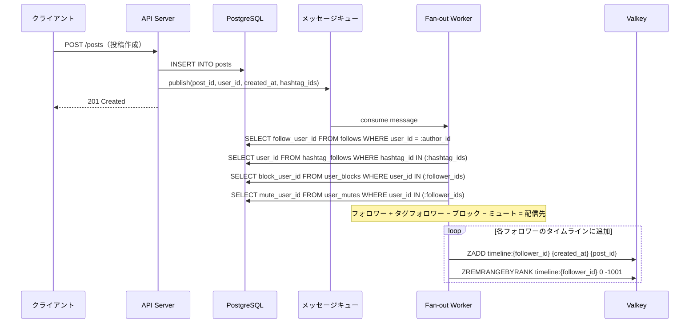
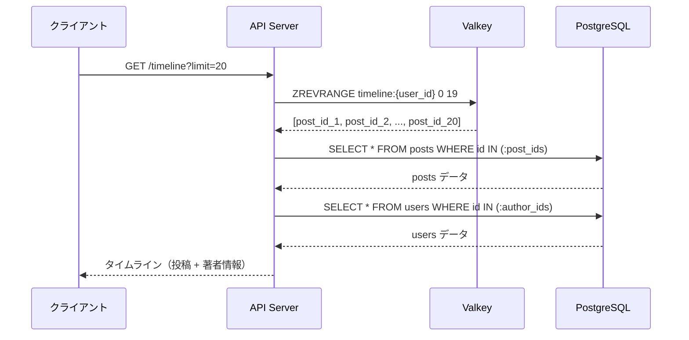
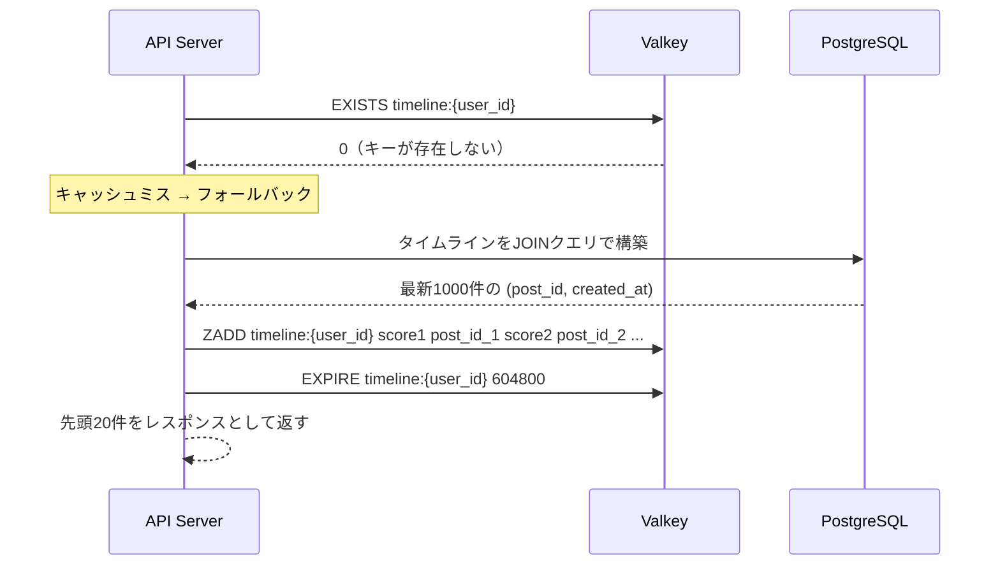
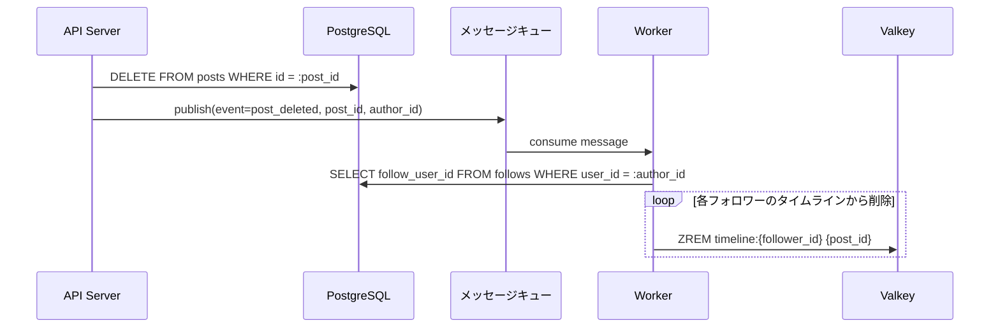

# インメモリタイムライン — Valkey Sorted Set によるタイムラインキャッシュ

## 前セクションとの接続

[前セクション（Fan-out on Write）](../01_fanout_on_write/)では、投稿時にフォロワーの `timeline_entries` テーブルへ事前に INSERT することで、タイムライン読み取りを高速化するパターンを学んだ。

しかし、RDB への事前集計には以下の課題がある:

| 課題 | 詳細 |
|------|------|
| 書き込み負荷 | フォロワー数 × INSERT/DELETE が RDB に集中する |
| ストレージコスト | タイムラインデータがディスク上に永続化され、容量を圧迫する |
| インデックス維持コスト | 大量の INSERT/DELETE に伴い B-Tree インデックスの再構築が頻発する |

> **本セクションのアプローチ:** タイムラインキャッシュの格納先を RDB からインメモリストア（Valkey）に移すことで、書き込み・読み取りの両方を高速化しつつ、RDB への負荷を軽減する。

---

## Valkey（Redis互換）の基礎

### Valkey とは

**Valkey** は Redis のオープンソースフォークで、BSD ライセンスのインメモリデータストアである。Redis と完全なプロトコル互換を持ち、既存の Redis クライアントライブラリがそのまま使える。

主な特徴:

- **インメモリ**: データをすべてメモリ上に保持するため、ディスクI/Oが不要
- **低レイテンシ**: 単純な読み書きで **サブミリ秒** の応答が可能
- **豊富なデータ構造**: String, List, Set, Sorted Set, Hash など
- **オープンソース**: Linux Foundation 傘下で開発

### SNS タイムラインに適した Sorted Set

タイムラインの要件は「**時系列順に並んだ投稿IDのリスト**」である。Valkey の **Sorted Set**（ソート済みセット）がこの要件に最適な理由:

| 要件 | Sorted Set の対応 |
|------|-------------------|
| 時系列順のソート | スコア（= `created_at` の UNIX timestamp）で自動ソート |
| 重複排除 | メンバー（= `post_id`）は一意に保持される |
| 範囲取得 | `ZREVRANGE` で最新N件を O(log N + M) で取得 |
| 個別削除 | `ZREM` で特定の投稿を O(log N) で削除 |
| サイズ制限 | `ZREMRANGEBYRANK` で古い投稿を一括削除 |

```
Sorted Set の内部構造イメージ:

timeline:user_A
┌─────────────────────────────────────┐
│ score (created_at)  │ member (post_id)  │
├─────────────────────┼───────────────────┤
│ 1712345678.000      │ post_id_001       │
│ 1712345700.000      │ post_id_002       │
│ 1712345800.000      │ post_id_003       │  ← 最新
└─────────────────────┴───────────────────┘
```

---

## データ設計

### キー設計

```
timeline:{user_id}
```

- **キー例**: `timeline:550e8400-e29b-41d4-a716-446655440000`
- ユーザーごとに1つの Sorted Set を持つ
- キー名に `user_id` を含めることで、Valkey Cluster 利用時のシャーディングキーとして機能する

### 格納する値

| 要素 | 値 | 例 |
|------|-----|-----|
| メンバー | `post_id`（UUID 文字列） | `01905a3b-8d20-7000-8000-000000000042` |
| スコア | `created_at` の UNIX timestamp（float） | `1712345678.123` |

### TTL 設計

ユーザーのアクティビティに応じて TTL を調整し、メモリを効率的に使う:

| ユーザー種別 | TTL | 理由 |
|-------------|-----|------|
| アクティブユーザー（直近24h以内にアクセス） | **7日** | 頻繁にタイムラインを参照するため、キャッシュ維持のメリットが大きい |
| 非アクティブユーザー | **1日** | しばらくアクセスがないため、メモリを節約する |
| 長期非アクティブ | キャッシュなし | タイムライン参照時にオンデマンドで構築（フォールバック） |

```redis
-- アクティブユーザーの TTL を 7日 に設定
EXPIRE timeline:550e8400-e29b-41d4-a716-446655440000 604800

-- 非アクティブユーザーの TTL を 1日 に設定
EXPIRE timeline:550e8400-e29b-41d4-a716-446655440000 86400
```

### サイズ制限

1ユーザーあたりの Sorted Set を **最新1000件** に制限する。上限を超えた古い投稿は自動的に削除する:

```redis
-- Sorted Set のサイズが 1000 件を超えた場合、最も古いものから削除
-- rank 0 が最も古い（スコアが小さい）ので、0 から (現在の件数 - 1000) までを削除
ZREMRANGEBYRANK timeline:550e8400-e29b-41d4-a716-446655440000 0 -1001
```

> **なぜ1000件？** 一般的なSNSではユーザーが1000件以上遡ることは稀であり、1 post_id（UUID文字列36バイト + スコア8バイト）× 1000件 ≈ **44KB/ユーザー** と、メモリ消費も十分に小さい。

---

## 書き込みフロー（投稿時）

### シーケンス図



### ZADD コマンド例

```redis
-- user_id=AAA が投稿 post_id=BBB を作成（created_at = 2025-04-05 12:34:56 UTC）
-- フォロワー CCC, DDD, EEE のタイムラインに追加

ZADD timeline:CCC 1743854096.0 "01905a3b-8d20-7000-8000-000000000042"
ZADD timeline:DDD 1743854096.0 "01905a3b-8d20-7000-8000-000000000042"
ZADD timeline:EEE 1743854096.0 "01905a3b-8d20-7000-8000-000000000042"
```

### パイプライン処理

フォロワーが多い場合、1件ずつ ZADD を送信するとネットワークラウンドトリップがボトルネックになる。**パイプライン** を使って複数コマンドをまとめて送信する:

```redis
-- パイプラインで一括送信（3コマンドを1回のラウンドトリップで実行）
PIPELINE
ZADD timeline:CCC 1743854096.0 "01905a3b-8d20-7000-8000-000000000042"
ZADD timeline:DDD 1743854096.0 "01905a3b-8d20-7000-8000-000000000042"
ZADD timeline:EEE 1743854096.0 "01905a3b-8d20-7000-8000-000000000042"
EXEC
```

| 方式 | 1万フォロワーの場合のラウンドトリップ数 |
|------|----------------------------------------|
| 逐次実行 | 10,000 回 |
| パイプライン（バッチサイズ 500） | 20 回 |

---

## 読み取りフロー（タイムライン取得）

### 基本フロー



### Valkey コマンド例

```redis
-- 最新20件の post_id を取得（スコアの降順 = 新しい順）
ZREVRANGE timeline:550e8400-e29b-41d4-a716-446655440000 0 19

-- 結果例:
-- 1) "01905a3b-8d20-7000-8000-000000000099"
-- 2) "01905a3b-8d20-7000-8000-000000000098"
-- ...
-- 20) "01905a3b-8d20-7000-8000-000000000080"
```

### カーソルベースページネーション

オフセットベース（`ZREVRANGE start stop`）ではなく、**スコアベース** のページネーションを使うことで、タイムライン更新中でもページ境界がずれない:

```redis
-- 1ページ目: 最新20件を取得（スコア付き）
ZREVRANGEBYSCORE timeline:{user_id} +inf -inf WITHSCORES LIMIT 0 20

-- 2ページ目: 1ページ目の最後のスコアを cursor として使う
-- cursor = 1743854000.0（1ページ目最後の投稿の created_at）
ZREVRANGEBYSCORE timeline:{user_id} (1743854000.0 -inf WITHSCORES LIMIT 0 20
```

| ページネーション方式 | メリット | デメリット |
|---------------------|---------|-----------|
| オフセットベース（ZREVRANGE） | 実装が単純 | 新規投稿追加でページ境界がずれる |
| カーソルベース（ZREVRANGEBYSCORE） | ページ境界が安定 | 同一スコア（同時刻投稿）の処理が必要 |

> **推奨:** カーソルベースを使用する。同一スコアの投稿が存在する場合は、`post_id` をタイブレーカーとしてアプリケーション側でソートする。

### RDB への問い合わせ

Valkey から取得した `post_id` のリストをもとに、PostgreSQL から投稿本文と著者情報を取得する:

```sql
-- post_ids は Valkey から取得した ID リスト
SELECT
    p.id,
    p.content,
    p.created_at,
    u.id AS author_id,
    u.display_name,
    u.avatar_url
FROM posts p
JOIN users u ON u.id = p.user_id
WHERE p.id IN (
    '01905a3b-8d20-7000-8000-000000000099',
    '01905a3b-8d20-7000-8000-000000000098'
    -- ... 最大20件
);
```

---

## キャッシュミス時のフォールバック

`timeline:{user_id}` が存在しない場合がある:

- TTL 切れ
- 新規登録ユーザー
- 長期間非アクティブだったユーザーが復帰

この場合、**RDB から直接タイムラインを構築** し、Valkey にキャッシュとして書き戻す。

### フォールバックフロー



### フォールバック用 SQL

```sql
-- フォロー中のユーザーとハッシュタグの投稿を取得し、
-- ブロック・ミュートを除外してタイムラインを構築する
WITH followed_posts AS (
    SELECT p.id, p.created_at
    FROM posts p
    JOIN follows f ON f.follow_user_id = p.user_id
    WHERE f.user_id = :my_user_id

    UNION

    SELECT p.id, p.created_at
    FROM posts p
    JOIN hashtag_posts hp ON hp.post_id = p.id
    JOIN hashtag_follows hf ON hf.hashtag_id = hp.hashtag_id
    WHERE hf.user_id = :my_user_id
),
filtered AS (
    SELECT fp.id, fp.created_at
    FROM followed_posts fp
    WHERE NOT EXISTS (
        SELECT 1 FROM user_blocks ub
        WHERE ub.user_id = :my_user_id
          AND ub.block_user_id = (SELECT user_id FROM posts WHERE id = fp.id)
    )
    AND NOT EXISTS (
        SELECT 1 FROM user_mutes um
        WHERE um.user_id = :my_user_id
          AND um.mute_user_id = (SELECT user_id FROM posts WHERE id = fp.id)
    )
)
SELECT id, created_at
FROM filtered
ORDER BY created_at DESC
LIMIT 1000;
```

### Valkey への書き戻し

```redis
-- SQL の結果を一括で ZADD（パイプラインで送信）
ZADD timeline:550e8400-e29b-41d4-a716-446655440000
    1743854096.0 "post_id_001"
    1743854000.0 "post_id_002"
    1743853900.0 "post_id_003"
    -- ... 最大1000件

EXPIRE timeline:550e8400-e29b-41d4-a716-446655440000 604800
```

> **注意:** フォールバックパスは RDB への負荷が高いため、大量のキャッシュミスが同時に発生しないよう、**Thundering Herd 対策**（ミューテックスロックや確率的早期更新）を検討すること。

---

## 投稿削除・フォロー解除時の処理

### 投稿削除

投稿が削除された場合、すべてのフォロワーのタイムラインから該当 `post_id` を削除する:



```redis
-- post_id を全フォロワーのタイムラインから削除
ZREM timeline:CCC "01905a3b-8d20-7000-8000-000000000042"
ZREM timeline:DDD "01905a3b-8d20-7000-8000-000000000042"
ZREM timeline:EEE "01905a3b-8d20-7000-8000-000000000042"
```

### フォロー解除

ユーザーAがユーザーBのフォローを解除した場合、ユーザーAのタイムラインからユーザーBの投稿をすべて削除する必要がある。これは **重い処理** なので非同期で実行する:

```redis
-- ユーザーBの投稿IDリストを取得（RDBから）
-- SELECT id FROM posts WHERE user_id = :user_b_id

-- ユーザーAのタイムラインからユーザーBの投稿を一括削除
ZREM timeline:{user_a_id} "post_id_1" "post_id_2" "post_id_3" ...
```

| 操作 | 処理方式 | 理由 |
|------|---------|------|
| 投稿削除 | 非同期（キュー経由） | フォロワー数に比例する処理量 |
| フォロー解除 | 非同期（キュー経由） | 対象ユーザーの投稿数に比例する処理量 |
| アカウント削除 | 即時 + 非同期 | 自分のキーは即時削除、フォロワーのタイムラインからは非同期削除 |

### アカウント削除

```redis
-- 削除対象ユーザー自身のタイムラインキーを削除
DEL timeline:550e8400-e29b-41d4-a716-446655440000

-- フォロワーのタイムラインからの投稿削除は非同期で処理（投稿削除と同じフロー）
```

---

## トレードオフ分析

| 観点 | RDB 事前集計（前セクション） | インメモリ（本セクション） |
|------|---------------------------|--------------------------|
| 読み取り速度 | 速い（インデックススキャン） | **非常に速い**（メモリ上、サブミリ秒） |
| 書き込みコスト | 高い（大量 INSERT + インデックス更新） | 中（ZADD は INSERT より軽量） |
| ストレージコスト | 高い（ディスク上に全データ永続化） | 中（メモリは高価だがデータ量を制限） |
| 永続性 | 高い（RDB なので永続） | **低い**（メモリなので揮発、フォールバック必須） |
| 整合性 | eventual consistency | eventual consistency |
| 運用コスト | 低い（既存 RDB を利用） | 中（Valkey クラスタの運用が必要） |

### Before / After 比較

**Before: RDB 事前集計パターン**

```sql
-- タイムライン読み取り: timeline_entries テーブルをスキャン
SELECT te.post_id, p.content, u.display_name
FROM timeline_entries te
JOIN posts p ON p.id = te.post_id
JOIN users u ON u.id = p.user_id
WHERE te.user_id = :my_user_id
ORDER BY te.created_at DESC
LIMIT 20;
-- → インデックススキャンで数ミリ秒
```

**After: インメモリパターン**

```redis
-- Step 1: Valkey から post_id リストを取得（サブミリ秒）
ZREVRANGE timeline:550e8400-e29b-41d4-a716-446655440000 0 19
```

```sql
-- Step 2: post_id リストで RDB から詳細取得（数ミリ秒）
SELECT p.id, p.content, p.created_at, u.display_name
FROM posts p
JOIN users u ON u.id = p.user_id
WHERE p.id IN (:post_ids);
```

> **ポイント:** インメモリパターンでは `timeline_entries` テーブルが不要になり、RDB への書き込み負荷が大幅に削減される。読み取りもメモリアクセスが起点となるため、レイテンシが改善する。一方で、キャッシュの揮発性を前提とした **フォールバック機構** が不可欠となる。

---

## Valkey クラスタ構成（概要）

### シングルノードの限界

Valkey のシングルノード構成では以下の問題が生じる:

| 制約 | 詳細 |
|------|------|
| メモリ上限 | 1台のサーバーの物理メモリに制限される |
| スループット | 1台で処理できるコマンド数に上限がある（約10万〜20万 ops/sec） |
| 可用性 | ノード障害時にサービスが停止する |

### Valkey Cluster

**Valkey Cluster** はデータを **16,384 個のハッシュスロット** に分散し、複数ノードで自動シャーディングを行う:

```
ハッシュスロットの分散例（3ノード構成）:

Node A: スロット 0 〜 5460
Node B: スロット 5461 〜 10922
Node C: スロット 10923 〜 16383

キー "timeline:user_123" のスロット:
  CRC16("timeline:user_123") mod 16384 → スロット番号 → 担当ノード
```

### ハッシュタグによるデータ局所性

Valkey Cluster ではキー内の `{...}` 部分（**ハッシュタグ**）のみをハッシュ計算に使用する。タイムラインキーを `timeline:{user_id}` のように設計すると:

```
timeline:{550e8400-e29b-41d4-a716-446655440000}

→ ハッシュ計算対象: "550e8400-e29b-41d4-a716-446655440000"
→ 同一ユーザーに関連するキーが必ず同じノードに配置される
```

これにより、将来的に `timeline:{user_id}` 以外のキー（例: `notifications:{user_id}` や `profile:{user_id}`）を追加しても、同一ユーザーのデータが同じノードに集まり、**クロスノード通信を回避** できる。

```
Node A                          Node B
┌────────────────────────┐     ┌────────────────────────┐
│ timeline:{user_1}      │     │ timeline:{user_2}      │
│ notifications:{user_1} │     │ notifications:{user_2} │
│ profile:{user_1}       │     │ profile:{user_2}       │
└────────────────────────┘     └────────────────────────┘
   ↑ 同一ユーザーのキーは           ↑ 同一ノードに集約
     同じノードに配置
```
