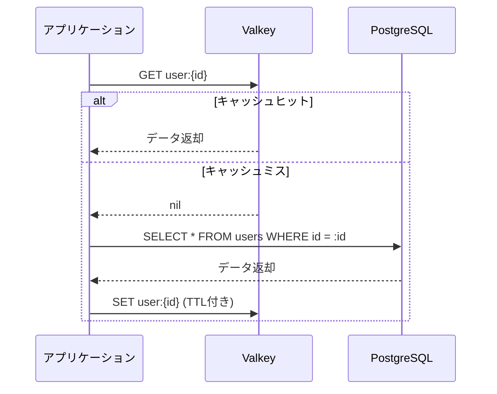
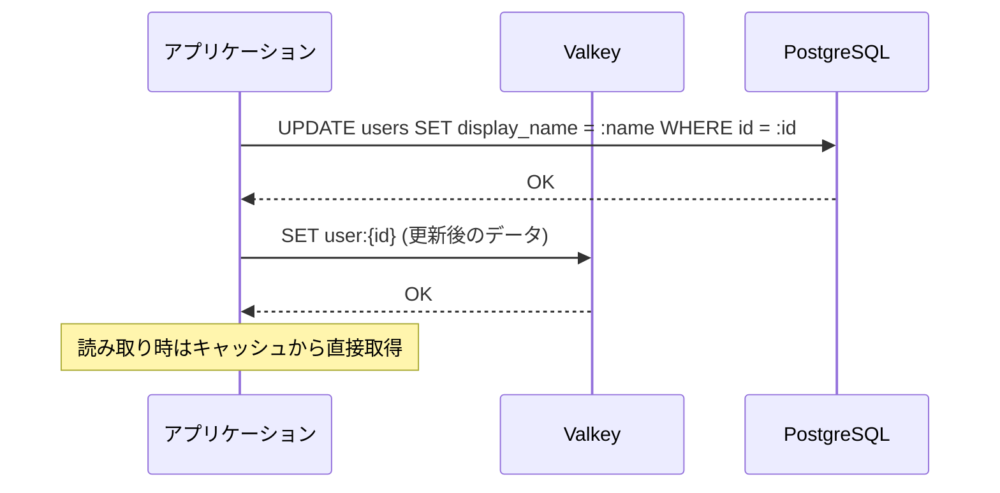
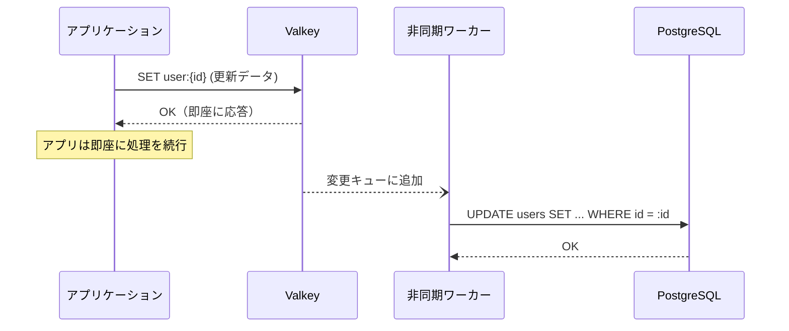
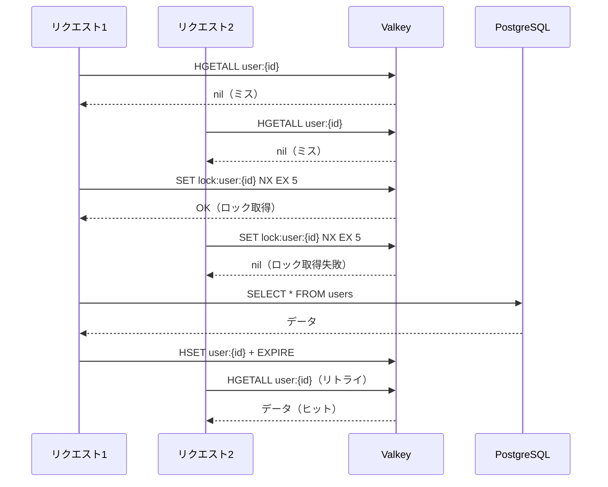
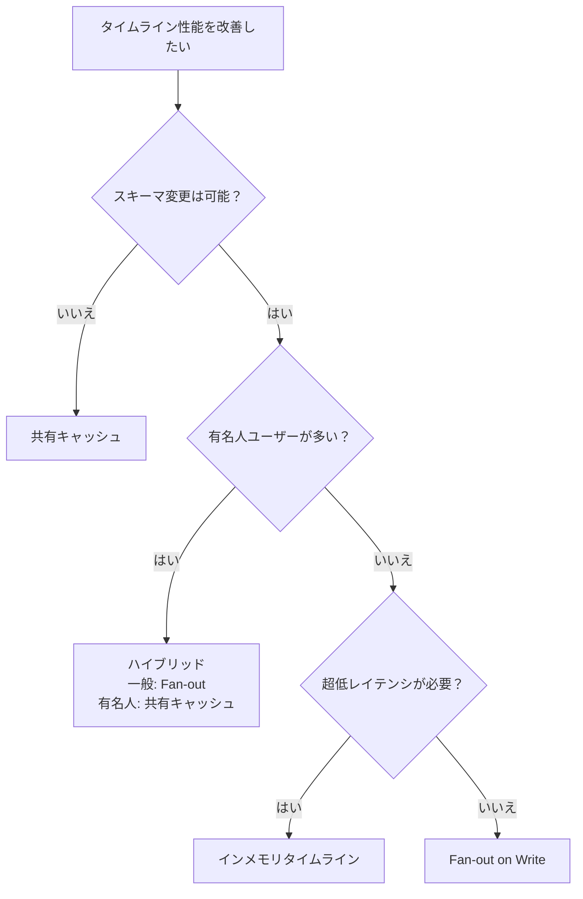

# 共有キャッシュパターン — JOINクエリ + Valkey キャッシュ

## 1. 前2セクションとの位置づけ

第3章の前2セクションでは、タイムライン取得の負荷を**書き込み時の事前展開**で解決するアプローチを学んだ。

| セクション | アプローチ | データ配置先 |
|-----------|-----------|-------------|
| [01 Fan-out on Write](../01_fanout_on_write/) | 書き込み時に全フォロワーへ事前展開 | RDB `timeline_entries` テーブル |
| [02 インメモリタイムライン](../02_inmemory_timeline/) | 書き込み時に Valkey Sorted Set へ展開 | Valkey/Redis |
| **03 共有キャッシュ（本セクション）** | JOINクエリを維持し、参照データをキャッシュ | RDB + Valkey/Redis |

本セクションは発想が異なる。**クエリ構造は変えずに、JOINの素材となるテーブルのデータをキャッシュしておく**ことで、DBへのアクセス回数を削減する。

### タイムラインクエリの再確認

```sql
SELECT
    p.id,
    p.content,
    p.created_at,
    u.display_name AS author_name,
    u.bio
FROM follows f
JOIN posts p ON p.user_id = f.follow_user_id
JOIN users u ON u.id = p.user_id
WHERE f.user_id = :me
ORDER BY p.created_at DESC
LIMIT 20;
```

このクエリで `users` テーブルは**全タイムライン取得で必ずJOINされる**が、ユーザープロフィールの更新頻度は低い。このような「読み取り頻度が高く、更新頻度が低い」データはキャッシュの最適な候補である。

> **ポイント**: Fan-out on Write/インメモリタイムラインはクエリ構造自体を変えるが、共有キャッシュは**既存のクエリロジックを維持**したまま性能を改善できる。スキーマ変更が不要なため、既存システムへの導入障壁が最も低い。

---

## 2. キャッシュ戦略の比較

共有キャッシュを導入する際、キャッシュの読み書きをどのタイミングで行うかによって3つの代表的な戦略がある。

### Cache-Aside（Lazy Loading）

アプリケーションがキャッシュの管理を明示的に行う最もシンプルなパターン。読み取り時にキャッシュを確認し、ミスならDBから取得してキャッシュに書き込む。



| 観点 | 評価 |
|------|------|
| メリット | 実装がシンプル。実際にアクセスされるデータだけがキャッシュされる |
| デメリット | 初回アクセスは必ずキャッシュミス（コールドスタート）。TTL切れまでデータが古くなる可能性 |
| 適した場面 | 読み取り多・更新少のデータ（ユーザープロフィール、投稿データ） |

### Write-Through

書き込み時にDBとキャッシュを**同時に**更新するパターン。キャッシュは常に最新の状態を保つ。



| 観点 | 評価 |
|------|------|
| メリット | キャッシュが常に最新。読み取りでキャッシュミスがほぼ発生しない |
| デメリット | 書き込みレイテンシが増加（DB + キャッシュの2回書き込み）。アクセスされないデータもキャッシュされる |
| 適した場面 | データの鮮度が重要で、書き込み頻度が低いデータ（フォロー関係） |

### Write-Behind（Write-Back）

書き込みはキャッシュのみに行い、DBへの反映は**非同期**で行うパターン。



| 観点 | 評価 |
|------|------|
| メリット | 書き込みが最も高速（キャッシュへの書き込みのみ）。バッチ処理で効率化可能 |
| デメリット | キャッシュ障害時にデータ損失のリスク。実装が複雑（非同期処理 + リトライが必要） |
| 適した場面 | 書き込み頻度が非常に高く、多少の遅延を許容できるデータ（カウンター、ログ） |

### 3戦略の比較

| 観点 | Cache-Aside | Write-Through | Write-Behind |
|------|-------------|---------------|--------------|
| 読み取りレイテンシ（ヒット時） | 低 | 低 | 低 |
| 読み取りレイテンシ（ミス時） | 高（DB往復あり） | — （常にヒット） | — （常にヒット） |
| 書き込みレイテンシ | DBのみ | 高（DB + キャッシュ） | 最低（キャッシュのみ） |
| データ整合性 | 結果整合性（TTL依存） | 強整合性 | 結果整合性 |
| 実装の複雑度 | 低 | 中 | 高 |
| データ損失リスク | なし | なし | キャッシュ障害時にあり |

---

## 3. SNSでの適用例

第2章の[SNSスキーマ](../../02/docs/00_schema.md)を対象に、どのデータをどの戦略でキャッシュすべきかを検討する。

### ユーザー情報キャッシュ

タイムライン取得で毎回JOINされる `users` テーブルは、キャッシュの最優先候補である。

| 項目 | 設定 |
|------|------|
| キー | `user:{user_id}` |
| データ型 | Hash |
| 戦略 | Cache-Aside |
| TTL | 1時間〜1日 |
| 理由 | プロフィール更新は稀。読み取り頻度が圧倒的に高い |

```
# キャッシュへの書き込み
HSET user:01905a3b-7c10-7000-8000-000000000001
    display_name "田中太郎"
    bio "エンジニアです"
    created_at "2025-06-15T09:23:00+09:00"
EX 3600

# キャッシュからの読み取り
HGETALL user:01905a3b-7c10-7000-8000-000000000001
# => {display_name: "田中太郎", bio: "エンジニアです", created_at: "2025-06-15T09:23:00+09:00"}
```

### 投稿データキャッシュ

投稿は作成後ほとんど変更されない（削除はあるが編集は稀）ため、Cache-Aside が適する。

| 項目 | 設定 |
|------|------|
| キー | `post:{post_id}` |
| データ型 | Hash |
| 戦略 | Cache-Aside |
| TTL | 1〜6時間 |
| 理由 | 投稿は不変に近い。人気の投稿は繰り返し参照される |

```
# キャッシュへの書き込み
HSET post:01905b2c-8d20-7000-8000-000000000042
    user_id "01905a3b-7c10-7000-8000-000000000001"
    content "Valkeyのキャッシュ戦略について学んでいます"
    created_at "2025-07-01T14:30:00+09:00"
EX 21600

# キャッシュからの読み取り
HGETALL post:01905b2c-8d20-7000-8000-000000000042
```

### フォロー関係キャッシュ

フォロー関係はタイムライン構築の起点（「誰の投稿を取得するか」）であり、フォロー/アンフォロー操作時に即座にキャッシュを更新する Write-Through が適する。

| 項目 | 設定 |
|------|------|
| キー | `following:{user_id}` |
| データ型 | Set |
| 戦略 | Write-Through |
| TTL | なし（イベントベースで管理） |
| 理由 | フォロー操作時に即座に反映が必要。古いフォロー一覧は UX を損なう |

```
# フォロー時
SADD following:01905a3b-7c10-7000-8000-000000000001
    "01905a3b-7c10-7000-8000-000000000002"

# アンフォロー時
SREM following:01905a3b-7c10-7000-8000-000000000001
    "01905a3b-7c10-7000-8000-000000000002"

# フォロー中のユーザー一覧取得
SMEMBERS following:01905a3b-7c10-7000-8000-000000000001
# => {"01905a3b-...-002", "01905a3b-...-003", ...}
```

---

## 4. アプリケーション実装パターン

### タイムライン取得の5ステップ

キャッシュを活用したタイムライン取得の全体フローを示す。

```
function getTimeline(myUserId):
    // Step 1: フォロー中のユーザーID一覧を取得
    followingIds = valkey.SMEMBERS("following:{myUserId}")
    if followingIds is empty:
        followingIds = db.query("SELECT follow_user_id FROM follows WHERE user_id = $1", myUserId)
        valkey.SADD("following:{myUserId}", followingIds...)

    // Step 2: 投稿をDBから取得（INDEXが効くクエリ）
    posts = db.query("""
        SELECT id, user_id, content, created_at
        FROM posts
        WHERE user_id = ANY($1)
        ORDER BY created_at DESC
        LIMIT 20
    """, followingIds)

    // Step 3: 必要なユーザーIDを抽出
    userIds = unique(posts.map(p => p.user_id))

    // Step 4: ユーザー情報をバッチ取得（キャッシュ優先）
    users = batchGetUsers(userIds)

    // Step 5: レスポンスを組み立て
    return posts.map(p => {
        ...p,
        author: users[p.user_id]
    })
```

> **注意**: Step 2 では `posts` テーブルへのクエリは残るが、`users` テーブルとのJOINは不要になる。これがキャッシュによる負荷削減のポイントである。

### N+1問題の回避 — バッチフェッチ

投稿20件に対して著者のユーザー情報を取得する場合、素朴な実装では20回のキャッシュアクセスが発生する（N+1問題）。

```
// NG: N+1 パターン（20回のラウンドトリップ）
for post in posts:
    user = valkey.HGETALL("user:{post.user_id}")

// OK: バッチフェッチパターン（1回のラウンドトリップ）
function batchGetUsers(userIds):
    // Pipeline で一括取得
    pipeline = valkey.pipeline()
    for id in userIds:
        pipeline.HGETALL("user:{id}")
    results = pipeline.execute()

    // キャッシュミスのIDを特定
    missedIds = []
    users = {}
    for i, result in enumerate(results):
        if result is empty:
            missedIds.append(userIds[i])
        else:
            users[userIds[i]] = result

    // ミスしたユーザーだけDBから取得してキャッシュに書き込み
    if missedIds is not empty:
        dbUsers = db.query("SELECT id, display_name, bio, created_at FROM users WHERE id = ANY($1)", missedIds)
        pipeline = valkey.pipeline()
        for user in dbUsers:
            pipeline.HSET("user:{user.id}", user.toHash())
            pipeline.EXPIRE("user:{user.id}", 3600)
            users[user.id] = user
        pipeline.execute()

    return users
```

### Valkey Pipeline の効果

Pipeline はクライアントからValkeyへの複数コマンドを**1回のネットワークラウンドトリップ**にまとめる仕組みである。

| 方式 | ラウンドトリップ数 | 所要時間（RTT 0.5ms の場合） |
|------|-------------------|---------------------------|
| 個別呼び出し × 20 | 20 | 10ms |
| Pipeline × 1 | 1 | 0.5ms |

```
// Pipeline の実行例
PIPELINE
    HGETALL user:01905a3b-...-001
    HGETALL user:01905a3b-...-002
    HGETALL user:01905a3b-...-003
EXEC
// => [{"display_name": "田中", ...}, {"display_name": "鈴木", ...}, {"display_name": "佐藤", ...}]
```

---

## 5. キャッシュの無効化（Invalidation）

> **"There are only two hard things in Computer Science: cache invalidation and naming things."**
> — Phil Karlton

キャッシュの最大の課題は「いつ古いデータを捨てるか」である。

### TTL ベースの無効化

最もシンプルなアプローチ。各キーに有効期限（TTL）を設定し、期限切れになったデータは自動的に削除される。

| キャッシュ対象 | 推奨 TTL | 根拠 |
|--------------|----------|------|
| ユーザー情報 | 1時間〜1日 | プロフィール変更は稀。多少の古さは許容可能 |
| 投稿データ | 1〜6時間 | 投稿は不変に近い。削除への対応はイベントベースで |
| フォロー関係 | TTLなし | Write-Through で管理。TTLでの自動削除は不適切 |

TTL ベースの無効化は「最悪でもTTL時間後には最新データに切り替わる」という**上限付きの古さ**を保証する。

### イベントベースの無効化

データ更新のイベントに応じてキャッシュを即座に無効化（または更新）するアプローチ。TTLベースより鮮度が高い。

| イベント | キャッシュ操作 | コマンド |
|---------|--------------|---------|
| プロフィール更新 | ユーザーキャッシュを削除 | `DEL user:{user_id}` |
| ユーザー削除 | ユーザーキャッシュを削除 | `DEL user:{user_id}` |
| 投稿削除 | 投稿キャッシュを削除 | `DEL post:{post_id}` |
| フォロー | フォローSetに追加 | `SADD following:{user_id} {follow_user_id}` |
| アンフォロー | フォローSetから削除 | `SREM following:{user_id} {follow_user_id}` |

> **注意**: イベントベースの無効化とTTLは併用するのが一般的である。イベント通知が失敗した場合でも、TTLが安全ネットとして機能する。

### キャッシュスタンピード防止

TTL切れやキャッシュ障害の直後に、大量のリクエストが同時にDBへ殺到する問題を**キャッシュスタンピード**（thundering herd）と呼ぶ。

#### Mutex / Lock パターン（SETNX）

キャッシュミス時に排他ロックを取得し、1つのリクエストだけがDBアクセスを行う。

```
function getUserWithLock(userId):
    // 1. キャッシュを確認
    data = valkey.HGETALL("user:{userId}")
    if data is not empty:
        return data

    // 2. ロックを取得（5秒のTTL付き）
    lockAcquired = valkey.SET("lock:user:{userId}", "1", NX, EX, 5)

    if lockAcquired:
        // 3. DBから取得してキャッシュに書き込み
        data = db.query("SELECT * FROM users WHERE id = $1", userId)
        valkey.HSET("user:{userId}", data.toHash())
        valkey.EXPIRE("user:{userId}", 3600)
        valkey.DEL("lock:user:{userId}")
        return data
    else:
        // 4. ロックを取得できなかった場合、短時間待って再試行
        sleep(50ms)
        return getUserWithLock(userId)  // 再帰的にリトライ
```



#### 確率的早期再計算（Probabilistic Early Recomputation）

TTL切れ前に、確率的にキャッシュを再計算するアプローチ。ロックが不要で実装がシンプルである。

```
function getUserWithEarlyRecompute(userId):
    data, ttl = valkey.HGETALL_WITH_TTL("user:{userId}")

    if data is empty:
        // 通常のキャッシュミス処理
        return fetchAndCacheUser(userId)

    // TTLの残りが短くなるほど、再計算の確率が上がる
    // beta はチューニングパラメータ（推奨: 元のTTLの1/10程度）
    beta = 360  // 3600秒TTLの場合、360秒
    shouldRefresh = random() < exp(-ttl / beta)

    if shouldRefresh:
        // バックグラウンドで再計算（現在のデータはそのまま返す）
        asyncRefresh("user:{userId}", userId)

    return data
```

| 方式 | メリット | デメリット |
|------|---------|-----------|
| Mutex/Lock | 確実にDB負荷を1リクエストに制限 | ロック待ちが発生。デッドロックのリスク |
| 確率的早期再計算 | ロック不要。実装がシンプル | 低確率で複数リクエストがDBアクセス |

---

## 6. トレードオフ分析（3パターン横断比較）

第3章の3つのパターンを横断的に比較する。

| 観点 | Fan-out on Write (01) | インメモリタイムライン (02) | 共有キャッシュ（本セクション） |
|------|----------------------|---------------------------|---------------------------|
| 読み取り複雑度 | 低（単純 SELECT） | 低（ZREVRANGE + SELECT） | 中（JOIN + キャッシュ併用） |
| 書き込み複雑度 | 高（全フォロワー分 INSERT） | 高（全フォロワー分 ZADD） | 低（通常の書き込みのみ） |
| ストレージコスト | 高（大量の重複レコード） | 中（メモリ上限あり） | 低（元データ + キャッシュ） |
| 有名人問題 | 深刻（100万フォロワー = 100万INSERT） | 深刻（100万ZADD） | なし（読み取り時に処理） |
| 整合性 | 結果整合性 | 結果整合性 | TTL・戦略次第 |
| 導入コスト | 高（スキーマ変更 + キュー） | 中（Valkey追加） | 低（Valkey追加のみ） |
| 適したユースケース | 読み取りヘビー、フォロワー少 | 超低レイテンシ必須 | バランス型、有名人が多い |

### 共有キャッシュが有利な場面

- **既存システムへの段階的導入**: スキーマ変更なしで導入可能。JOINクエリはそのまま
- **有名人（フォロワー100万人超）が多いSNS**: 書き込みコストがフォロワー数に比例しない
- **更新頻度が低い参照データが多い**: `users`, `hashtags` など

### 共有キャッシュが不利な場面

- **読み取りレイテンシの絶対値を最小化したい**: JOINが残るため、事前計算パターンには勝てない
- **キャッシュヒット率が低い**: ロングテールなアクセスパターンではキャッシュの恩恵が薄い
- **強い整合性が必要**: キャッシュは本質的に結果整合性である

---

## 7. 使い分けの指針

### サービス規模別の推奨パターン

| サービス規模 | 推奨パターン | 根拠 |
|-------------|-------------|------|
| 小規模（〜1万ユーザー） | 共有キャッシュ | JOINクエリで十分。ホットデータのキャッシュだけで性能改善 |
| 中規模（1万〜100万ユーザー） | Fan-out on Write | タイムラインの事前計算で読み取りを最適化。有名人問題は少ない |
| 大規模（100万ユーザー超） | ハイブリッド | 一般ユーザーは Fan-out、有名人は共有キャッシュ + 読み取り時結合 |

### 判断フロー



### まとめ

3つのパターンは排他的ではなく、**組み合わせて使う**のが実際のSNSでは一般的である。

- **一般ユーザー**: Fan-out on Write で事前計算
- **有名人**: 共有キャッシュ + 読み取り時結合（書き込みコスト爆発を回避）
- **ユーザー情報・ハッシュタグ**: 共有キャッシュ（どのパターンでも参照データのキャッシュは有効）

共有キャッシュは単体でもインクリメンタルな改善として有効だが、他のパターンと組み合わせることで真価を発揮する。次のステップとして、自分のSNSアプリケーションのアクセスパターンを分析し、どのデータがキャッシュに適しているかを `EXPLAIN ANALYZE` で確認してみよう。
