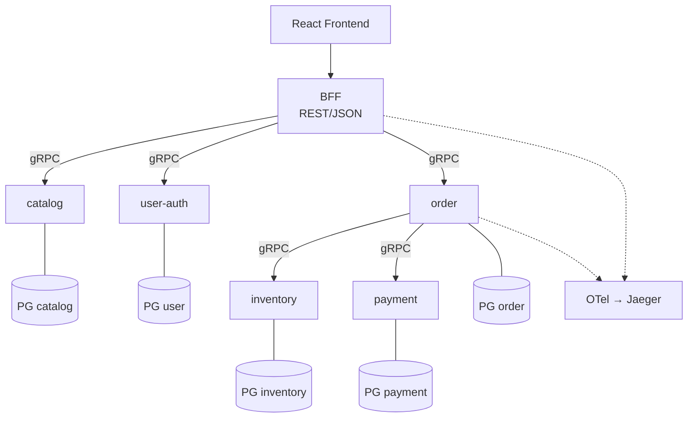

# 01: マイクロサービスとは

> マイクロサービスを「規模の小ささ」ではなく「独立にライフサイクル管理できる単位」として捉え、モノリスやモジュラーモノリスと何が違うのかを本章サンプルの構成と紐付けて整理する。

---

## 1. なぜ マイクロサービス を扱うのか

「マイクロサービス」は流行語として消費されやすいが、学習対象として最初に押さえるべきは、サイズではなく **何を独立させるか** である。

本章のサンプルは EC サイトを題材に、`catalog` / `inventory` / `order` / `payment` / `user-auth` の 5 サービスと BFF・フロントエンドを動かす。「実プロダクションで戦える最小」ではないが、**マイクロサービスを成立させる境界が何か** を体感するには十分な量である。

マイクロサービスを設計するとは、コード・データ・チーム・デプロイ・障害伝播のどこに線を引くかを決めることである。01 では一番外側の線、つまり「プロセス境界」を固める。チーム境界は [03_conway.md](03_conway.md)、コード境界は [04_decomposition.md](04_decomposition.md) に譲る。

## 2. マイクロサービス とは

本章では以下の 4 条件をすべて満たすものをマイクロサービスと呼ぶ。

1. **独立にデプロイ可能**: 他サービスを止めずに、自分だけを再起動・置換できる
2. **自分のデータを所有**: 自分の Postgres スキーマを持ち、他サービスはその DB を直接読み書きしない
3. **小さい責務**: ひとつのビジネス能力（例: 在庫管理）を引き受け、それ以外には踏み込まない
4. **プロセス境界で隔離**: 別プロセス・別コンテナで動き、通信はネットワーク越し（本章では gRPC）

ここで強調したいのは、**「マイクロ」は規模を表す形容詞ではない** ことである。本質は「独立にライフサイクル管理できる単位」 — 開発・デプロイ・障害対応・スケールアウトを他サービスに同期せずに進められる単位、という意味である。

### モノリスとの対比

モノリスは、上記 4 条件が一切成立しないアーキテクチャだと考えるとわかりやすい。

| 観点 | モノリス | モジュラーモノリス | マイクロサービス |
|---|---|---|---|
| プロセス | 単一プロセス | 単一プロセス | 複数プロセス |
| デプロイ単位 | アプリ全体 | アプリ全体 | サービスごと |
| データ所有 | 単一 DB を全モジュールが共有 | 単一 DB（モジュール別スキーマで論理分割することも） | サービスごとに別 DB |
| 境界の強制 | なし（インポート自由） | コードレベル（モジュール間の依存ルール） | 配備レベル（プロセス・ネットワーク） |
| 障害分離 | 1 箇所の panic でプロセス全体が落ちる | 同上 | 1 サービスのクラッシュは他に直接波及しない |
| 通信コスト | 関数呼び出し | 関数呼び出し | ネットワーク I/O |

**モジュラーモノリス** は、モノリスのまま境界を「コードレベル」で強制する設計である。Go なら internal パッケージ、Java ならモジュールシステムなどで不正な参照を弾く。マイクロサービスとの最大の違いは、**境界を破ろうと思えばリビルドで簡単に破れる** こと。それを「楽さ」と取るか「規律の弱さ」と取るかは、組織とサービス数次第である。

逆にいえば、マイクロサービスは「境界を物理的に強制する」アーキテクチャである。`inventory` のテーブルを `order` から SQL で直接読むことは、ネットワーク的に到達できないので物理的にできない。これが規律として機能する一方で、運用コストの源にもなる（[02_pros_cons.md](02_pros_cons.md)）。

### 「サービス」と「ライブラリ」の違い

似ているようで決定的に違うのがライブラリとサービスである。

- **ライブラリ**: 呼び出し側のプロセスに **同居** する。失敗は例外・戻り値で同期的に返る。デプロイは呼び出し側の再ビルドが必要。
- **サービス**: 呼び出し側とは **別プロセス** で動く。失敗はネットワーク遅延・タイムアウト・部分障害として現れる。デプロイは独立。

独立デプロイの必要がなければライブラリで十分なことも多い。サービス化はタダではない（タイムアウト・リトライ・観測性などのコストが付随する）。

## 3. 実例: 本章のサンプルではどう現れるか

本章のリポジトリ構成（Plan 1 で確定したもの）は以下のとおりである。

```
06_microservie/
├── proto/        # gRPC 契約（5 サービス分の .proto）
├── services/     # 5 マイクロサービス（catalog / inventory / order / payment / user-auth）
├── bff/          # BFF（REST→gRPC 変換、UI 向けの集約）
├── frontend/     # React + Vite
└── docker-compose.yml
```

`services/` 直下に並ぶ 5 ディレクトリが、それぞれ独立のマイクロサービスである。各サービスは自分の Postgres を持ち、`proto/` で定義された gRPC 契約越しにしか相互参照しない。BFF は複数サービスを束ねる集約レイヤで、UI 向けに REST/JSON で応答するが、自分は永続化を持たない。

章全体の構成を簡略化すると次のようになる（親仕様 §3.1 の全体図を本 doc の説明粒度に合わせて単純化したもの）。



サンプルが「最小のマイクロサービス」になっている事実を確認する。

- **5 services**: ビジネス能力ごとに独立した責務（カタログ・在庫・注文・決済・認証）
- **+ BFF**: フロント向け集約のためのサービス（永続化なし）
- **+ frontend**: 同じ docker-compose 上で動く React アプリ
- **+ 5 Postgres**: DB-per-service を物理的に強制

注文確定フローを例にとると、`bff/internal/handler/checkout.go::Checkout.Post` が REST を受け取り、order サービスを呼ぶ。order は `services/order/internal/saga/checkout.go::Run` の中で `services/inventory/internal/server/grpc.go::Reserve` を gRPC で呼ぶ。**`order` が `inventory` の Postgres を直接見ない** — この一点が、モジュラーモノリスではなくマイクロサービスにしている境界である。

認証も同じ構造で、`services/user-auth/internal/jwt/jwt.go::Issue` と `Verify` で JWT を発行・検証し、BFF は `bff/internal/middleware/auth.go::Auth` で入口を守る。

## 4. 落とし穴 / よくある誤解

**誤解 1: 「マイクロ」だからコード量が少ない**
コード量は結果でしかない。一つのサービスが何千行になっても、独立デプロイ可能で自分の DB を持っていればマイクロサービスである。逆に 100 行のサービスでも、他サービスの DB を覗いていればそれは「ただの分散モノリス」である。

**誤解 2: 「サービスを分けた = マイクロサービス」**
プロセスを分けただけで境界（データ所有・契約・独立デプロイ）が伴わないものは **分散モノリス** と呼ばれる。本章では「DB を分ける」「proto で契約を切る」「タイムアウト・リトライ・サーキットブレーカー」を持ち込み、これに陥らない最小例を示す。

**誤解 3: モノリスは劣ったアーキテクチャ**
モノリスやモジュラーモノリスは多くの場合、より合理的な選択肢である。組織の運用力が伴わないうちに分散させると、得られる独立性以上に運用負荷が増える。選定基準は [02_pros_cons.md](02_pros_cons.md) で扱う。

## 5. スコープ外 — この章で扱わないこと

以下は意図的に踏み込まない。

- **「サイズの基準」議論**: 「ピザ 2 枚で養えるチーム」のような基準には触れない。サイズより独立性の話を先に固めるため。
- **組織論・コンウェイの法則**: チームと境界の対応は [03_conway.md](03_conway.md) で扱う。本 doc は「プロセス境界」に集中する。
- **サービス分割の方法論**: 境界づけられたコンテキストに基づく分割は [04_decomposition.md](04_decomposition.md) で扱う。
- **通信プロトコル選択・データ所有・レジリエンス・観測性**: それぞれ独立 doc で扱う。

---

**次に読む:** [02: メリット・デメリット](02_pros_cons.md)
**章の入口に戻る:** [README](../README.md)
