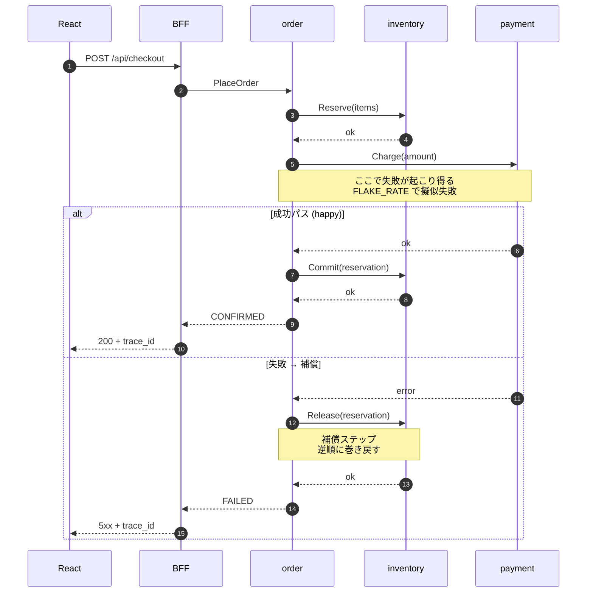

# 02: マイクロサービスのメリット・デメリット

> マイクロサービスは「銀の弾丸」ではない。何を得て、何を失うのかを直視し、選定の判断材料を持ち帰る。

---

## 1. なぜ メリット・デメリット を扱うのか

`01_concepts.md` で違いを整理した次に直面するのは「自分のシステムで採用すべきか」という意思決定である。判断を誤ると、得るはずだったメリットが幻になり、デメリットだけが残る。「Netflix がやっているから」で踏み込むと運用の複雑性に圧倒され、逆に必要なのに踏み込まないとデプロイの渋滞に押し潰される。

この doc の why は **「メリットとデメリットを対称に把握し、判断材料を渡す」** ことに尽きる。how はチェックリストと本章サンプル（注文確定 Saga）の実例で示す。

---

## 2. メリットとデメリット とは

### 2.1 メリット 4 つ

#### (a) 独立デプロイ

各サービスは独自のリポジトリ/パイプライン/コンテナを持ち、他サービスを止めずにデプロイできる。モノリスでは「在庫の小さな修正」のために全機能を含むバイナリを再デプロイするが、マイクロサービスなら `inventory` だけを差し替えられる。

#### (b) 独立スケール

サービスごとにリソース特性は違う。`catalog` は読み込み中心で水平スケールしやすく、`payment` は外部 API 待ちが多い。プロセスを分けておけば `catalog` だけを 10 レプリカに増やし `payment` は 2 のままにできる。モノリスでは「最大需要に合わせて全体を倍にする」しか選択肢がない。

#### (c) 障害分離

`payment` が外部決済 API の障害で落ちても、`catalog` の商品一覧と `inventory` の在庫表示は生き続ける。タイムアウト・リトライ・サーキットブレーカーを組み合わせれば、ユーザに見えるのは「決済だけが一時的に使えない」状態にできる。

#### (d) 技術スタック自由度

サービスごとに言語・DB・ライブラリを選べる。本章は Go + Postgres で統一しているが、現実には「機械学習バッチは Python」のように適材適所が許される。ただし自由度は両刃の剣で、運用が分散するコストを次のデメリットで払う。

### 2.2 デメリット 4 つ

#### (a) 運用複雑性

プロセス数・コンテナ数・DB 数・パイプライン数が N 倍になる。本章でも Postgres 5 台、Go プロセス 6 つ、OTel Collector と Jaeger が加わる。本番では k8s・CI/CD・シークレット管理・証明書・ログ集約をすべて N サービス分整える必要がある。

#### (b) 分散トランザクション

モノリスなら 1 つの DB トランザクションで完結した処理が、マイクロサービスでは複数 DB にまたがる。2 フェーズコミット（2PC）は実用的でないため、**Saga（補償トランザクション）** で結果整合性を取りに行くのが定石になる。実装と障害時のデバッグは明確に難しい。

#### (c) 観測性の困難

「1 リクエストが何をしたか」を知るのに複数サービスのログを突き合わせる必要がある。サービス境界を越えるたびにコンテキストが切れるため、`trace_id` を伝搬する分散トレースが必須になる。本章では OpenTelemetry + Jaeger でこれを最初から組み込んでいる。

#### (d) ネットワーク遅延と失敗

モノリスのメソッド呼び出しは「ほぼ確実に・μ秒で」返ってくる。gRPC 呼び出しは「ms オーダーで・時々失敗する」。タイムアウト・リトライ・冪等性・サーキットブレーカーを考慮しないと、ネットワークの 1 % の失敗率がシステム全体の体感品質を破壊する。

### 2.3 選定チェックリスト

以下に **YES が多ければマイクロサービスを検討する** クラスに入る。すべて YES である必要はないが、過半数が NO なら（モジュラー）モノリスのほうが幸せである可能性が高い。

- [ ] サービスごとに独立したデプロイ頻度が要求されているか
- [ ] 機能ごとに必要なスケール特性が大きく違うか
- [ ] 障害ドメインを分離したい強い動機があるか
- [ ] チームを複数のストリーム整列型に分けられる組織規模か（詳細は `03_conway.md`）
- [ ] 分散トレース・構造ログ・メトリクスを最初から運用に組み込む覚悟があるか
- [ ] 結果整合性を業務側と合意できるか
- [ ] 冪等性キー設計・リトライ戦略・サーキットブレーカーを各呼び出しに入れる工数を見込めるか
- [ ] CI/CD・コンテナ基盤・シークレット管理を N サービス分回せるか

逆に、以下に当てはまるならまずモジュラーモノリスを選ぶべきである。

- [ ] チームが 1〜2 ピザサイズ（〜10 名前後）に収まる
- [ ] ドメイン境界がまだ定まっておらず月次で再設計している
- [ ] 観測性とレジリエンスへ初期投資する時間が取れない

---

## 3. 実例: 本章のサンプルではどう現れるか

本章のサンプル（親仕様 §3.4 主要フロー）では、注文確定が次の Saga として走る。

このフローはメリットとデメリットを同時に体現している。

**メリット側**

- 独立デプロイ: `payment` を修正しても `catalog` と `inventory` は無停止
- 独立スケール: `catalog` だけ急増しても `order` には影響しない
- 障害分離: `payment` が落ちても商品閲覧と過去注文の参照は生き続ける
- 技術スタック自由度: `payment` だけ別言語にしても他サービスは無関心

**デメリット側**

- 運用複雑性: `docker-compose.yml` に Postgres 5 台と Go 6 プロセスと OTel スタックが並ぶ
- 分散トランザクション: 補償ステップを `services/order/internal/saga/checkout.go::Step` で構造体として持つ
- 観測性の困難: `bff/internal/middleware/traceid.go::TraceID` と `bff/internal/obs/tracing.go::InitTracing` を入れて初めて Jaeger 上に 1 本の trace として並ぶ
- ネットワーク遅延と失敗: `services/payment/internal/flake/flake.go::ShouldFail` の擬似失敗に、`services/order/internal/saga/checkout.go::Run` の `backoff.Retry` 呼び出しと `gobreaker.CircuitBreaker` の初期化で対処する

### 3.1 擬似失敗と BFF 集約が教えるもの

`services/payment/internal/flake/flake.go::ShouldFail` は `FLAKE_RATE` で確率的に `Charge` を失敗させる装置で、`make demo:retry`（0.2）はリトライ、`make demo:circuit`（0.6）はサーキットブレーカーの Open 遷移を観察させる。モノリスでは不要だった仕掛けが代償として必要になる。

`bff/internal/handler/checkout.go::Checkout.Post` は `order.PlaceOrder` を呼ぶ薄い集約レイヤで、`trace_id` をレスポンスヘッダに含めることで、ユーザがエラー画面の ID を Jaeger に貼り付けて自分の trace を辿れる。観測性の困難への教材としての答えである。

---

## 4. 落とし穴 / よくある誤解

- **「サービスを小さく切るほど良い」ではない**。境界づけられたコンテキストを跨いだ細切れは、結合度の高い分散モノリスを生む。詳しくは `04_decomposition.md`
- **「マイクロサービスにすれば速くなる」ではない**。ネットワーク越しの呼び出しはモノリスのメソッド呼び出しより遅い。目的はスループットや障害分離であって、レイテンシ低減ではない
- **「Saga を入れれば分散トランザクションは解決」ではない**。Saga は結果整合性を許容できるドメインで、補償ステップを書ける業務であることが前提
- **「観測性は後から足せる」ではない**。`trace_id` 伝搬は最初から全サービスに入れないと、サービス追加のたびにブラックホールが増える
- **「サーキットブレーカーを入れたから安全」ではない**。Open 時のフォールバック（縮退表示・エラー画面）を業務側と合意していなければユーザ体験は守れない
- **「モノリスは時代遅れ」ではない**。モジュラーモノリスは多くの組織にとって最も合理的な選択肢である

---

## 5. スコープ外 — この章で扱わないこと

- マイクロサービス採用に必要な具体的な人月見積もりや組織サイズの数値基準（「N 人以上なら採用」のような断定）
- Mesos/Kubernetes 導入コストの試算
- API ゲートウェイ製品（Kong, APISIX 等）の選定基準 — 本章では BFF を自前で書く
- Choreography 型 Saga・Outbox/Inbox パターン — `07_resilience.md` で概念のみ軽く触れる

これらは現実の採用判断で必要になるが、本章は学習者に「メリット・デメリットの対称な目線」を渡すことを優先する。

---

**次に読む:** [03: コンウェイの法則と Team Topologies](03_conway.md)
**章の入口に戻る:** [README](../README.md)
