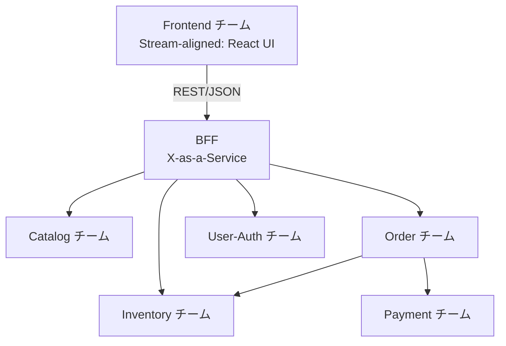

# 03: コンウェイの法則と Team Topologies

> 「システム設計は組織のコミュニケーション構造を写す」というコンウェイの法則を起点に、Inverse Conway Maneuver と Team Topologies が望むアーキテクチャを引き寄せる仕組みを整理する。

---

## 1. なぜ コンウェイの法則 を扱うのか

マイクロサービスを「分割の技術」だけで議論すると現場では壊れる。境界が綺麗に切れていても、ひとつのチームが 5 サービス全部を抱えていれば独立デプロイの旨味は出ない。逆に組織が分断されているのにモノリスを共同編集していれば、調整コストで前に進めない。

この「組織とアーキテクチャの形が揃っていないと痛い」という現象を半世紀前に言語化したのがコンウェイの法則である。本章の 5 サービス分割は「技術的に切れるから切った」のではなく、「将来そういう責務分担のチームを想定するから切った」と読むのが正しい。本 doc では、その読み替えのための語彙 — コンウェイの法則、Inverse Conway Maneuver、Team Topologies — を導入する。

---

## 2. コンウェイの法則 とは

### 2.1 主張と原典

Melvin E. Conway が 1968 年の論文 *"How Do Committees Invent?"* で述べた一文がよく引用される。

> "Any organization that designs a system ... will inevitably produce a design whose structure is a copy of the organization's communication structure."

意訳すれば「システムを設計する組織は、その組織のコミュニケーション構造を写したものを必ず作る」。Conway が言っているのは「報告ライン」ではなく「コミュニケーション構造」だという点に注意したい。誰と誰が日常的に会話するか、レビューがどこを跨いで走るか — そういう情報の流れ方が、システムの結合度として現れる。

### 2.2 なぜ「組織が先、アーキテクチャが後」になりがちか

機械的なメカニズムが 3 つある。

1. **インターフェースは合意コスト** — 別チーム所有モジュールの境界変更は合意が要る。コストが高いから、最初から境界に変更が及ばないよう設計が引かれ、チーム境界がそのままモジュール境界になる。
2. **暗黙知の局所性** — 同じチーム内では前提を共有しているので密結合なコードを書ける。チーム外には説明可能な API しか露出できない。
3. **意思決定の経路** — 設計判断はコミュニケーション経路の上で行われる。経路が分かれていれば判断も分かれ、コードは分かれたまま固まる。

新しいシステムをゼロから設計しているつもりでも、人は今いるチーム編成・座席・既存プロダクトの所有関係に影響される。結果、ドメインの自然な境界ではなく、組織の都合で境界が引かれる。

### 2.3 Inverse Conway Maneuver

そこで提唱されたのが Inverse Conway Maneuver である。「組織がアーキテクチャを規定する」という法則を逆手に取り、**先に望むアーキテクチャを決め、それに合うように組織のコミュニケーション構造を作り直す**。

- ドメインを分析して理想的なサービス境界を引く
- それぞれのサービスを所有する小さなチームを作る
- API・ドキュメント・所有 DB を整え、他チームと余計な会話をしなくて済むようにする
- レビュー権限・デプロイ権限もチーム境界に合わせる

肝心なのは「組織図」を書き直すのではなく「実際の日常のコミュニケーションの流れ」を作り直す点である。報告ラインを変えても日々のやり取りが旧来通りなら、コンウェイの法則は古い形のまま再現される。

---

## 3. 実例: 本章のサンプルではどう現れるか

### 3.1 Team Topologies — 4 種のチームと 3 種のインタラクション

Matthew Skelton と Manuel Pais による Team Topologies は、Inverse Conway Maneuver を「どんなチームを、どう関係させるか」という具体形に落とし込んだ枠組みである。

**4 種のチーム**

| 種別 | 役割 |
|---|---|
| **Stream-aligned** | ひとつのビジネス価値の流れにエンドツーエンドで責務を持つ。主役 |
| **Enabling** | Stream-aligned が新しい技術を獲得するのを一時的に支援する |
| **Platform** | 内製の「製品としての基盤」を提供し、Stream-aligned の認知負荷を下げる |
| **Complicated subsystem** | 暗号・検索・ML 等、専門知識が必要な複雑な部分を担う |

**3 種のインタラクション**

| 種別 | 性質 |
|---|---|
| **Collaboration** | 探索期に 2 チームで詰める。高帯域・短期。長引かせない |
| **X-as-a-Service** | 一方が API として提供し、他方は「使うだけ」。低帯域・長期 |
| **Facilitating** | Enabling が Stream-aligned をコーチングする。知識移転後に終わる |

Collaboration を平常運転にせず、長期関係は X-as-a-Service に収斂させる。これが「組織のコミュニケーション帯域を絞る」ことの実態である。

### 3.2 5 つの仮想 Stream-aligned チーム

本章の 5 サービスを仮想チームに割り当てる思考実験をしてみよう。

| チーム名（仮想） | 所有サービス | ビジネスストリーム |
|---|---|---|
| Catalog チーム | `services/catalog` | 商品情報の整備・公開 |
| Inventory チーム | `services/inventory` | 在庫の真実を保ち、予約・確定・解放を提供する |
| Order チーム | `services/order` | 注文ライフサイクル全体、Saga 含む |
| Payment チーム | `services/payment` | 決済の試行・結果 |
| User-Auth チーム | `services/user-auth` | ユーザ管理と JWT 発行 |

各チームは自分の所有 DB を持ち、他チームの DB を直接覗かない。これは技術原則であると同時に、「他チームの内部表現に無断で依存しない」という組織原則でもある。

### 3.3 frontend は BFF を X-as-a-Service として消費する Stream-aligned

frontend は React UI を持つもうひとつの Stream-aligned チームとして位置づける。ただし frontend は 5 つのバックエンドサービスを直接叩かず、**BFF を X-as-a-Service として消費する**。

frontend は「在庫の内部表現」も「Saga のステップ構造」も知らずに済む。BFF が安定した API（カート・チェックアウト・注文履歴）を契約として提供し、奥がどう分割されていても frontend には見えない。Order と Inventory / Payment の関係も平常時は X-as-a-Service。横断的な観測性スタック（OTel Collector + Jaeger）は仮想 Platform チームが提供する内製基盤と読める。

### 3.4 サービス境界＝チーム境界＝認知境界

`catalog` と `inventory` が同じ `product_id` を扱うのに別サービスである理由は、「カタログの真実」と「在庫の真実」が**別チームの責務**だと想定しているからである。同じチームが両方を持つなら、ひとつのサービスにまとめた方が運用は楽になる。「分割すべきか」の答えは、コードを眺めて出るものではなく、**誰がそのコードに責任を持ち続けるか**の答えが先にある。

---

## 4. 落とし穴 / よくある誤解

- **「組織を分けたから自動でマイクロサービスになる」は誤り** — 組織だけ分けても共有 DB が残れば合意形成が要り、コードだけ分けてもひとつのチームが全部抱えていれば調整コストは消えない。両輪で揃えて初めて意味がある。
- **Stream-aligned を「機能横断チーム」と読み替えない** — 本質は「ビジネス価値の流れにエンドツーエンドで責務を持つ」こと。便宜的に職能を集めただけのチームではなく、長期に同じストリームを持ち続け判断権限を持つ点が肝心。
- **Platform チームを「インフラ係」と読み替えない** — Stream-aligned が「セルフサービスで使える」状態を目指す内製プロダクト提供者である。チケット駆動の窓口になった瞬間、それは Collaboration の慢性化であり Team Topologies が避けたい状態である。
- **Inverse Conway Maneuver は「組織図を書き直す」ことではない** — 変えるべきは「誰と誰が毎日話すか」「誰がレビューを通すか」「誰がデプロイ権限を持つか」である。
- **「BFF があるから frontend は何も考えなくていい」は誤り** — X-as-a-Service の関係でも、frontend が BFF の SLA・エラー契約・trace_id 受け渡しに無頓着であってよいわけではない。

---

## 5. スコープ外 — この章で扱わないこと

- **実組織での導入手順** — どのチームから着手するか、評価制度をどう変えるか、移行期に旧チームとどう共存させるか、といった実務手順は対象外。
- **Spotify モデル等の派生** — Squad / Tribe / Chapter / Guild のような特定組織から生まれた派生モデルは扱わない。Team Topologies は汎用枠組みとして紹介する。
- **チーム規模・人数の具体論** — Two-pizza team や Dunbar 数の議論は本筋から外れるため省く。
- **コミュニケーションツールの選定** — Slack / Teams 等の選定論は組織論の周辺であって本 doc の主題ではない。

---

**次に読む:** [04: サービス分割](04_decomposition.md)
**章の入口に戻る:** [README](../README.md)
