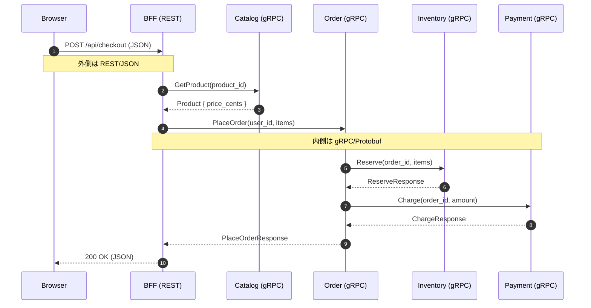

# サービス間通信: 同期と非同期、REST と gRPC

> マイクロサービスでは「どう呼ぶか」が「何を分けたか」と同じくらい設計を左右する。本章は同期と非同期、REST と gRPC の使い分けと、本サンプルが採る「外は REST、内は gRPC」方針を整理する。

---

## 1. なぜ通信方式を扱うのか

モノリスの世界では関数呼び出しに約束ごとはほとんど無い。同一プロセス内なのでメモリは共有され、戻り値は必ず返ってくる。マイクロサービスではこの前提が崩れる。サービスは別プロセス、しばしば別ホストに分かれ、その間にはネットワークが横たわる。ネットワークは関数呼び出しと違って **遅い・落ちる・順序が狂う・重複する**。

通信方式の選び方ひとつで応答時間、障害伝播の範囲、デプロイの自由度、開発体験までも変わる。さらに「同期か非同期か」「REST か gRPC か」という選択は後から差し替えるコストが高い。だから境界づけられたコンテキスト同士をどう繋ぐかは、分け方と同じレベルで上流に置いて考える必要がある。

---

## 2. 通信方式の比較

### 2.1 同期 vs 非同期 — 即応性と結合度

**同期通信** は呼び出し元が応答を待つ方式である。HTTP リクエスト/レスポンスや gRPC unary がこれにあたる。長所は単純で、結果を見てから次の処理を組み立てられる。短所は呼び出し先が落ちている、あるいは遅延しているとき、呼び出し元もそのまま引きずられる点。すなわち **時間的結合 (temporal coupling)** が強い。チェックアウトのように「在庫を確保できなければ注文を作らない」場面で活きる。

**非同期通信** は呼び出し元がメッセージを投げて結果を待たない方式。応答性が高く時間的結合がほどける反面、結果整合性と冪等性の設計が必須になる。通知や集計のような後追いでよい処理で力を発揮する。

| 観点 | 同期 | 非同期 |
|---|---|---|
| 応答時間 | 上流に依存 | 受付完了で即返る |
| 結合度 | 時間的に強結合 | 弱結合 |
| 整合性 | その瞬間は強整合 | 結果整合 |
| 失敗時 | エラーが伝播 | リトライ/補償が前提 |
| 適する処理 | 決定 (注文確定など) | 通知、集計、ETL |

本章は学習目的で同期通信に絞り、メッセージング基盤は §5 のとおりスコープ外とする。

### 2.2 REST vs gRPC — 人間可読とバイナリ効率

REST と gRPC は対立軸ではなく目的が違う道具と捉えるのが良い。

| 観点 | REST (HTTP/1.1, JSON) | gRPC (HTTP/2, Protobuf) |
|---|---|---|
| エンコーディング | テキスト (JSON) | バイナリ (Protocol Buffers) |
| 契約 | OpenAPI / 慣習 | `.proto` (強制) |
| トランスポート | HTTP/1.1 が一般的 | HTTP/2 多重化 |
| 帯域 / レイテンシ | 人間可読だが冗長 | 小さく速い |
| ブラウザ互換 | そのまま動く | 直接は不可 |
| デバッグ | curl / DevTools | grpcurl など |
| クライアント生成 | 手書きや自動生成 | proto から自動生成が前提 |

REST の強みは **人間とブラウザに優しい** こと。URL とメソッドで表現され、JSON はそのまま読め、DevTools の Network タブで挙動が追える。gRPC の強みは **マシン間で速く正確に話せる** こと。proto がインターフェースを強制するため両端で型が揃い、HTTP/2 の多重化で多数の呼び出しを少ない TCP コネクションで捌ける。

### 2.3 本サンプルの選択 — 外は REST、内は gRPC

本章のサンプルはこの両者を **境界ごとに使い分ける**。

- **BFF と外 (ブラウザ) は REST** — フロントエンドは `fetch` だけで叩け、レスポンスは JSON でそのまま読める。学習教材として「動いている様子が見える」ことを優先した。
- **BFF と内 (サービス間) は gRPC** — 在庫、注文、決済、ユーザー認証は gRPC で繋ぐ。proto が契約を強制し、クライアントコードは buf が生成する。マシン同士の会話なので型安全と効率が優る。

これは BFF (Backend for Frontend) パターンの自然な帰結でもある。BFF は「ブラウザ向け語彙」と「内部サービス語彙」を翻訳する場所であり、両側で違うプロトコルが使われるのはむしろ素直だ。

### 2.4 proto による契約管理

gRPC を選んだ以上 **proto ファイルが正本** になる。サービスもクライアントも proto から生成され、手書き DTO が真ん中で食い違う事故が起きにくい。

本サンプルでは `proto/` 配下に `catalog/v1/`, `inventory/v1/`, `order/v1/`, `payment/v1/`, `user/v1/` を置き、buf でコード生成を回している。`buf.gen.yaml` が生成プラグインを、`buf.yaml` が lint と breaking change チェックを宣言する。これにより「proto を壊す変更を CI で止める」運用が自然に成立する。

### 2.5 「ネットワークは信頼できない」前提

どんなに整った契約でもネットワーク自体は壊れる。Fallacies of Distributed Computing が指摘するとおり、ネットワークは信頼できず、遅延はゼロでなく、帯域は無限でなく、トポロジは変わる。この前提を受け入れると、同期通信を書くときに自然と以下を意識する。

- **タイムアウト** — 待ち続けない。呼び出しごとに上限を切る。
- **リトライ** — 一時的失敗はやり直す。ただし冪等性が前提。
- **サーキットブレーカー** — 連続失敗時は呼び出しを止める。
- **観測性** — どこで遅延・失敗したかを trace_id と span で追える。

実装パターンは `07_resilience.md` で深掘りする。本章では「通信方式の選択そのものが信頼性設計と地続き」点を押さえる。

---

## 3. 実例: 本章のサンプルではどう現れるか

### 3.1 全体フロー

ブラウザが `/api/checkout` を叩いてから注文が確定するまでの流れを追う。

ブラウザと BFF の間だけが REST/JSON で、それより内側はすべて gRPC/Protobuf。BFF が **プロトコルの翻訳点** として機能している。

### 3.2 BFF — REST を受けて gRPC を集約する

エントリポイントは `bff/internal/handler/checkout.go::Checkout.Post`。JSON で `{ items: [{ product_id, quantity }, ...] }` を受け取り、(1) Catalog から商品価格を引き、(2) Order に PlaceOrder を発行する二段の集約をする。

ハンドラ内で扱う型に注目したい。ブラウザ向け DTO (`checkoutReq`, `checkoutResp`) は同ファイルに手書きされ、Order への引数 `*orderv1.PlaceOrderItem` は `proto/order/v1/order.proto` から自動生成された型をそのまま使う。BFF が「人間向けの語彙」と「マシン向けの語彙」をマッピングする場所であることが、コードの形にそのまま現れている。

### 3.3 サービス側 — proto が契約を強制する

下流の例として `services/inventory/internal/server/grpc.go::Reserve` を見ると、`*inventoryv1.ReserveRequest` を受け `*inventoryv1.ReserveResponse` を返すシグネチャは `proto/inventory/v1/inventory.proto` の `rpc Reserve(...)` をそのまま映している。proto を変えれば両端の型が同時に変わり、CI の `buf` がスキーマ破壊を検出する。

### 3.4 認証だけは別系統

BFF 入り口の `bff/internal/middleware/auth.go::Auth` は JWT を検証して `user_id` をコンテキストに乗せる。認証は REST の世界 (Authorization ヘッダ) で完結させ、内部 gRPC には「検証済みのユーザー ID」だけを流す。境界で守り内側は信頼するという構造である。

---

## 4. 落とし穴 / よくある誤解

**「REST と gRPC のどちらが優れているか」** — 役割が違う道具である。ブラウザに gRPC を直接話させようとすると grpc-web のような追加レイヤが要り、デバッグ体験は悪化する。逆にサービス間で REST/JSON を使うと毎回 JSON をパースし、型は手書きで合わせ、契約は人間の規律に頼ることになる。

**「proto があれば破壊的変更は起きない」** — 起きる。フィールド番号の付け替え、enum の値削除など proto3 の規約に沿わない変更は容赦なく壊す。buf の breaking check を CI に挟むのは「ここを人間の注意力に任せない」宣言である。

**「同期だから整合性が取れている」** — その一瞬だけ。Order が PlaceOrder の途中で落ちれば、在庫は Reserve されたまま注文は残らない可能性がある。だから Saga と補償 (Release) が要る (`08_saga.md`)。

**「内部は信頼できるからリトライ不要」** — 同一データセンタ内でもパケットロスは起き、サービス再起動中の数百ミリ秒は呼び出し元から見れば落ちているのと同じ。タイムアウトとリトライは外向きだけでなく内向きにも要る。

---

## 5. スコープ外 — この章で扱わないこと

- **メッセージング基盤 (NATS / Kafka / RabbitMQ)** — 非同期通信そのものは紹介したが、ブローカー選定や Pub/Sub には踏み込まない。
- **GraphQL** — BFF とブラウザの間で GraphQL を使う選択肢はあるが、本章は REST/JSON に固定する。
- **gRPC streaming** — server / client / bidirectional streaming は扱わない。本章は unary のみ。
- **サービスメッシュ / サイドカー** — Istio や Linkerd の話は `07_resilience.md` に寄せ、本章では触れない。
- **REST 詳細設計** — URL 設計、HATEOAS、バージョニング戦略には踏み込まない。

---

**次に読む:** [06: データ所有](06_data_ownership.md)
**章の入口に戻る:** [README](../README.md)
