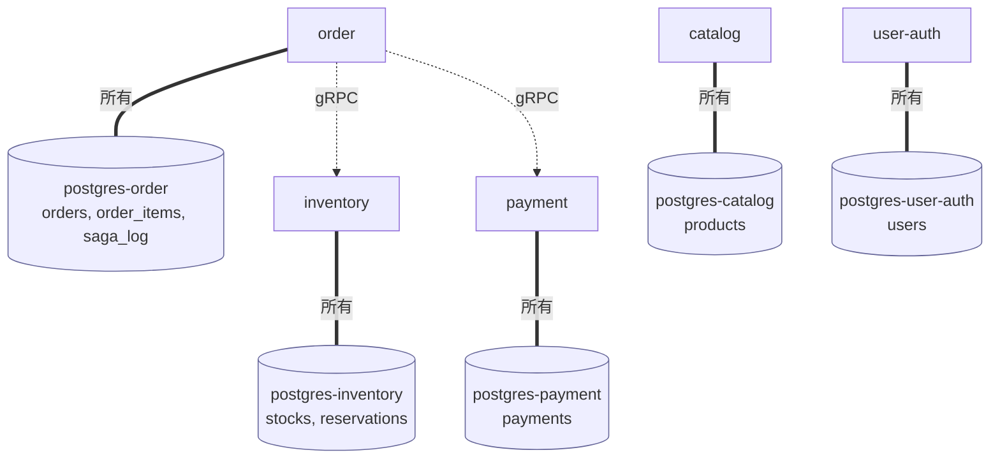

# 06: データ所有 — DB-per-service と結果整合性

> マイクロサービスにおける最大の不自由「他サービスの DB を直接見ない」と、その代償として現れる「外部キーが効かない世界」「結果整合性」「データの意図的な重複」を、本章サンプルの 5 つの Postgres と `inventory` / `catalog` の構造を通じて整理する。

---

## 1. なぜ データ所有 を扱うのか

[01_concepts.md](01_concepts.md) で挙げたマイクロサービスの 4 条件のうち、もっとも踏み外しやすいのが「**自分のデータを所有する**」である。プロセスを分け、proto で契約を切り、独立にデプロイできるようにしたとしても、複数サービスが **同じ DB を共有** した瞬間にすべての独立性は崩壊する。スキーマ変更は同期デプロイを要求し、片方のバグが他方のテーブルを壊し、性能問題が連鎖する — 典型的な「分散モノリス」である。

マイクロサービスにおけるデータ所有は、**外部キー制約による整合性保証を捨てる代わりに、サービス境界の独立性を得る** という設計上の取引である。本 doc では「DB-per-service の原則」「参照整合性が消える世界」「結果整合性」「データ重複は正常」「価格スナップショット」の 5 軸でその取引を読み解く。整合性を取り戻す補償ロジックは [07_resilience.md](07_resilience.md)、Outbox / Event Sourcing は §5 でスコープ外として明示する。

## 2. データ所有 とは

### 2.1 DB-per-service の原則

DB-per-service とは、各マイクロサービスが **自分専用の物理 DB を持ち、他サービスはそれを直接読み書きしない** という設計原則である。境界破りは二つあり、どちらも禁止する。

- **直接 SQL を投げる**: 他サービスの Postgres に接続して `SELECT` する
- **共有テーブルを作る**: 二つのサービスが同じテーブルへ書き込む

許される唯一のアクセス手段は **所有者サービスが公開する API（本章では gRPC）越し** である。これにより、所有者は内部スキーマを自由に変更でき、外部に対しては proto の契約だけを安定させればよい。

### 2.2 参照整合性が効かなくなる世界

単一 DB のモノリスなら `order_items.product_id` から `products.id` に **外部キー制約** を貼れる。存在しない `product_id` の挿入は DB が物理的に拒否する。

しかし DB-per-service では `products` は catalog の DB、`order_items` は order の DB にあり、**二つの Postgres インスタンスをまたぐ外部キーは作れない**。order が「この `product_id` は catalog に存在するか？」を確かめる手段は catalog の gRPC を呼ぶことだけで、呼んだ次の瞬間に削除されているかもしれない。受け入れるべき事実は次の三つである。

- **書き込み時点で参照先の存在を保証できない**
- **強整合な「外部キー違反 → 即エラー」は得られない**
- **整合性の責任はアプリ側に移る**（存在確認・補償をコードで書く）

これは弱点というより、**境界の代償** である。

### 2.3 結果整合性と読み手の責任

外部キーが効かない世界で残るのは「**結果整合性（eventual consistency）**」 — ある時点では「order の `product_id` が catalog では消えている」状態が起こり得るが、**十分な時間が経てば** 関係者の状態は揃う、という時間軸を含む整合性概念である。

ここで読み手（読み出し側）に新しい責任が生まれる。

- **古い・存在しないデータを前提に組む**: catalog から消えた商品 ID が order に残った場合の表示（「販売終了」）を UI で用意する
- **整合性のタイミングを宣言する**: 「商品名は数秒遅れて更新される」と仕様で許容する
- **冪等な再試行で揃える**: 一時的な不整合は時間とリトライで解消する（[07_resilience.md](07_resilience.md)）

「**読み手が古い・欠けたデータに耐える**」 — これが結果整合性を選んだ世界のコストである。

### 2.4 データの重複は正常

単一 DB では重複は正規化違反として嫌われる。DB-per-service では逆に **重複は正常であり、しばしば必須** である。サービス境界をまたいで JOIN ができないため、サービス A が B の値を画面に出したければ毎回 B を呼ぶか、必要な分だけ自分の DB に **写しを持つ** しかない。

注意点は「同じ ID でも **意味が違う**」場合があることで、次節の `product_id` がまさにそれである。

## 3. 実例: 本章のサンプルではどう現れるか

### 3.1 5 インスタンスの Postgres

親仕様 §3.2 のサービス責務表を再掲する。

| サービス | 所有データ |
|---|---|
| **catalog** | `products(id, name, price, ...)` |
| **inventory** | `stocks(product_id, available, reserved)`、`reservations(...)` |
| **order** | `orders(...)`、`order_items(..., unit_price_cents)`、`saga_log(...)` |
| **payment** | `payments(id, order_id, status, amount, ...)` |
| **user-auth** | `users(id, email, password_hash, ...)` |

これら 5 つは `docker-compose.yml` 上で **5 つの独立した Postgres コンテナ** として配備されている（`postgres-catalog` / `postgres-inventory` / `postgres-order` / `postgres-payment` / `postgres-user-auth`）。一つの Postgres に 5 スキーマを置く論理分離もあり得るが、本章ではあえて **物理的に分離** することで「DB を共有できない」原則を見える化している。

`order` が `inventory` や `payment` の DB を覗くことはできない。order の Saga は `services/order/internal/saga/checkout.go::Run` の中で `services/inventory/internal/server/grpc.go::Reserve` / `Commit` / `Release` を gRPC 越しに呼ぶ。

### 3.2 `inventory` と `catalog` が同じ `product_id` を別の意味で持つ

最も分かりやすい「意図的な重複」は、`product_id` という文字列が **2 つの DB に出現する** ことである。

- catalog 側の `products.id`: **その商品が存在し、何という名前で、いくらか** という「カタログの真実」
- inventory 側の `stocks.product_id`: **その SKU の在庫がいくつ確保可能か** という「在庫の真実」

同じ `P-001` でも、catalog から見れば「コーヒー豆、1200 円」、inventory から見れば「available: 42、reserved: 3」である。**どちらも自分の文脈での真実を持っている** ため、所有者が一意に決まっていれば見た目の重複は健全である。商品の表示属性が変わっても在庫数には影響しないし、catalog が落ちても inventory は引当を続けられる。

### 3.3 注文行に price snapshot を保存する

`order_items` テーブルには `unit_price_cents` 列がある。これは catalog の `products.price` を **注文時点でコピーした値**、すなわち **価格スナップショット** である。catalog の現在価格を毎回参照しない理由は二つある。

1. **catalog の価格変更から独立させる**: ユーザが「1200 円」を確認して注文した直後に catalog 側で 1500 円に変わっても、その注文の請求額は 1200 円のままでなければならない。注文は **その時点の価格に対する合意** であり、後から書き換えられる構造は事実関係を壊す。
2. **注文サービスが catalog に依存しない**: 注文履歴を返すたびに catalog を叩く設計だと、catalog 障害時に履歴表示まで巻き込まれる。スナップショットがあれば order だけで完結する。

「**コピーは正常**」原則の典型例である。

## 4. 落とし穴 / よくある誤解

**誤解 1: 「DB を分けたらマイクロサービス」**
物理 DB を分けても、A が B の Postgres ユーザで直接 SQL を投げているなら形だけの分離である。本章では Postgres ユーザをサービスごとに分け、他サービスの認証情報を持たせないことで物理的に強制している。

**誤解 2: 「外部キーが効かないと整合性が壊れる」**
外部キーは整合性を保つ **手段の一つ** に過ぎない。マイクロサービスでは「Saga による補償」「冪等性キーによる再試行安全性」「読み手の耐性」の三点セットで整合性を組み立てる。概念が「強整合 → 結果整合」にズレるだけで、壊れるわけではない。

**誤解 3: 「価格スナップショットは性能最適化」**
これは性能ではなく **意味論** の問題である。catalog の参照が無料でも、過去の注文に「現在の価格」を当てるのは事実関係として誤りである。

## 5. スコープ外 — この章で扱わないこと

- **Event Sourcing / CQRS**: 状態変更をイベント列で保存し、読み出し用モデルを別途構築する設計。本章の射程外。
- **Outbox / Inbox パターン**: DB 書き込みとメッセージ発行を信頼性をもって連動させる定番パターン。本章では `make seed` で擬似的に解決している。
- **分散トランザクション（2PC, Saga 補償ロジック）**: 補償の設計と実装は [07_resilience.md](07_resilience.md) で扱う。

---

**次に読む:** [07: レジリエンス](07_resilience.md)
**章の入口に戻る:** [README](../README.md)
