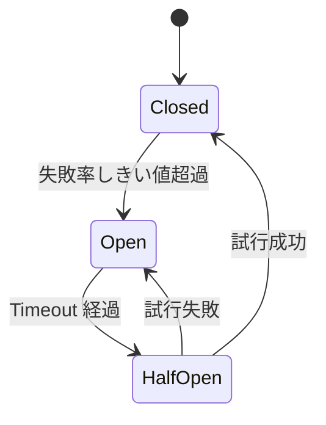
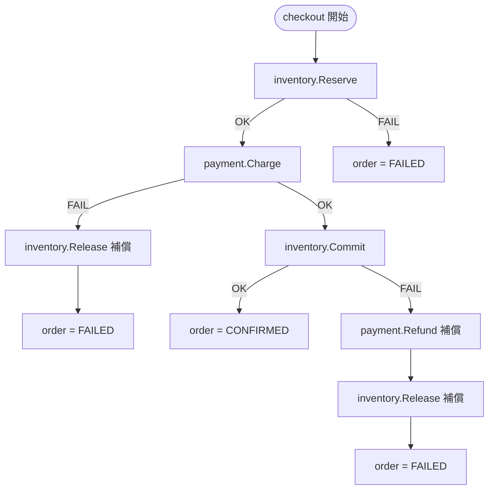

# 07: レジリエンス

> マイクロサービスはネットワーク越しに結ばれた時点で部分障害が前提になる。本 doc では本章サンプルの注文 Saga を題材に、タイムアウト・リトライ・サーキットブレーカー・補償（Saga）・冪等性キーがなぜセットで必要なのかを整理する。

---

## 1. なぜ レジリエンス を扱うのか

モノリスでは「関数呼び出しは戻ってくる」ことが暗黙の前提だった。マイクロサービスではこの前提が壊れる。

第一に、**ネットワークは信頼できない**。古典的な「分散コンピューティングの誤謬」が示すように、レイテンシはゼロではなく、相手はいつ落ちるか分からない。`order` から `inventory` への gRPC 呼び出しは「相手が応答するか分からない要求」である。

第二に、**障害は独立しているように見えて連鎖する**。`payment` が応答しないとき、`order` がただ待ち続けるとワーカが詰まり、BFF からの新規注文も詰まる。1 サービスの遅延が全体の遅延に化ける現象がカスケード障害である。障害分離の恩恵を受けたければ、**待つことを諦める仕組み** を呼び出し側に持たせる必要がある。

親仕様 §4.1 のレジリエンスパターン表を引用する。

| パターン | 実装箇所 | 方針 |
|---|---|---|
| **Timeout** | `bff → 各サービス`、`order → inventory/payment` | gRPC の Context deadline。サーバ側でも `ctx.Err()` チェック。デフォルト 2s |
| **Retry** | `order → inventory.Reserve`、`order → payment.Charge` | 指数バックオフ。冪等な呼び出しのみ。最大 3 回 |
| **Circuit Breaker** | `order → payment.Charge` | 直近 10 秒の失敗率 50% 超で 30 秒 Open、半開で 1 件試行 |
| **Saga（補償）** | `order` サービス内（オーケストレータ方式） | `services/order/internal/saga/checkout.go::Run` に集約 |

## 2. レジリエンス とは

### 2.1 タイムアウト

呼び出し側が「これ以上待たない」期限（deadline）を必ず設ける。Go では `context.WithTimeout` を使い、gRPC クライアントに ctx を渡せば、deadline に達した時点で `DeadlineExceeded` が返る。サーバ側も同じ ctx を受け取り、長時間処理の途中で `ctx.Err()` を確認して中断する。これがないと、クライアントは諦めたのにサーバはまだ動いている「ゾンビ処理」が発生する。

タイムアウトは **一番外の deadline が一番大きい** ように設計する。BFF が 5s なら `order → inventory` は 3s、その内側の DB は 1s。逆順だと、外側のタイムアウトに到達する前にすべて成功扱いされてしまう。

### 2.2 リトライ

`DeadlineExceeded`・`Unavailable` のような一過性のエラーは、少し待って叩き直せば成功することが多い。ただしリトライは無条件には許されない。

1. **冪等な呼び出しに限る**: 2 回投げて副作用が二重に起きてはいけない（§2.5 へ）
2. **指数バックオフ**: 失敗直後の殺到リトライは相手の復旧を遅らせる。100ms → 200ms → 400ms と倍々に伸ばす
3. **永続エラーは即停止**: `FailedPrecondition`（例: 在庫不足）は何度叩いても結果が変わらない。`backoff.Permanent` でループを止める

### 2.3 サーキットブレーカー

リトライしても相手が壊れているなら、リトライ自体が無駄なリソース消費になる。サーキットブレーカーは「直近の失敗率が一定を超えたら、呼び出し自体を諦める」スイッチである。

- **Closed**: 通常通過、内部で成功/失敗をカウント
- **Open**: 即時失敗を返す。相手にリクエストを送らない（=相手の復旧を邪魔しない）
- **Half-Open**: 一定時間後、試行 1 件だけ通す。成功で Closed、失敗で Open に戻る

### 2.4 Saga（補償）

複数サービスを跨ぐ業務トランザクションは単一の ACID では括れない。`inventory` と `payment` は別 DB なので、二相コミットを避けるなら **失敗時に手で巻き戻す** しかない。これが Saga である。

本章はオーケストレータ方式を採る。`services/order/internal/saga/checkout.go::Run` がコーディネータとなり、ステップを直列に進め、途中で失敗したら **成功済みのステップを逆順に補償** する。

補償もまた失敗しうる。Release が失敗したら saga_log に記録し、後で人手か別ジョブで突き合わせる。教材としては「補償の失敗はログに残す」までで十分とする。

### 2.5 冪等性キー

リトライを安全にする鍵が冪等性キーである。同じキーで何度呼んでも、相手は「一度しか実行しない」ことを保証する。

- `inventory.Reserve`: `reservation_id`。2 回 Reserve しても 2 重に在庫を引かない
- `payment.Charge`: `payment_idempotency_key`（`order-` + 注文 ID）。2 回叩いても 2 重に課金しない

冪等性キーがないと、リトライは「成功したかもしれない呼び出しをもう一度叩く」危険な操作になる。タイムアウト発火時、サーバ側で処理が完了していたかどうかはクライアントから区別できない。冪等性キーで初めて、安心してリトライできる。

## 3. 実例: 本章のサンプルではどう現れるか

注文確定フロー全体は `services/order/internal/saga/checkout.go::Run` に集約されている。Step1〜Step3 を Reserve → Charge → Commit の順に進め、各ステップが失敗したら逆順に補償する Saga が、`Run` 内のシーケンシャルなコードとして並んでいる。

リトライは Reserve 側に組み込まれている。`services/order/internal/saga/checkout.go` の `backoff.Retry` 呼び出しが指数バックオフ付き最大 3 回のリトライを回す。`FailedPrecondition`（在庫不足）が返った場合は `backoff.Permanent` でラップして即終了するため、業務的に回復不能なエラーで無駄なリトライを繰り返さない。

サーキットブレーカーは Payment 側に組み込まれている。`services/order/internal/saga/checkout.go` の `gobreaker.CircuitBreaker` の初期化で名前付きブレーカーを作り、`Charge` の実呼び出しを包む。失敗率 50% を超えて 5 件以上で Open、30 秒経つと Half-Open に遷移し試行 1 件で復旧判定をする。

擬似失敗注入は `services/payment/internal/flake/flake.go::ShouldFail` に集約してある。環境変数 `FLAKE_RATE` の確率で失敗を返すだけの薄い関数で、`Charge` ハンドラの先頭で呼ばれる。`make demo:retry`（`FLAKE_RATE=0.2`）でリトライ発火、`make demo:circuit`（`FLAKE_RATE=0.6`）でブレーカー Open 遷移を観察できる。

冪等性キーは 2 か所で渡る。`inventory.Reserve` には `reservation_id`、`payment.Charge` には `payment_idempotency_key` を渡す。「Charge がタイムアウトで返ったが、サーバ側では完了していた」というケースでも、リトライで二重課金は起きない。

結果として、サンプルは次の振る舞いを観察できる教材になっている。

- 単発の一時障害は **リトライで吸収**
- 連続的な障害は **ブレーカーで遮断** され、`payment` の復旧を邪魔しない
- `order.status` は最終的に `FAILED` か `CONFIRMED` に落ち着き、中間状態は残らない
- 失敗 trace は Jaeger UI で赤く表示され、`saga_log` にステップごとの結果が残る（詳細は [08_observability.md](08_observability.md)）

## 4. 落とし穴 / よくある誤解

**誤解 1: とりあえずリトライを入れれば直る**
非冪等な呼び出しのリトライは二重課金・二重出庫を生む。リトライは冪等性キーとセットで初めて安全になる。

**誤解 2: タイムアウトを長くすれば失敗が減る**
タイムアウトを伸ばすと、相手が壊れたとき自分のコネクションが詰まりカスケード障害を起こす。短めに設定し、足りないぶんはリトライとブレーカーで埋める。

**誤解 3: サーキットブレーカーは多いほどよい**
ブレーカーは呼び出し先ごとに分けるのが基本。全 RPC を 1 つにまとめると無関係な相手にも遮断がかかる。本章は失敗が出やすい `payment.Charge` のみ装着し、内向きの `inventory` 系には付けていない。

**誤解 4: Saga は分散トランザクションの代替**
Saga は ACID を提供しない。途中状態が外部から観測されうるし、補償が失敗するケースも残る。Saga が保証するのは「最終的にどの状態に落ち着くか」だけである。一時的な不整合を許容できない業務なら、そもそもサービス分割の境界を見直すべき（[04_decomposition.md](04_decomposition.md)）。

**誤解 5: 補償は元操作の「逆操作」**
Refund は Charge の逆ではない。Charge は課金を作る、Refund は払い戻しレコードを作る、で台帳上は両方の事実が残る。レジリエンスは「数学的に元に戻す」のではなく、「業務的に整合する状態に持っていく」ことを目指す。

## 5. スコープ外 — この章で扱わないこと

- **Bulkhead**: コネクションプール隔離。本章はプロセスが別なので一定は成立しているがプール隔離まではやらない
- **Rate limiting**: 自分の処理能力を超えるリクエストを早期に弾く。本章では入れない
- **Backpressure**: 下流の負荷を上流に伝えて流量制御する仕組み。非同期メッセージング基盤の話になる
- **Choreography 型 Saga**: イベントバス経由で各サービスが自律的に進める方式。本章はオーケストレータ方式のみ
- **Outbox / Inbox パターン**: DB 書き込みと外部イベント発行を原子的に揃えるテーブル設計

これらは 09_scaling_istio.md やその先で名前だけ触れるが、本 doc の射程はオーケストレータ Saga と同期 RPC のレジリエンスに絞る。

---

**次に読む:** [08: 観測性](08_observability.md)
**章の入口に戻る:** [README](../README.md)
