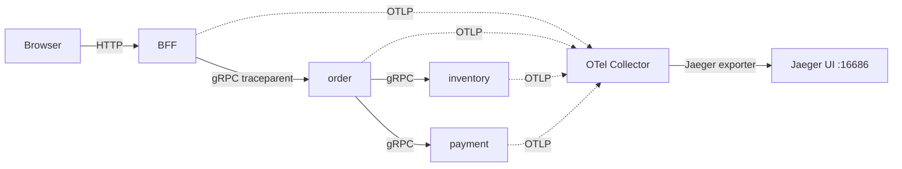

# 08: 観測性 — 構造ログと分散トレース

> マイクロサービスでは「1 回の checkout がどこで何秒かかり、どこで落ちたか」をログだけでは追えない。trace_id を縦串にして、複数プロセスを横断する出来事を 1 本の物語に束ねる仕組みを学ぶ。

---

## 1. なぜ観測性を扱うのか

モノリスではリクエストがプロセスの中で完結していて、スタックトレースとログを時系列に並べれば因果関係が追えた。マイクロサービスではこの前提が崩れる。本章サンプルで `POST /api/checkout` を 1 回叩くだけで、リクエストは「ブラウザ → BFF → order → inventory.Reserve → payment.Charge → inventory.Commit」を渡り歩く。

途中で payment が擬似失敗してリトライが走り、最終的にサーキットブレーカーが開いた場合、`docker compose logs payment` だけ眺めても「なぜ閉じたか」「どの注文が巻き込まれたか」は見えない。ログがプロセス単位に分散しているからだ。

欲しいのは「同じ checkout に属するイベントだけを横串で取り出す ID」と、「サービス境界をまたいで親子関係を再構成する仕組み」。前者が trace_id、後者が分散トレースで、観測性 (observability) はこの 2 つを足場に「外から見えるシグナルから内部状態を推測できる性質」を指す。

---

## 2. 観測性の 3 本柱と分散トレースの考え方

観測性は伝統的に **ログ / メトリクス / トレース** の 3 本柱で語られる。本章はそのうちログとトレースに焦点を絞る（メトリクスはスコープ外）。

### 2.1 構造ログ

ログをマイクロサービス間で機械的に処理するために **JSON 構造ログ**を採用する。Go なら標準 `slog` の JSON handler でよい。必須フィールドは `time` / `level` / `service` / `trace_id` / `span_id` / `msg` の最小セット。trace_id さえ揃っていれば `docker compose logs | jq 'select(.trace_id=="<id>")'` で 1 リクエスト分のログだけ拾える。

### 2.2 分散トレース

1 リクエストの処理は、サービスごとに細かい区間 (span) に分かれる。「BFF が REST を受けた」「order が saga を回した」「inventory.Reserve を呼んだ」がそれぞれ別の span だ。**trace_id** はリクエスト全体に 1 つで、ブラウザから入って戻るまで不変。**span_id** は各区間に 1 つ。**parent_span_id** は「この span を呼んだ親」を指し、これで親子関係の木構造が再現できる。span は開始時刻・終了時刻・属性（呼び出し先 URL、エラー有無）を持ち、全部集めるとリクエストのガントチャートが組み上がる。Jaeger UI で見える「1 本の trace」がそれだ。

### 2.3 W3C TraceContext と traceparent

サービス境界をまたぐ際、trace_id と親 span_id を運ぶ標準が **W3C TraceContext** だ。HTTP/gRPC のリクエストに以下のヘッダを 1 行だけ載せる。

```
traceparent: 00-<trace_id>-<parent_span_id>-<flags>
```

受け側はこのヘッダから親情報を取り出し、自分の span を子として開始する。送信側は自分の span_id を載せて下流に伝搬する。これで「prop­agation（伝搬）」が成立する。

### 2.4 OpenTelemetry の三層構造

トレースの実装は **OpenTelemetry (OTel)** が事実上の標準で、本章もこれに従う。三層に分かれる。

| 層 | 役割 | 本章での実体 |
|---|---|---|
| SDK | アプリ内で span を作り、エクスポータに渡す | 各 Go プロセスにリンクされた OTel SDK |
| Collector | SDK から受け取り、バックエンドへ整形・転送する中継 | `otel-collector` コンテナ |
| バックエンド | trace を保存・検索・可視化する | Jaeger (`:16686`) |



SDK と Collector を分ける理由は、アプリから「どこに送るか」を引き剥がせるからだ。今日は Jaeger、明日は Tempo、と差し替えるときに変更が Collector の設定だけで済む。

---

## 3. 実例: 本章のサンプルではどう現れるか

### 3.1 SDK の初期化

各 Go プロセスは起動時に OTel SDK を立ち上げる。BFF の例: `bff/internal/obs/otel.go::InitTracing`。やることは 3 つだけ — OTLP/gRPC で Collector を指す exporter を作り、サービス名を載せた `TracerProvider` をグローバル登録し、`propagation.TraceContext{}` をグローバル propagator にする（= traceparent ヘッダを読み書きする方言を選ぶ）。

order / inventory / payment / user-auth にも同形のコードが置かれている。これは親仕様 §4.7 の **意図的な重複** だ。共通ライブラリ化すれば DRY だが、教材では「初期化が各サービスに収まっていて読みやすい」を優先した。実プロダクトでは社内 SDK にまとめるのが普通、と明示することで誤解を防いでいる。

### 3.2 サービス境界の自動 instrumentation

gRPC に `otelgrpc` の **interceptor** を server / client 両側に挟む。これだけで:

- サーバ側は受信した traceparent を読み、子 span を開始
- クライアント側は呼び出すときに自分の span_id を traceparent に詰めて送信

アプリコードに `tracer.Start(...)` を書かなくても、サービス境界の span は自動的に積み上がる（親仕様 §4.5）。BFF → order → inventory/payment のチェーンが Jaeger 上で 1 本に並ぶのはこの interceptor のおかげだ。

### 3.3 trace_id をレスポンスヘッダで返す

BFF は HTTP の入口で受けた（あるいは生成した）trace_id を、レスポンスの `X-Trace-Id` ヘッダに必ず載せる。実装は `bff/internal/middleware/traceid.go::TraceID`。リクエスト context の span から trace_id を取り出し、`w.Header().Set` するだけのシンプルなミドルウェアだ。

これによりブラウザ側は「自分の出した 1 リクエスト」の trace_id を知ることができる。

### 3.4 エラー JSON に trace_id を同梱

エラーレスポンスは `bff/internal/httpx/error.go::WriteError` で必ず以下の形に揃える。

```json
{ "code": "INVENTORY_INSUFFICIENT", "message": "...", "trace_id": "<32 hex>" }
```

ヘッダだけでなく body にも入れる理由は、フロントが catch した例外オブジェクトの中だけで trace_id を保持できるようにするためだ。UI でトーストを出すコードがレスポンスヘッダまで遡る必要がなくなる。

### 3.5 フロントエンドでの体験

ブラウザ側のフェッチラッパ `frontend/src/api/http.ts::apiFetch` は、成功時はヘッダから、失敗時は body から trace_id を取り出して `ApiResult` または `ApiError` に詰める。`ApiError` クラスは `code`, `message`, `traceId` を持つ Error の拡張だ（マイクロサービスのエラー追跡を Error オブジェクトに含めるための例外的な class 使用）。

UI コンポーネント `frontend/src/components/TraceIdChip.tsx::TraceIdChip` は受け取った trace_id を短縮表示し、クリップボードコピーと「Jaeger で開く」リンクを提供する。ユーザは checkout が失敗したエラートーストの隣でこのチップを押すと、Jaeger の該当 trace に直接飛べる。

### 3.6 BFF の Checkout 集約と trace の見え方

`bff/internal/handler/checkout.go::Checkout.Post` が REST の入口、order の saga が下流呼び出しを束ねる。Jaeger 上では次のような階層になる。

```
bff: POST /api/checkout
└─ order: Checkout.Run (saga)
   ├─ inventory: Reserve
   ├─ payment: Charge          ← ここで擬似失敗するとリトライが span として並ぶ
   └─ inventory: Commit
```

成功した checkout は緑の span が一本に並ぶ。payment が落ちた checkout は赤い span が見え、エラーメッセージも span attribute に残る。`docker compose logs order | jq 'select(.trace_id=="<id>")'` で同じ trace_id のログを横断的に読めば、Jaeger のガントとログが完全に対応する。

---

## 4. 落とし穴 / よくある誤解

**(1) ログに trace_id を入れ忘れる**: SDK を入れて Jaeger には trace が出るのに、ログ側に trace_id を入れていないと「Jaeger で異常な span を見つけたが、対応するログ行が探せない」が起こる。共通ミドルウェアで `slog.With("trace_id", ...)` を必ず注入し、`grep` で突き合わせ可能にしておく。

**(2) フロント側で traceparent を生成してしまう**: 学習者が「ブラウザから traceparent を送るべきでは」と考えがちだが、本章では BFF に trace の開始を任せている（親仕様 §4.5）。ブラウザ起点の trace を真面目に扱うとサンプリングや CORS の検討が増えて学習動線が太るためだ。

**(3) 全 span を 100% 保存する前提で考える**: 本章は学習用なのでフルサンプリングだが、本番では 1% などにサンプリングするのが普通だ。サンプリング戦略は本 doc のスコープ外（§5）。

**(4) 観測性 = 監視 (monitoring) と混同する**: 監視は「既知の壊れ方を検知する」、観測性は「未知の壊れ方を後から問い詰められる」性質だ。Dashboards が緑でも観測性は低い、という状況はありうる。

**(5) Collector を省略して SDK から直接 Jaeger に送る**: 1 サービスならそれでも動くが、エクスポート先を変えるたびに全プロセスを再デプロイする羽目になる。Collector を挟むのは「アプリと永続化を切り離す」のが目的だ。

---

## 5. スコープ外 — この章で扱わないこと

- **メトリクス (Prometheus / Grafana)**: 観測性 3 本柱のうちメトリクスは本章で実装しない。`POST /api/checkout` の p99 レイテンシを赤線で見たい、SLO を引きたい、というのは次のステップだ。
- **ログ集約基盤 (Loki / ELK / Datadog)**: 本章は `docker compose logs` と `jq` で済ませる。複数ホストにスケールしたら集約基盤が必要になるが、概念は trace_id を縦串にする原則が変わらないだけで、本 doc の主張に直接影響しない。
- **サンプリング戦略の細部**: head-based / tail-based、確率 vs ルールベース、エラーは必ず残す、などは実運用の論点。本章は学習用にフル取得。
- **アラート / on-call ローテーション**: SRE 文脈は別教材で扱う。
- **profiling / continuous profiling (Pyroscope 等)**: 「どの関数が CPU を食っているか」は重要だが、本章はサービス境界の可視化が主題。

---

**次に読む:** [09: 大規模化と Istio](09_scaling_istio.md)
**章の入口に戻る:** [README](../README.md)
