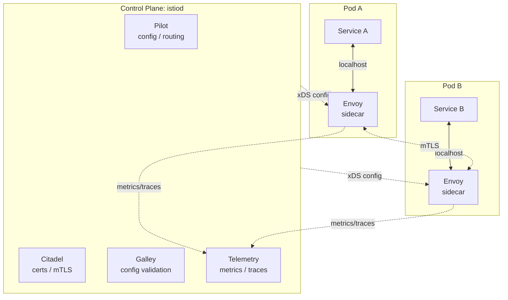

# 09: 大規模化と Istio

> サービスが 5 個から 50 個・500 個へと増えるとき、本章でアプリに書いてきた mTLS・リトライ・サーキットブレーカー・トラフィック分割・観測性は「インフラ層」に追い出される。その移動先がサービスメッシュであり、代表例として Istio の構成要素を概念で押さえる。

---

## 1. なぜ 大規模化と Istio を扱うのか

本章ではここまで、5 つのマイクロサービスを題材に、レジリエンス（[07](07_resilience.md)）と観測性（[08](08_observability.md)）をアプリのコードとして書いてきた。タイムアウトは `context`、リトライは `backoff.Retry`、サーキットブレーカーは `gobreaker.CircuitBreaker`、trace_id は `bff/internal/middleware/traceid.go::TraceID` でレスポンスに付加した。

5 サービスならこれで破綻しない。しかし以下のような状況になるとどうなるか。

- サービスが 50 個になり、Go・Node.js・Python・Kotlin が混在する
- 「サービス間通信は必ず mTLS にせよ」というセキュリティ要件が降ってくる
- 新バージョンに 5% だけトラフィックを流したい（カナリアリリース）
- 「全サービスで p99 レイテンシを取れ」と監査が来る

これらをアプリで実装しようとすると、各言語で `tls.Config` を組み、リトライライブラリの選定で揉め、アプリ側のルータを書き、メトリクスエクスポータを各プロセスに埋め込むことになる。**横串の関心事がアプリのコードに混じり込む** ことの限界が、サービス数の増加で顕在化する。

サービスメッシュは「これらの横串関心事をアプリの外（インフラ層）に追い出す」という発想で答える。本 doc ではその分業のしくみと Istio の構成要素を概念で押さえる。

## 2. サービスメッシュ とは

サービスメッシュは「サービス間通信の責任を、アプリと別の場所に集める」設計パターンである。各サービスのプロセスのすぐ隣に **サイドカー** と呼ばれる小さなプロキシを常駐させ、サービス間のすべての通信をそのサイドカー経由にする。アプリは `localhost` の隣人にしか喋らず、ネットワークの実体はサイドカーが面倒を見る。

### 2.1 データプレーンとコントロールプレーン

メッシュは大きく 2 層に分かれる。

- **データプレーン**: 実際にトラフィックを処理する層。サイドカープロキシ（Istio では Envoy）の集合体。リクエストはここを通過する
- **コントロールプレーン**: データプレーンの設定を一元管理する層。Istio 本体（`istiod`）がここに当たる。リクエストはコントロールプレーンを通らない

リクエストパスはデータプレーン上にあり、コントロールプレーンが死んでも配布済み設定で通信は継続する（運用上の重要な性質）。

### 2.2 トポロジー

A から B への呼び出しは `A → SidecarA → SidecarB → B` という経路をたどる。mTLS の確立も、リトライも、サーキットブレーカーも、L7 ルーティングも、すべて `SidecarA ↔ SidecarB` の区間で起こる。

### 2.3 サイドカープロキシ（Envoy）の役割

Envoy はメッシュの「働き手」で、アプリと相乗りする形で常駐し以下を担う。

- **mTLS の終端と発端**: 平文のアプリ間通信を対向サイドカーとの間で TLS に乗せ替える。証明書はコントロールプレーンから配布される
- **L7 ルーティング**: HTTP/gRPC のメソッド・ヘッダ・パスに基づくルーティング
- **リトライ / タイムアウト / サーキットブレーカー**: ネットワーク失敗時の挙動をプロキシが担う
- **観測性のソース**: 全リクエストを計測しメトリクスと span をテレメトリ系に送る

### 2.4 Istio の構成要素

現在の Istio のコントロールプレーンは `istiod` という単一プロセスに統合されているが、論理的な責務に分けると次のようになる。

| コンポーネント | 責務 |
|---|---|
| **Pilot** | サービスディスカバリと Envoy への設定配布。`VirtualService` などを Envoy 設定に変換する |
| **Citadel** | サービスごとの証明書発行と mTLS 鍵管理。SPIFFE 形式の ID で Envoy 間の相互認証を成立させる |
| **Galley** | Istio への設定 YAML を検証・正規化する |
| **Telemetry** | メトリクス・分散トレースの集約と外部システム（Prometheus / Jaeger 等）への送出 |

設定は `kubectl apply → Galley が検証 → Pilot が Envoy 用設定に変換 → xDS API で各 Envoy に push` という一方向で届く。

### 2.5 メッシュが解く課題

1. **mTLS の標準化**: 「サービス間は必ず暗号化＋相互認証」をアプリのコード変更なしで満たす
2. **L7 ルーティング**: ヘッダやパスに基づく振り分け、バージョン別ルーティング
3. **観測性の標準化**: 全サービスから同じ形式のメトリクス・トレースが出る（実装言語によらず）
4. **トラフィック分割（カナリア）**: v1 に 95%、v2 に 5% といった振り分け、A/B テスト、シャドートラフィック

どれも「アプリのビジネスロジックではない」横串の関心事である。

## 3. 実例: 本章のサンプルではどう現れるか

本章のサンプルは **サービスメッシュを使っていない**。同じ関心事をアプリのコードで書いている。メッシュ移行で何がアプリから消えるかを対比で見ると、効果が直感的にわかる。

| 関心事 | 本章での実装位置 | メッシュ移行後 |
|---|---|---|
| サービス間 mTLS | なし（平文 gRPC） | サイドカー間で自動。アプリは平文のまま |
| order → payment のリトライ | アプリ側の `backoff.Retry` | サイドカーの `VirtualService` 設定 |
| order → payment のサーキットブレーカー | `services/order/internal/resilience/breaker.go::NewBreaker` と利用箇所 `services/order/internal/client/payment.go` | サイドカーの `DestinationRule` 設定 |
| trace_id 伝搬 | `bff/internal/middleware/traceid.go::TraceID` でレスポンスに付加 | サイドカーが `traceparent` を自動付加。レスポンスへの露出はアプリの仕事として残る |
| メトリクス取得 | 各サービスに OTel SDK | サイドカーが全リクエストを自動計測 |

特に注目したいのは、サーキットブレーカーがアプリのコードからは消え、`DestinationRule` の YAML だけが残るという点である。

ただし、すべてがメッシュに引き渡せるわけではない。

- **Saga の補償ロジック**: 「Reserve が成功して Charge が失敗したら Release を呼ぶ」というビジネスフローはメッシュには見えない。アプリ側に残る
- **冪等性キーの管理**: 同じ予約 ID で 2 度呼ばれてもよい、という保証はアプリの責務
- **構造ログのフィールド設計**: どの業務属性を `slog` で出すかはアプリの仕事
- **trace_id の UX 露出**: `traceparent` 伝搬はメッシュが、レスポンスヘッダや UI 表示はアプリが受け持つ

つまり「ネットワーク層の関心事はメッシュへ、ビジネスフローはアプリへ」という棲み分けになる。

## 4. 落とし穴 / よくある誤解

**誤解 1: サービスメッシュを入れればマイクロサービスが簡単になる**
メッシュは「横串関心事をどこに置くか」を変えるだけで、サービス分割・データ所有・Saga の難しさは一切解決しない。境界がぐちゃぐちゃのまま Istio を載せても、ぐちゃぐちゃがプロキシ越しに走るだけである。

**誤解 2: サイドカーはタダで動く**
Envoy は各 Pod に常駐する別プロセスで、CPU・メモリ・起動時間を消費する。サービス数 × Pod 数 × Envoy の固定コストが累積するため、ごく小規模では「アプリで書いた方が軽い」となる場面もある。

**誤解 3: メッシュがあればアプリにレジリエンスは要らない**
リトライ・タイムアウトはメッシュに寄せられる一方、**冪等性の保証** や **Saga の補償ステップ** はアプリにしか書けない。リトライがネットワーク層で勝手に走ると、冪等でない API では二重実行になる。「メッシュにリトライを任せる前提でアプリの冪等性を強化する」という順序が重要になる。

## 5. スコープ外 — この章で扱わないこと

以下は意図的に踏み込まない。

- **Istio の実セットアップ手順**: `istioctl install` や `kubectl apply -f ...` の操作は扱わない。本 doc は「何が・なぜ存在するか」だけ
- **Kubernetes マニフェスト・Helm**: 親仕様 §7 で明示的にスコープ外
- **他のサービスメッシュ実装**: Linkerd・Consul Connect・AWS App Mesh などの比較は対象外。Istio を「概念の代表例」として扱う
- **Istio ambient mode の細部**: サイドカーレスな運用形態にも触れるが、ztunnel・waypoint の詳細までは入らない

本章の主目的は「小さく動くマイクロサービスを書いて読む」ことである。メッシュは「もし 50 サービスになったらどこへ向かうか」を見据えるコンパスとして紹介し、実装はしない。

---

**次に読む:** [10: コード上のパターン索引](10_patterns_in_code.md)
**章の入口に戻る:** [README](../README.md)
