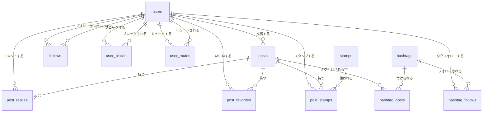

# データベース第2章: SQLクエリ最適化 Implementation Plan

> **For Claude:** REQUIRED SUB-SKILL: Use superpowers:executing-plans to implement this plan task-by-task.

**Goal:** SNSアプリケーションを題材に、EXPLAIN・インデックス・クエリチューニング・非正規化を段階的に学ぶデータベース教材（第2章）を作成する。

**Architecture:** 理論ドキュメント（トピック別4ファイル）+ 段階的演習（6ステップ）+ 解答の構成。参考リポジトリ（piamy-backend）のタイムラインCTE構造と非正規化パターンを簡略化して取り入れる。第1章の文体・構成パターンを踏襲する。

**Tech Stack:** PostgreSQL 17、Docker Compose、Markdown（Mermaid ER図）

---

## 参考ファイル（実装前に必ず確認すること）

- `05_database/01/docs/normalization.md` — 文体・Markdown構造の規範
- `05_database/01/sql/normalization.sql` — SQL命名規則・コメントスタイルの規範
- `05_database/docker-compose.yml` — ボリュームマウントのパターン
- `05_database/init/00_init.sh` — 初期化スクリプトのパターン
- `05_database/README.md` — READMEの章構成パターン

## 重要な制約

- SQLは全て `DROP TABLE IF EXISTS ... CASCADE;` で冪等に書く
- テーブル名・カラム名は英語スネークケース
- コメントは日本語で書く（`-- コメント`）
- Markdown内のテーブルは必ずサンプルデータを含む
- Mermaid ER図には必ずカーディナリティラベルを付ける（`||--o{` など）

---

### Task 1: ディレクトリ作成 + インフラ更新

**Files:**
- Create: `05_database/02/docs/.gitkeep`（ディレクトリ確保用）
- Create: `05_database/02/sql/.gitkeep`（ディレクトリ確保用）
- Modify: `05_database/docker-compose.yml:28`
- Modify: `05_database/init/00_init.sh:21-26`

**Step 1: ディレクトリを作成する**

```bash
mkdir -p /Users/yui/Documents/workspace/tanaka-yui/learning/05_database/02/docs
mkdir -p /Users/yui/Documents/workspace/tanaka-yui/learning/05_database/02/sql
```

**Step 2: docker-compose.yml を更新する**

`05_database/docker-compose.yml` の28行目のコメントを外す:
```yaml
      - ./02/sql:/sql/02:ro
```

**Step 3: init/00_init.sh を更新する**

chapter02セクション（21-26行）を以下に置き換える:

```bash
# ----------------------------------------------------------------
# chapter02: 02章（クエリ最適化）
# ----------------------------------------------------------------
psql -v ON_ERROR_STOP=1 --username "$POSTGRES_USER" --dbname "$POSTGRES_DB" \
    -c "CREATE DATABASE chapter02;"

psql -v ON_ERROR_STOP=1 --username "$POSTGRES_USER" --dbname "chapter02" \
    -f /sql/02/00_schema.sql

psql -v ON_ERROR_STOP=1 --username "$POSTGRES_USER" --dbname "chapter02" \
    -f /sql/02/01_explain.sql

psql -v ON_ERROR_STOP=1 --username "$POSTGRES_USER" --dbname "chapter02" \
    -f /sql/02/02_indexing.sql

psql -v ON_ERROR_STOP=1 --username "$POSTGRES_USER" --dbname "chapter02" \
    -f /sql/02/03_query_tuning.sql

psql -v ON_ERROR_STOP=1 --username "$POSTGRES_USER" --dbname "chapter02" \
    -f /sql/02/04_denormalization.sql

psql -v ON_ERROR_STOP=1 --username "$POSTGRES_USER" --dbname "chapter02" \
    -f /sql/02/exercise.sql

psql -v ON_ERROR_STOP=1 --username "$POSTGRES_USER" --dbname "chapter02" \
    -f /sql/02/answer.sql
```

**Step 4: コミット**

```bash
git add 05_database/docker-compose.yml 05_database/init/00_init.sh
git commit -m "feat(database): enable chapter02 in docker-compose and init script"
```

---

### Task 2: スキーマSQL（00_schema.sql）

**Files:**
- Create: `05_database/02/sql/00_schema.sql`

これが全ての基盤。大量テストデータを生成することでEXPLAINの差が明確に出る。

**Step 1: 00_schema.sql を作成する**

```sql
-- ============================================================
-- 00_schema.sql: SNS アプリケーションのスキーマ + テストデータ
-- 対象DB: chapter02
--
-- テーブル構成（3NF）:
--   users, posts, post_replies, post_favorites,
--   stamps, post_stamps,
--   follows, hashtags, hashtag_posts, hashtag_follows,
--   user_blocks, user_mutes
--
-- データ量（EXPLAIN の差が出るよう大量に投入）:
--   users: 1,000件
--   posts: 100,000件
--   follows: 50,000件
--   post_favorites: 200,000件
--   post_replies: 30,000件
--   hashtags: 100件
--   hashtag_posts: 300,000件
--   hashtag_follows: 10,000件
--   user_blocks: 5,000件
--   user_mutes: 5,000件
-- ============================================================

-- ============================================================
-- テーブル定義
-- ============================================================

DROP TABLE IF EXISTS user_mutes       CASCADE;
DROP TABLE IF EXISTS user_blocks      CASCADE;
DROP TABLE IF EXISTS hashtag_follows  CASCADE;
DROP TABLE IF EXISTS hashtag_posts    CASCADE;
DROP TABLE IF EXISTS hashtags         CASCADE;
DROP TABLE IF EXISTS post_stamps      CASCADE;
DROP TABLE IF EXISTS stamps           CASCADE;
DROP TABLE IF EXISTS post_favorites   CASCADE;
DROP TABLE IF EXISTS post_replies     CASCADE;
DROP TABLE IF EXISTS posts            CASCADE;
DROP TABLE IF EXISTS follows          CASCADE;
DROP TABLE IF EXISTS users            CASCADE;

-- ユーザー
CREATE TABLE users (
    id           SERIAL PRIMARY KEY,
    display_name VARCHAR(100) NOT NULL,
    bio          TEXT,
    created_at   TIMESTAMPTZ NOT NULL DEFAULT NOW()
);

-- フォロー関係
CREATE TABLE follows (
    user_id        INT NOT NULL REFERENCES users(id),
    follow_user_id INT NOT NULL REFERENCES users(id),
    created_at     TIMESTAMPTZ NOT NULL DEFAULT NOW(),
    PRIMARY KEY (user_id, follow_user_id),
    CHECK (user_id <> follow_user_id)
);

-- 投稿
CREATE TABLE posts (
    id         SERIAL PRIMARY KEY,
    user_id    INT NOT NULL REFERENCES users(id),
    content    TEXT NOT NULL,
    created_at TIMESTAMPTZ NOT NULL DEFAULT NOW()
);

-- コメント（投稿へのリプライ）
CREATE TABLE post_replies (
    id         SERIAL PRIMARY KEY,
    post_id    INT NOT NULL REFERENCES posts(id),
    user_id    INT NOT NULL REFERENCES users(id),
    content    TEXT NOT NULL,
    created_at TIMESTAMPTZ NOT NULL DEFAULT NOW()
);

-- いいね
CREATE TABLE post_favorites (
    post_id    INT NOT NULL REFERENCES posts(id),
    user_id    INT NOT NULL REFERENCES users(id),
    created_at TIMESTAMPTZ NOT NULL DEFAULT NOW(),
    PRIMARY KEY (post_id, user_id)
);

-- スタンプマスタ
CREATE TABLE stamps (
    id         SERIAL PRIMARY KEY,
    name       VARCHAR(50) NOT NULL,
    created_at TIMESTAMPTZ NOT NULL DEFAULT NOW()
);

-- 投稿へのスタンプ
CREATE TABLE post_stamps (
    post_id    INT NOT NULL REFERENCES posts(id),
    stamp_id   INT NOT NULL REFERENCES stamps(id),
    user_id    INT NOT NULL REFERENCES users(id),
    created_at TIMESTAMPTZ NOT NULL DEFAULT NOW(),
    PRIMARY KEY (post_id, stamp_id, user_id)
);

-- タグマスタ
CREATE TABLE hashtags (
    id         SERIAL PRIMARY KEY,
    name       VARCHAR(100) NOT NULL UNIQUE,
    created_at TIMESTAMPTZ NOT NULL DEFAULT NOW()
);

-- 投稿-タグ紐付け
CREATE TABLE hashtag_posts (
    hashtag_id INT NOT NULL REFERENCES hashtags(id),
    post_id    INT NOT NULL REFERENCES posts(id),
    created_at TIMESTAMPTZ NOT NULL DEFAULT NOW(),
    PRIMARY KEY (hashtag_id, post_id)
);

-- タグフォロー
CREATE TABLE hashtag_follows (
    hashtag_id INT NOT NULL REFERENCES hashtags(id),
    user_id    INT NOT NULL REFERENCES users(id),
    created_at TIMESTAMPTZ NOT NULL DEFAULT NOW(),
    PRIMARY KEY (hashtag_id, user_id)
);

-- ブロック
CREATE TABLE user_blocks (
    user_id       INT NOT NULL REFERENCES users(id),
    block_user_id INT NOT NULL REFERENCES users(id),
    created_at    TIMESTAMPTZ NOT NULL DEFAULT NOW(),
    PRIMARY KEY (user_id, block_user_id),
    CHECK (user_id <> block_user_id)
);

-- ミュート
CREATE TABLE user_mutes (
    user_id      INT NOT NULL REFERENCES users(id),
    mute_user_id INT NOT NULL REFERENCES users(id),
    created_at   TIMESTAMPTZ NOT NULL DEFAULT NOW(),
    PRIMARY KEY (user_id, mute_user_id),
    CHECK (user_id <> mute_user_id)
);

-- ============================================================
-- テストデータ生成
-- ============================================================

-- ユーザー: 1,000件
INSERT INTO users (display_name, bio, created_at)
SELECT
    'ユーザー' || i,
    'ユーザー' || i || 'のプロフィールです。',
    NOW() - (random() * INTERVAL '365 days')
FROM generate_series(1, 1000) AS i;

-- スタンプマスタ: 10件
INSERT INTO stamps (name) VALUES
    ('いいね'), ('最高'), ('笑える'), ('驚き'), ('悲しい'),
    ('怒り'), ('応援'), ('感謝'), ('好き'), ('拍手');

-- フォロー: 50,000件（1ユーザーあたり平均50フォロー）
INSERT INTO follows (user_id, follow_user_id, created_at)
SELECT DISTINCT
    (random() * 999 + 1)::INT,
    (random() * 999 + 1)::INT,
    NOW() - (random() * INTERVAL '300 days')
FROM generate_series(1, 60000)   -- 重複除去のため多めに生成
WHERE (random() * 999 + 1)::INT <> (random() * 999 + 1)::INT
ON CONFLICT DO NOTHING;

-- 投稿: 100,000件
INSERT INTO posts (user_id, content, created_at)
SELECT
    (random() * 999 + 1)::INT,
    '投稿内容 ' || i || ': ' || md5(i::TEXT),
    NOW() - (random() * INTERVAL '180 days')
FROM generate_series(1, 100000) AS i;

-- コメント: 30,000件
INSERT INTO post_replies (post_id, user_id, content, created_at)
SELECT
    (random() * 99999 + 1)::INT,
    (random() * 999 + 1)::INT,
    'コメント ' || i,
    NOW() - (random() * INTERVAL '180 days')
FROM generate_series(1, 30000) AS i;

-- いいね: 200,000件
INSERT INTO post_favorites (post_id, user_id, created_at)
SELECT DISTINCT
    (random() * 99999 + 1)::INT,
    (random() * 999 + 1)::INT,
    NOW() - (random() * INTERVAL '180 days')
FROM generate_series(1, 250000)
ON CONFLICT DO NOTHING;

-- スタンプ: 50,000件
INSERT INTO post_stamps (post_id, stamp_id, user_id, created_at)
SELECT DISTINCT
    (random() * 99999 + 1)::INT,
    (random() * 9 + 1)::INT,
    (random() * 999 + 1)::INT,
    NOW() - (random() * INTERVAL '180 days')
FROM generate_series(1, 70000)
ON CONFLICT DO NOTHING;

-- タグ: 100件
INSERT INTO hashtags (name)
SELECT 'タグ' || i FROM generate_series(1, 100) AS i;

-- タグ-投稿紐付け: 300,000件（1投稿あたり平均3タグ）
INSERT INTO hashtag_posts (hashtag_id, post_id, created_at)
SELECT DISTINCT
    (random() * 99 + 1)::INT,
    (random() * 99999 + 1)::INT,
    NOW() - (random() * INTERVAL '180 days')
FROM generate_series(1, 400000)
ON CONFLICT DO NOTHING;

-- タグフォロー: 10,000件
INSERT INTO hashtag_follows (hashtag_id, user_id, created_at)
SELECT DISTINCT
    (random() * 99 + 1)::INT,
    (random() * 999 + 1)::INT,
    NOW() - (random() * INTERVAL '300 days')
FROM generate_series(1, 15000)
ON CONFLICT DO NOTHING;

-- ブロック: 5,000件
INSERT INTO user_blocks (user_id, block_user_id, created_at)
SELECT DISTINCT
    (random() * 999 + 1)::INT,
    (random() * 999 + 1)::INT,
    NOW() - (random() * INTERVAL '300 days')
FROM generate_series(1, 7000)
WHERE (random() * 999 + 1)::INT <> (random() * 999 + 1)::INT
ON CONFLICT DO NOTHING;

-- ミュート: 5,000件
INSERT INTO user_mutes (user_id, mute_user_id, created_at)
SELECT DISTINCT
    (random() * 999 + 1)::INT,
    (random() * 999 + 1)::INT,
    NOW() - (random() * INTERVAL '300 days')
FROM generate_series(1, 7000)
WHERE (random() * 999 + 1)::INT <> (random() * 999 + 1)::INT
ON CONFLICT DO NOTHING;

-- 統計情報を最新化（EXPLAIN の推定を正確にする）
ANALYZE;
```

**Step 2: SQLが正しく実行できることを確認する（Dockerが起動中の場合）**

```bash
psql -h localhost -U learning -d chapter02 -f \
  /Users/yui/Documents/workspace/tanaka-yui/learning/05_database/02/sql/00_schema.sql
```

Expected: エラーなしで完了。最後に`ANALYZE`が表示される。

**Step 3: コミット**

```bash
git add 05_database/02/sql/00_schema.sql
git commit -m "feat(database): add chapter02 SNS schema with 100K+ test data"
```

---

### Task 3: スキーマドキュメント（00_schema.md）

**Files:**
- Create: `05_database/02/docs/00_schema.md`

**Step 1: 00_schema.md を作成する**

第1章の `normalization.md` と同じMarkdown構造（見出し、テーブル定義、Mermaid ER図）に従う。

内容構成:
1. この章で学ぶこと（箇条書き）
2. 学習の進め方（読む順番）
3. SNSアプリケーションの概要
4. 各テーブルの定義（カラム説明 + サンプルデータ5行）
5. Mermaid ER図（全12テーブル、カーディナリティラベル付き）
6. テストデータの概要（件数表）

Mermaid ER図のスケルトン:


**Step 2: コミット**

```bash
git add 05_database/02/docs/00_schema.md
git commit -m "docs(database): add chapter02 SNS schema documentation"
```

---

### Task 4: EXPLAINドキュメント + SQL（01_explain.md / 01_explain.sql）

**Files:**
- Create: `05_database/02/docs/01_explain.md`
- Create: `05_database/02/sql/01_explain.sql`

**Step 1: 01_explain.sql を作成する**

ドキュメント内の具体例に使うSQLのみ（テーブル作成なし、`EXPLAIN`文のみ）。

```sql
-- ============================================================
-- 01_explain.sql: EXPLAIN 解説で使用するクエリ例
-- 対象DB: chapter02
-- 注意: 00_schema.sql 実行後に使うこと
-- ============================================================

-- ----------------------------------------------------------------
-- 例1: Seq Scan（インデックスなし）
-- ----------------------------------------------------------------
-- posts テーブル全件スキャンが発生する例
EXPLAIN ANALYZE
SELECT * FROM posts WHERE user_id = 42;

-- ----------------------------------------------------------------
-- 例2: Index Scan（インデックスあり）
-- ----------------------------------------------------------------
-- インデックス追加後に再実行すると差がわかる
-- CREATE INDEX idx_posts_user_id ON posts(user_id);
EXPLAIN ANALYZE
SELECT * FROM posts WHERE user_id = 42;

-- ----------------------------------------------------------------
-- 例3: Nested Loop（小さいテーブルとのJOIN）
-- ----------------------------------------------------------------
EXPLAIN ANALYZE
SELECT u.display_name, p.content
FROM users u
JOIN posts p ON p.user_id = u.id
WHERE u.id = 42;

-- ----------------------------------------------------------------
-- 例4: Hash Join（大きいテーブルのJOIN）
-- ----------------------------------------------------------------
EXPLAIN ANALYZE
SELECT u.display_name, COUNT(p.id) AS post_count
FROM users u
JOIN posts p ON p.user_id = u.id
GROUP BY u.id, u.display_name;

-- ----------------------------------------------------------------
-- 例5: Sort + Limit（ORDER BY + LIMIT）
-- ----------------------------------------------------------------
EXPLAIN ANALYZE
SELECT * FROM posts ORDER BY created_at DESC LIMIT 20;
```

**Step 2: 01_explain.md を作成する**

内容構成:
1. `EXPLAIN` と `EXPLAIN ANALYZE` の違い
   - `EXPLAIN`: 推定コストのみ（実行しない）
   - `EXPLAIN ANALYZE`: 実際に実行して実測値も表示
   - `EXPLAIN (ANALYZE, BUFFERS)`: バッファI/Oも表示
2. 出力の読み方（コスト・行数・実行時間の見方）
   - `cost=0.00..1234.56` → startup cost .. total cost
   - `rows=1000` → 推定行数
   - `actual time=0.012..45.678` → 実際の時間（ms）
   - `loops=1` → ループ回数
3. ノードタイプ一覧
   - Seq Scan: テーブル全件スキャン（インデックスなし or 大量取得時）
   - Index Scan: インデックスを使ったスキャン
   - Index Only Scan: インデックスのみで完結（テーブルアクセスなし）
   - Bitmap Index/Heap Scan: 複数条件の組み合わせ時
4. JOIN戦略
   - Nested Loop: 片方が小さい時（外側ループ × 内側インデックスアクセス）
   - Hash Join: 両方が大きい時（小さい方をハッシュ表構築）
   - Merge Join: 両方がソート済みの時
5. 具体例: `posts WHERE user_id = 42` のBefore/After（Seq Scan → Index Scan）

**Step 3: コミット**

```bash
git add 05_database/02/docs/01_explain.md 05_database/02/sql/01_explain.sql
git commit -m "docs(database): add EXPLAIN theory documentation and SQL examples"
```

---

### Task 5: インデックスドキュメント + SQL（02_indexing.md / 02_indexing.sql）

**Files:**
- Create: `05_database/02/docs/02_indexing.md`
- Create: `05_database/02/sql/02_indexing.sql`

**Step 1: 02_indexing.sql を作成する**

```sql
-- ============================================================
-- 02_indexing.sql: インデックス解説で使用するクエリ例
-- 対象DB: chapter02
-- ============================================================

-- ----------------------------------------------------------------
-- 例1: 単一カラムインデックス
-- ----------------------------------------------------------------
-- Before: posts.user_id に何もない状態
EXPLAIN ANALYZE SELECT * FROM posts WHERE user_id = 42;

-- インデックス追加
CREATE INDEX idx_posts_user_id ON posts(user_id);

-- After: Index Scan に変わることを確認
EXPLAIN ANALYZE SELECT * FROM posts WHERE user_id = 42;

-- ----------------------------------------------------------------
-- 例2: 複合インデックス（左端プレフィックスルール）
-- ----------------------------------------------------------------
-- follows(user_id, follow_user_id) の複合インデックス
CREATE INDEX idx_follows_user ON follows(user_id, follow_user_id);

-- 使われる: user_id だけの条件
EXPLAIN ANALYZE SELECT * FROM follows WHERE user_id = 1;

-- 使われる: user_id + follow_user_id の条件
EXPLAIN ANALYZE SELECT * FROM follows WHERE user_id = 1 AND follow_user_id = 42;

-- 使われない: follow_user_id だけの条件（左端でないため）
EXPLAIN ANALYZE SELECT * FROM follows WHERE follow_user_id = 42;

-- ----------------------------------------------------------------
-- 例3: カバリングインデックス（INCLUDE）
-- ----------------------------------------------------------------
-- タイムライン用: user_id で絞り込み、created_at と id だけ使う
DROP INDEX IF EXISTS idx_posts_user_id;
CREATE INDEX idx_posts_user_covering ON posts(user_id) INCLUDE (id, created_at);

-- Index Only Scan になることを確認
EXPLAIN ANALYZE
SELECT id, created_at FROM posts WHERE user_id = 42 ORDER BY created_at DESC;

-- ----------------------------------------------------------------
-- クリーンアップ（ドキュメント用。演習では残す）
-- ----------------------------------------------------------------
DROP INDEX IF EXISTS idx_follows_user;
DROP INDEX IF EXISTS idx_posts_user_covering;
```

**Step 2: 02_indexing.md を作成する**

内容構成:
1. B-treeインデックスの仕組み（概念図を文字で表現）
   - データをバランスツリー構造で管理
   - ルートノードから葉ノードへO(log N)で到達
   - 範囲検索にも対応（`BETWEEN`、`>`、`<`）
2. インデックスの種類
   - 単一カラムインデックス: `CREATE INDEX idx_name ON table(col)`
   - 複合インデックス: 左端プレフィックスルール（重要）
   - 部分インデックス: `WHERE deleted_at IS NULL` のように条件付き
   - カバリングインデックス: `INCLUDE (col)` で追加カラムを持たせる
3. どのカラムにインデックスを張るか
   - 高選択性（ユニークに近い）カラム → 効果大
   - JOINのキー（FK）→ 必ず張る
   - WHERE/ORDER BYで頻繁に使うカラム → 張る
4. インデックスが逆効果なケース
   - テーブルが小さい（数百行程度）→ Seq Scanの方が速い
   - 更新が非常に多いカラム → インデックス更新コストが高い
   - 選択性が低い（例: boolean カラム）→ 大量ヒットで効果薄
5. Before/After例: `follows` テーブルの複合インデックス

**Step 3: コミット**

```bash
git add 05_database/02/docs/02_indexing.md 05_database/02/sql/02_indexing.sql
git commit -m "docs(database): add indexing theory documentation and SQL examples"
```

---

### Task 6: クエリチューニングドキュメント + SQL（03_query_tuning.md / 03_query_tuning.sql）

**Files:**
- Create: `05_database/02/docs/03_query_tuning.md`
- Create: `05_database/02/sql/03_query_tuning.sql`

**Step 1: 03_query_tuning.sql を作成する**

```sql
-- ============================================================
-- 03_query_tuning.sql: クエリチューニング解説で使用するクエリ例
-- 対象DB: chapter02
-- ============================================================

-- ----------------------------------------------------------------
-- 例1: IN vs EXISTS（集合メンバーシップの確認）
-- ----------------------------------------------------------------
-- IN: サブクエリ結果を全部メモリに持つ
EXPLAIN ANALYZE
SELECT * FROM posts
WHERE user_id IN (SELECT follow_user_id FROM follows WHERE user_id = 1);

-- EXISTS: 1件見つかったら即終了（大きい集合に強い）
EXPLAIN ANALYZE
SELECT * FROM posts p
WHERE EXISTS (
    SELECT 1 FROM follows f
    WHERE f.user_id = 1 AND f.follow_user_id = p.user_id
);

-- ----------------------------------------------------------------
-- 例2: NOT EXISTS によるブロック除外
-- ----------------------------------------------------------------
-- 「自分（user_id=1）がブロックしていない かつ ブロックされていない」投稿
EXPLAIN ANALYZE
SELECT p.*
FROM posts p
WHERE NOT EXISTS (
    -- 自分がブロックした
    SELECT 1 FROM user_blocks b
    WHERE b.user_id = 1 AND b.block_user_id = p.user_id
)
AND NOT EXISTS (
    -- 自分がブロックされた
    SELECT 1 FROM user_blocks b
    WHERE b.user_id = p.user_id AND b.block_user_id = 1
);

-- ----------------------------------------------------------------
-- 例3: CTE（WITH句）の使い方
-- ----------------------------------------------------------------
-- フォロー中ユーザーの投稿を取得するCTE
EXPLAIN ANALYZE
WITH followed_users AS (
    SELECT follow_user_id FROM follows WHERE user_id = 1
)
SELECT p.*
FROM posts p
JOIN followed_users fu ON fu.follow_user_id = p.user_id
ORDER BY p.created_at DESC
LIMIT 20;

-- ----------------------------------------------------------------
-- 例4: 相関サブクエリ vs LATERAL JOIN（1投稿あたりのいいね数）
-- ----------------------------------------------------------------
-- 遅い: 相関サブクエリ（投稿ごとにサブクエリ実行）
EXPLAIN ANALYZE
SELECT
    p.id,
    p.content,
    (SELECT COUNT(*) FROM post_favorites pf WHERE pf.post_id = p.id) AS like_count
FROM posts p
WHERE p.user_id = 42;

-- 速い: LATERAL JOIN（1回のパス）
EXPLAIN ANALYZE
SELECT p.id, p.content, agg.like_count
FROM posts p
LEFT JOIN LATERAL (
    SELECT COUNT(*) AS like_count
    FROM post_favorites pf
    WHERE pf.post_id = p.id
) agg ON TRUE
WHERE p.user_id = 42;

-- ----------------------------------------------------------------
-- 例5: ページネーション（OFFSET vs キーセット）
-- ----------------------------------------------------------------
-- 遅い: OFFSET（10万件目を取る場合、10万件読み捨て）
EXPLAIN ANALYZE
SELECT * FROM posts ORDER BY created_at DESC LIMIT 20 OFFSET 10000;

-- 速い: キーセットページネーション（前ページの最後のIDを使う）
EXPLAIN ANALYZE
SELECT * FROM posts
WHERE created_at < '2025-01-01 00:00:00+09'
ORDER BY created_at DESC
LIMIT 20;
```

**Step 2: 03_query_tuning.md を作成する**

内容構成:
1. `EXISTS` vs `IN` vs `JOIN`
   - EXISTS: 1件マッチで即終了。大きい集合の存在確認に強い
   - IN: 全件取得してリスト比較。小さい集合向き
   - JOIN: 全件突合。集計・射影が必要な場合に使う
2. `NOT EXISTS` によるブロック/ミュート除外
   - 4方向除外パターン（自分がブロック/された、自分がミュート/された）
   - LEFT JOIN IS NULL との比較（NOT EXISTSの方が短絡評価で速いことが多い）
3. CTE（WITH句）の使い方
   - 可読性向上・重複クエリの共有
   - PostgreSQL 12+: デフォルトでインライン展開（最適化器が貫通できる）
   - `MATERIALIZED` ヒント: 強制的に一時テーブル化（副作用の隔離に使う）
4. 相関サブクエリ vs LATERAL JOIN
   - 相関サブクエリ: 外側の行ごとにサブクエリ実行 → O(N×M)になりやすい
   - LATERAL JOIN: JOINとして処理できる場合あり → 最適化しやすい
5. ページネーション
   - OFFSET: 読み捨てが発生するため深いページほど遅い
   - キーセットページネーション: `WHERE created_at < ?` で前ページの位置から開始

**Step 3: コミット**

```bash
git add 05_database/02/docs/03_query_tuning.md 05_database/02/sql/03_query_tuning.sql
git commit -m "docs(database): add query tuning documentation and SQL examples"
```

---

### Task 7: 非正規化ドキュメント + SQL（04_denormalization.md / 04_denormalization.sql）

**Files:**
- Create: `05_database/02/docs/04_denormalization.md`
- Create: `05_database/02/sql/04_denormalization.sql`

**Step 1: 04_denormalization.sql を作成する**

```sql
-- ============================================================
-- 04_denormalization.sql: 非正規化パターンの解説例
-- 対象DB: chapter02
-- ============================================================

-- ================================================================
-- パターン1: 冗長FK（post_favorites に post_user_id を持たせる）
-- ================================================================
-- Before: 「誰かが自分の投稿にいいねした」を取るのにJOINが必要
EXPLAIN ANALYZE
SELECT pf.user_id AS reaction_user, p.user_id AS post_owner
FROM post_favorites pf
JOIN posts p ON p.id = pf.post_id
WHERE p.user_id = 42;

-- 非正規化: post_favorites に post_user_id を追加
ALTER TABLE post_favorites ADD COLUMN IF NOT EXISTS post_user_id INT;
UPDATE post_favorites pf
SET post_user_id = p.user_id
FROM posts p
WHERE p.id = pf.post_id;
ALTER TABLE post_favorites ALTER COLUMN post_user_id SET NOT NULL;

CREATE INDEX idx_post_favorites_post_user ON post_favorites(post_user_id);

-- After: JOINなしで取得できる
EXPLAIN ANALYZE
SELECT user_id AS reaction_user, post_user_id AS post_owner
FROM post_favorites
WHERE post_user_id = 42;

-- ================================================================
-- パターン2: JSON集約カラム（posts に hashtags を持たせる）
-- ================================================================
-- Before: 投稿のタグ一覧取得に JOIN が必要
EXPLAIN ANALYZE
SELECT p.id, p.content, array_agg(h.name) AS tags
FROM posts p
LEFT JOIN hashtag_posts hp ON hp.post_id = p.id
LEFT JOIN hashtags h ON h.id = hp.hashtag_id
WHERE p.user_id = 42
GROUP BY p.id, p.content;

-- 非正規化: JSON配列を posts に追加
ALTER TABLE posts ADD COLUMN IF NOT EXISTS hashtags JSONB;
UPDATE posts p
SET hashtags = (
    SELECT COALESCE(jsonb_agg(h.name), '[]')
    FROM hashtag_posts hp
    JOIN hashtags h ON h.id = hp.hashtag_id
    WHERE hp.post_id = p.id
);

CREATE INDEX idx_posts_hashtags ON posts USING GIN (hashtags);

-- After: JOINなしでタグ取得
EXPLAIN ANALYZE
SELECT id, content, hashtags FROM posts WHERE user_id = 42;

-- ================================================================
-- パターン3: 集約キャッシュテーブル（post_stats）
-- ================================================================
-- Before: タイムライン表示のたびにCOUNTサブクエリが走る
EXPLAIN ANALYZE
SELECT
    p.id, p.content, p.created_at,
    (SELECT COUNT(*) FROM post_favorites pf WHERE pf.post_id = p.id) AS like_count,
    (SELECT COUNT(*) FROM post_replies  pr WHERE pr.post_id = p.id) AS reply_count
FROM posts p
WHERE p.user_id IN (SELECT follow_user_id FROM follows WHERE user_id = 1)
ORDER BY p.created_at DESC
LIMIT 20;

-- 集約テーブル作成
CREATE TABLE IF NOT EXISTS post_stats (
    post_id     INT PRIMARY KEY REFERENCES posts(id),
    like_count  INT NOT NULL DEFAULT 0,
    reply_count INT NOT NULL DEFAULT 0,
    stamp_count INT NOT NULL DEFAULT 0,
    updated_at  TIMESTAMPTZ NOT NULL DEFAULT NOW()
);

-- 現在値を投入
INSERT INTO post_stats (post_id, like_count, reply_count, stamp_count)
SELECT
    p.id,
    COUNT(DISTINCT pf.user_id),
    COUNT(DISTINCT pr.id),
    COUNT(DISTINCT ps.user_id)
FROM posts p
LEFT JOIN post_favorites pf ON pf.post_id = p.id
LEFT JOIN post_replies  pr ON pr.post_id = p.id
LEFT JOIN post_stamps   ps ON ps.post_id = p.id
GROUP BY p.id
ON CONFLICT (post_id) DO UPDATE
    SET like_count  = EXCLUDED.like_count,
        reply_count = EXCLUDED.reply_count,
        stamp_count = EXCLUDED.stamp_count,
        updated_at  = NOW();

-- After: post_stats を JOIN するだけ
EXPLAIN ANALYZE
SELECT p.id, p.content, p.created_at, ps.like_count, ps.reply_count
FROM posts p
JOIN post_stats ps ON ps.post_id = p.id
WHERE p.user_id IN (SELECT follow_user_id FROM follows WHERE user_id = 1)
ORDER BY p.created_at DESC
LIMIT 20;
```

**Step 2: 04_denormalization.md を作成する**

内容構成:
1. 非正規化とは何か（第1章の非正規化との接続）
   - 第1章: 整合性のために正規化する
   - 第2章: パフォーマンスのために意図的に正規化を崩す
2. パターン1: 冗長FK
   - 例: `post_favorites.post_user_id`（JOINを1つ減らす）
   - いつ使うか: 片方向の参照が多い、JOINコストが高い
   - トレードオフ: 更新時に冗長カラムも更新が必要
3. パターン2: JSON集約カラム
   - 例: `posts.hashtags`（タグ表示のためのJOINを完全に排除）
   - いつ使うか: 読み取り頻度が非常に高い、書き込みはまれ
   - トレードオフ: タグ名変更時に全投稿のJSONを更新必要
4. パターン3: 集約キャッシュテーブル
   - 例: `post_stats`（COUNT集計をキャッシュ）
   - いつ使うか: タイムラインのような高頻度な集計クエリ
   - トレードオフ: いいね時に `post_stats` も更新が必要（アプリ側の整合性維持）
5. トレードオフ整理表

| パターン | 読み取り改善 | 書き込みコスト増 | 整合性リスク |
|---------|------------|---------------|------------|
| 冗長FK | JOIN 1つ削減 | 低（FK更新時のみ） | 低 |
| JSON集約 | JOIN 複数削減 | 中（タグ変更時） | 中 |
| 集約キャッシュ | COUNT削減 | 高（毎回の更新が必要） | 高 |

**Step 3: コミット**

```bash
git add 05_database/02/docs/04_denormalization.md 05_database/02/sql/04_denormalization.sql
git commit -m "docs(database): add denormalization patterns documentation and SQL examples"
```

---

### Task 8: 演習問題（exercise.md + exercise.sql）

**Files:**
- Create: `05_database/02/docs/exercise.md`
- Create: `05_database/02/sql/exercise.sql`

**Step 1: exercise.sql を作成する**

演習の出発点となる「最適化なし」の状態のクエリのみを含む。インデックスは一切作成しない。

```sql
-- ============================================================
-- exercise.sql: クエリ最適化演習
-- 対象DB: chapter02
-- 注意: 00_schema.sql 実行後に使うこと
-- ============================================================

-- ================================================================
-- 演習の出発点クエリ（最適化なし）
-- これをベースに exercise.md の各ステップを進める
-- ================================================================

-- ユーザーID=1 がフォローしているユーザーの最新投稿20件
-- （このクエリを使ってEXPLAINを確認し、最適化を行う）
SELECT
    p.id,
    p.content,
    p.created_at,
    u.display_name
FROM posts p
JOIN users u ON u.id = p.user_id
WHERE p.user_id IN (
    SELECT follow_user_id
    FROM follows
    WHERE user_id = 1
)
ORDER BY p.created_at DESC
LIMIT 20;
```

**Step 2: exercise.md を作成する**

内容構成:
1. 演習の概要と前提
2. 演習で使うユーザー（`user_id = 1` を主人公として固定）
3. Step 1: ベースクエリを書く（上記のSQLを書いて実行）
4. Step 2: `EXPLAIN ANALYZE` で実行計画を読む
   - 「実行してみよう」→ EXPLAIN の出力をノードごとに読む
   - 「何が問題か？」→ Seq Scan の箇所を特定するタスク
5. Step 3: インデックスを追加して改善
   - 「どのカラムにインデックスが必要か考えてみよう」
   - `CREATE INDEX` を書いて再 `EXPLAIN ANALYZE` で確認
6. Step 4: タイムラインを拡張する
   - ブロック/ミュート除外（NOT EXISTS 4方向）を追加
   - フォロータグの投稿も追加（UNION）
7. Step 5: Step 4のクエリを `EXPLAIN ANALYZE` → 追加インデックス → 再確認
8. Step 6: 非正規化で最終改善
   - `post_stats` テーブルを追加して COUNT サブクエリを除去
   - `posts.hashtags` JSON を追加してタグ JOIN を除去
   - 最終版タイムラインクエリを書いて Before/After を比較

**Step 3: コミット**

```bash
git add 05_database/02/docs/exercise.md 05_database/02/sql/exercise.sql
git commit -m "docs(database): add chapter02 progressive optimization exercise"
```

---

### Task 9: 解答（answer.md + answer.sql）

**Files:**
- Create: `05_database/02/docs/answer.md`
- Create: `05_database/02/sql/answer.sql`

**Step 1: answer.sql を作成する**

6ステップ全ての完成SQLを含む。冪等に実行できるよう `CREATE INDEX IF NOT EXISTS` を使う。

```sql
-- ============================================================
-- answer.sql: クエリ最適化演習 解答SQL
-- 対象DB: chapter02
-- ============================================================

-- ================================================================
-- Step 3: インデックス追加
-- ================================================================

-- follows テーブル: user_id でフォロー先を素早く引く
CREATE INDEX IF NOT EXISTS idx_follows_user_id
    ON follows(user_id);

-- posts テーブル: user_id + created_at（タイムライン順ソート用）
CREATE INDEX IF NOT EXISTS idx_posts_user_created
    ON posts(user_id, created_at DESC);

-- ================================================================
-- Step 3: 改善後のベースクエリ（EXISTS版）
-- ================================================================
EXPLAIN ANALYZE
SELECT p.id, p.content, p.created_at, u.display_name
FROM posts p
JOIN users u ON u.id = p.user_id
WHERE EXISTS (
    SELECT 1 FROM follows f
    WHERE f.user_id = 1 AND f.follow_user_id = p.user_id
)
ORDER BY p.created_at DESC
LIMIT 20;

-- ================================================================
-- Step 4: 完全タイムラインクエリ
--   - フォローユーザーの投稿
--   - フォロータグの投稿
--   - ブロック/ミュート除外（4方向）
-- ================================================================
WITH
    -- フォロー中ユーザーの投稿
    user_feed AS (
        SELECT p.id, p.content, p.created_at, p.user_id
        FROM posts p
        WHERE EXISTS (
            SELECT 1 FROM follows f
            WHERE f.user_id = 1 AND f.follow_user_id = p.user_id
        )
    ),
    -- フォロー中タグの投稿
    tag_feed AS (
        SELECT p.id, p.content, p.created_at, p.user_id
        FROM posts p
        WHERE EXISTS (
            SELECT 1
            FROM hashtag_posts hp
            JOIN hashtag_follows hf ON hf.hashtag_id = hp.hashtag_id
            WHERE hp.post_id = p.id AND hf.user_id = 1
        )
    ),
    -- 全フィード（重複除去）
    feed AS (
        SELECT * FROM user_feed
        UNION
        SELECT * FROM tag_feed
    )
SELECT f.id, f.content, f.created_at, u.display_name
FROM feed f
JOIN users u ON u.id = f.user_id
-- ブロック/ミュート除外（4方向）
WHERE NOT EXISTS (
    SELECT 1 FROM user_blocks b WHERE b.user_id = 1 AND b.block_user_id = f.user_id
)
AND NOT EXISTS (
    SELECT 1 FROM user_blocks b WHERE b.user_id = f.user_id AND b.block_user_id = 1
)
AND NOT EXISTS (
    SELECT 1 FROM user_mutes m WHERE m.user_id = 1 AND m.mute_user_id = f.user_id
)
AND NOT EXISTS (
    SELECT 1 FROM user_mutes m WHERE m.user_id = f.user_id AND m.mute_user_id = 1
)
ORDER BY f.created_at DESC
LIMIT 20;

-- ================================================================
-- Step 5: 追加インデックス
-- ================================================================
CREATE INDEX IF NOT EXISTS idx_hashtag_follows_user
    ON hashtag_follows(user_id, hashtag_id);

CREATE INDEX IF NOT EXISTS idx_hashtag_posts_hashtag
    ON hashtag_posts(hashtag_id, post_id);

CREATE INDEX IF NOT EXISTS idx_user_blocks_user
    ON user_blocks(user_id, block_user_id);

CREATE INDEX IF NOT EXISTS idx_user_blocks_blocked
    ON user_blocks(block_user_id, user_id);

CREATE INDEX IF NOT EXISTS idx_user_mutes_user
    ON user_mutes(user_id, mute_user_id);

CREATE INDEX IF NOT EXISTS idx_user_mutes_muted
    ON user_mutes(mute_user_id, user_id);

-- ================================================================
-- Step 6: 非正規化
-- ================================================================

-- post_stats テーブル（集約キャッシュ）
CREATE TABLE IF NOT EXISTS post_stats (
    post_id     INT PRIMARY KEY REFERENCES posts(id),
    like_count  INT NOT NULL DEFAULT 0,
    reply_count INT NOT NULL DEFAULT 0,
    stamp_count INT NOT NULL DEFAULT 0,
    updated_at  TIMESTAMPTZ NOT NULL DEFAULT NOW()
);

INSERT INTO post_stats (post_id, like_count, reply_count, stamp_count)
SELECT
    p.id,
    COUNT(DISTINCT pf.user_id),
    COUNT(DISTINCT pr.id),
    COUNT(DISTINCT ps.user_id)
FROM posts p
LEFT JOIN post_favorites pf ON pf.post_id = p.id
LEFT JOIN post_replies  pr ON pr.post_id = p.id
LEFT JOIN post_stamps   ps ON ps.post_id = p.id
GROUP BY p.id
ON CONFLICT (post_id) DO UPDATE
    SET like_count  = EXCLUDED.like_count,
        reply_count = EXCLUDED.reply_count,
        stamp_count = EXCLUDED.stamp_count,
        updated_at  = NOW();

-- posts.hashtags JSON集約カラム
ALTER TABLE posts ADD COLUMN IF NOT EXISTS hashtags JSONB;
UPDATE posts p
SET hashtags = (
    SELECT COALESCE(jsonb_agg(h.name), '[]')
    FROM hashtag_posts hp
    JOIN hashtags h ON h.id = hp.hashtag_id
    WHERE hp.post_id = p.id
);
CREATE INDEX IF NOT EXISTS idx_posts_hashtags ON posts USING GIN (hashtags);

-- ================================================================
-- Step 6: 最終版タイムラインクエリ（非正規化版）
-- ================================================================
EXPLAIN ANALYZE
WITH
    user_feed AS (
        SELECT p.id, p.content, p.created_at, p.user_id, p.hashtags
        FROM posts p
        WHERE EXISTS (
            SELECT 1 FROM follows f
            WHERE f.user_id = 1 AND f.follow_user_id = p.user_id
        )
    ),
    tag_feed AS (
        SELECT p.id, p.content, p.created_at, p.user_id, p.hashtags
        FROM posts p
        WHERE EXISTS (
            SELECT 1
            FROM hashtag_posts hp
            JOIN hashtag_follows hf ON hf.hashtag_id = hp.hashtag_id
            WHERE hp.post_id = p.id AND hf.user_id = 1
        )
    ),
    feed AS (
        SELECT * FROM user_feed
        UNION
        SELECT * FROM tag_feed
    )
SELECT
    f.id,
    f.content,
    f.created_at,
    f.hashtags,
    u.display_name,
    ps.like_count,
    ps.reply_count,
    ps.stamp_count
FROM feed f
JOIN users u ON u.id = f.user_id
JOIN post_stats ps ON ps.post_id = f.id
WHERE NOT EXISTS (
    SELECT 1 FROM user_blocks b WHERE b.user_id = 1 AND b.block_user_id = f.user_id
)
AND NOT EXISTS (
    SELECT 1 FROM user_blocks b WHERE b.user_id = f.user_id AND b.block_user_id = 1
)
AND NOT EXISTS (
    SELECT 1 FROM user_mutes m WHERE m.user_id = 1 AND m.mute_user_id = f.user_id
)
AND NOT EXISTS (
    SELECT 1 FROM user_mutes m WHERE m.user_id = f.user_id AND m.mute_user_id = 1
)
ORDER BY f.created_at DESC
LIMIT 20;
```

**Step 2: answer.md を作成する**

各ステップについて以下を記述:
1. 完成SQL
2. EXPLAIN ANALYZE の代表的な出力（コメント付き）
3. 「何が改善されたか・なぜか」の解説

Step 6の最後に「Before vs After 比較表」を追加:

| 指標 | Step 1（最適化なし） | Step 6（最適化後） |
|-----|------|------|
| follows Seq Scan | あり | Index Scan |
| posts Seq Scan | あり | Index Scan |
| COUNT サブクエリ | 投稿ごとに実行 | post_stats テーブル参照 |
| タグ JOIN | あり | posts.hashtags 直接参照 |

**Step 3: コミット**

```bash
git add 05_database/02/docs/answer.md 05_database/02/sql/answer.sql
git commit -m "docs(database): add chapter02 exercise answer with step-by-step EXPLAIN analysis"
```

---

### Task 10: README更新

**Files:**
- Modify: `05_database/README.md`

**Step 1: README.md に第2章を追記する**

既存の第1章の情報の後に第2章セクションを追加:

```markdown
## 第2章: クエリ最適化 — EXPLAIN・インデックス・非正規化

### この章で学ぶこと

- EXPLAIN ANALYZE による実行計画の読み方
- インデックスの種類と選び方（B-tree・複合・部分・カバリング）
- クエリの書き換えによる最適化（EXISTS・CTE・LATERAL JOIN・ページネーション）
- パフォーマンスのための非正規化パターン（冗長FK・JSON集約・集約キャッシュ）

### 読む順番

1. [SNSスキーマ設計](02/docs/00_schema.md) — 題材となるSNSのDB構造
2. [EXPLAINの読み方](02/docs/01_explain.md) — 実行計画を読んでボトルネックを発見する
3. [インデックス](02/docs/02_indexing.md) — インデックスの仕組みと選び方
4. [クエリチューニング](02/docs/03_query_tuning.md) — クエリの書き方で速くする
5. [非正規化パターン](02/docs/04_denormalization.md) — 意図的な冗長化でさらに速くする
6. [クエリ最適化演習](02/docs/exercise.md) — タイムラインクエリを段階的に改善する
7. [演習の解答](02/docs/answer.md)

### 前提知識

- 第1章の内容（正規化の理解）
- 基本的なJOINクエリ（INNER JOIN・LEFT JOIN）
- CREATE TABLE・INSERT
```

**Step 2: コミット**

```bash
git add 05_database/README.md
git commit -m "docs(database): add chapter02 entry to README"
```

---

## 検証方法（全タスク完了後）

```bash
# 1. Dockerをクリーンスタート
cd /Users/yui/Documents/workspace/tanaka-yui/learning/05_database
docker compose down -v && docker compose up -d

# 2. 起動を待つ（healthcheck が通るまで）
docker compose ps  # postgres が healthy になるまで繰り返す

# 3. chapter02 DBに接続して確認
psql -h localhost -U learning -d chapter02

# 4. テーブル一覧確認
\dt

# 5. データ件数確認
SELECT
  (SELECT COUNT(*) FROM users) AS users,
  (SELECT COUNT(*) FROM posts) AS posts,
  (SELECT COUNT(*) FROM follows) AS follows,
  (SELECT COUNT(*) FROM post_favorites) AS favorites;

# 6. 演習クエリの動作確認（exercise.sql の最初のクエリが実行できる）
\i /sql/02/exercise.sql

# 7. answer.sql が全ステップ正常に実行できることを確認
\i /sql/02/answer.sql
```

Expected: 全テーブルにデータが存在し、answer.sql が最後まで実行できる。
